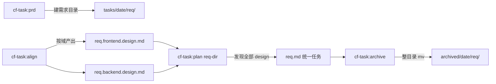
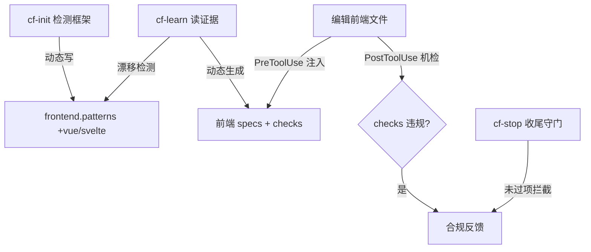

# code-flow 前端支持与任务文档需求目录化 — 设计简报

> **文档编号**: MOD-CF-FE-v1.0
> **文档版本**: v1.0
> **创建日期**: 2026-06-25
> **文档状态**: 草稿
> **来源 PRD**: `.code-flow/tasks/2026-06-25/frontend-support-and-task-restructure.prd.md`

**ID 体系**: US（来自 PRD）、FEAT（功能）、RULE（业务规则/系统约束）、TC（测试用例）、RISK（风险）、NFR（非功能指标）。场景编号：S-（正常）、E-（异常）、B-（边界）。

---

## 1. 文档控制

### 1.1 责任人

| 角色 | 姓名 | 职责范围 |
|------|------|---------|
| 开发负责人 | | 技术方案、代码实现 |
| 测试负责人 | | 测试策略、质量保证 |

### 1.2 修订历史

| 版本 | 日期 | 作者 | 变更描述 |
|------|------|------|---------|
| v0.1 | 2026-06-25 | | 由 PRD 派生（技术维度承接规划对齐） |

---

## 2. 需求分析

### 2.1 需求概述

| 项目 | 内容 |
|------|------|
| 模块名称 | code-flow 前端支持 + cf-task 需求目录化 |
| 需求类型 | 新功能 + 技术重构 |
| 业务背景 | 前端适配弱（无前端设计维度 / 无机检 / 注入漏 `.vue`）；任务文档扁平，前后端 design 分离后难管理 |
| 核心目标 | AI 动态识别项目并适配前端全链路；任务文档按需求目录组织、支持前后端 design 分离与整目录归档 |

### 2.2 痛点与价值

| 维度 | 内容 |
|------|------|
| 目标用户 | code-flow 前端/全栈工程师 + 项目维护者 |
| 当前问题 | 编辑 `.vue`/`.svelte` 零注入；前端规范无机检；设计套后端模板；需求多文档松散关联 |
| 业务影响 | 前端开发拿不到规范支撑、代码质量靠自觉；需求产物散落难管理 |
| 预期价值 | 前端"设计→编码"全链路可支撑且可强制；需求产物集中可管理 |

**用户故事**（继承 PRD §3.2）

| 编号 | 用户故事 | 优先级 |
|------|---------|--------|
| US-01 | 作为前端工程师，编辑任意前端文件（含 `.vue`/`.svelte`）时自动注入贴合本项目框架的前端规范，无需人工指定框架 | P0 |
| US-02 | 作为前端工程师，有独立的前端设计文档（组件/状态/样式/交互维度） | P0 |
| US-03 | 作为前端/全栈工程师，实现代码被强制做到分层、组件复用、样式与接口调用分离 | P0 |
| US-04 | 作为开发者，一个需求的 prd/design/plan 集中在同一需求目录 | P0 |
| US-05 | 作为全栈工程师，一个需求分别有前后端设计文档，plan 一次消费两者生成统一任务 | P0 |
| US-06 | 作为开发者，归档按整个需求目录归档 | P0 |

---

### 2.3 功能方案

#### 2.3.1 功能清单

| 功能ID | 功能名称 | 功能描述 | 优先级 | 来源 |
|--------|---------|---------|--------|------|
| FEAT-01 | 前端注入覆盖动态化 | cf-init 按检测框架动态补 `frontend.patterns`；cf-learn 增"注入覆盖漂移"检测 | P0 | US-01 |
| FEAT-02 | 独立前端设计模板 | 框架中立 `design-frontend.md` 脚手架 + align 动态产出前端设计文档 | P0 | US-02 |
| FEAT-03 | 前端最佳代码强制 | cf-learn 从证据动态生成前端分层/复用/样式-接口分离规范与机检 checks，接 quality_loop + cf-stop | P0 | US-03 |
| FEAT-04 | 任务文档需求目录化 | prd/align/plan 写入 `tasks/<日期>/<需求>/` | P0 | US-04 |
| FEAT-05 | 前后端 design 分离 + plan 多 design 消费 | align 产出后缀区分 design；plan 指定需求目录自动发现全部 design 生成统一任务 | P0 | US-05 |
| FEAT-06 | 按需求目录归档 | archive 整需求目录归档，兼容旧扁平 | P0 | US-06 |

---

### 2.4 范围与边界

| 类别 | 内容 |
|------|------|
| 范围（In Scope） | FEAT-01~06；frontend specs 强化；CLAUDE.md/USAGE.md 同步；双副本 + 多平台传播 |
| 非范围（Out of Scope） | 旧扁平文档迁移；Node/TS 后端模板适配；SFRD 历史存档；scan→stats（已完成，独立提交） |
| 前置假设 | 项目已 `code-flow init`；前端项目用主流框架；quality_loop/cf-stop/checks 已存在 |
| 有意妥协 / 技术债 | 命令为 prompt 驱动，布局/动态逻辑无法单元测试，靠文档断言 + parity + 端到端手验兜底 |

---

### 2.5 验收条件

#### 2.5.1 业务规则与约束

| ID | 类型 | 描述 |
|----|------|------|
| RULE-01 | 系统约束 | 前端适配由 AI 命令动态识别，禁止在静态模板硬编码框架清单/正则 |
| RULE-02 | 系统约束 | 跨平台命令对等（claude=costrict 逐字、codex skill ≥85%），改动必过 parity |
| RULE-03 | 系统约束 | 新旧任务布局并存，旧扁平文档（含 archived/）可查找/归档 |

#### 2.5.2 功能验收场景

**正常场景**

| 场景ID | FEAT | 前置 | 操作步骤 | 预期结果 |
|--------|------|------|---------|---------|
| S-01 | FEAT-04 | 已 init | `/cf-task:prd "X"` | 生成 `tasks/<日期>/<需求>/<需求>.prd.md` |
| S-02 | FEAT-05 | 全栈需求 | `/cf-task:align <prd>` | 同目录产出 `*.frontend.design.md` + `*.backend.design.md` |
| S-03 | FEAT-05 | 需求目录有多 design | `/cf-task:plan <需求目录>` | 自动发现全部 design → 一份 `<需求>.md`，TASK Source 各自指向 |
| S-04 | FEAT-06 | 需求全 done | `/cf-task:archive <需求>` | 整个需求目录移入 `archived/<日期>/<需求>/` |
| S-05 | FEAT-01 | Vue 项目 | `/cf-init` | `frontend.patterns` 自动含 `**/*.vue` |
| S-06 | FEAT-02 | 前端需求 | `/cf-task:align` | 自动选用 design-frontend 模板（无人为 flag） |
| S-07 | FEAT-03 | 有真实组件/services | `/cf-learn` | 生成分层/复用/样式-接口分离候选 + checks 草稿 |

**异常场景**

| 场景ID | FEAT | 触发条件 | 系统行为 |
|--------|------|---------|---------|
| E-01 | FEAT-01 | React 项目 cf-init | `frontend.patterns` 不含 `.vue`（按检测适配，非全塞） |
| E-02 | FEAT-03 | `services/` 内出现 `fetch(` | 不触发机检（路径作用域避免误伤数据层） |
| E-03 | FEAT-06 | 归档旧扁平布局任务 | 回退逐文件归档，正常完成 |

**边界场景**

| 场景ID | FEAT | 边界条件 | 预期行为 |
|--------|------|---------|---------|
| B-01 | FEAT-05 | 单域需求（纯后端/CLI） | 只产出一份 design（单域后缀或无后缀） |

#### 2.5.3 非功能指标

| 指标ID | 要求 |
|--------|------|
| NFR-COMPAT-01 | 新旧任务布局并存 |
| NFR-COMPAT-02 | `test_adapter_parity` + codex ≥85% 通过 |
| NFR-REL-01 | 机检低误报（路径作用域），cf-stop 不打扰正常代码 |

---

## 3. 技术设计

### 3.1 方案选型

**关键决策记录**

| 决策点 | 选择 | 被否决项 | 理由 | 可逆性 |
|--------|------|---------|------|--------|
| 前端适配位置 | AI 命令动态识别（cf-init/cf-learn/align） | 静态模板硬编码框架/正则 | 贴合 code-flow 哲学；项目演进自适应 | 易 |
| 设计模板形态 | 单一中立 `design-frontend.md` | lite/full 双前端模板 | 前端功能多中等复杂度，避免模板翻倍 | 易 |
| 任务目录布局 | `tasks/<日期>/<需求>/`（保留日期层） | 去日期层 / 扁平+后缀 | 日期分组 + 需求聚合，归档整目录 | 难（影响多命令路径） |
| design 命名 | 后缀 `<req>.frontend/backend.design.md` | design/ 子目录 | 一眼看全需求文件 | 易 |
| plan 多 design | 指定需求目录自动发现 | 显式传多路径 | 最省事，目录即上下文 | 易 |
| 强制程度 | 注入 + 机检 + cf-stop 守门 | 仅文档 / 仅反馈不阻塞 | 用户要"保证" | 易（config 开关） |
| 向后兼容 | 新旧并存 | 迁移现有 | `tasks/**` glob 两者皆命中，零迁移成本 | — |

**技术栈**：沿用现有——JS（`src/cli.js`，deployed 为 verbatim 拷贝）+ Python（`cf_*.py`）+ 命令 Markdown（claude canonical → costrict/opencode/codex 多平台）。**无新增依赖**。

---

### 3.2 架构设计

**任务文档需求目录流（FEAT-04/05/06）**



**前端动态适配流（FEAT-01/02/03）**



#### 技术分层（受影响命令）

| 命令 | 变更 |
|------|------|
| prd / align / plan | 写路径改为需求目录 |
| align | 按检测域产出后缀 design；前端用 design-frontend 模板 |
| plan | 接受需求目录参数，自动发现多 design，合并为一份任务 |
| archive | 整目录归档 + 旧扁平回退 |
| cf-init | 按检测框架动态补 patterns |
| cf-learn | 注入覆盖漂移检测 + 前端 specs/checks 生成 |
| start/status/block/graph/note | 不变（`tasks/**` glob 命中嵌套目录） |

---

### 3.4 接口设计（形态 B：命令）

| 命令 | 参数/Flag | 说明 | 变更 |
|------|----------|------|------|
| `cf-task:plan` | `<需求目录>` | 自动发现目录内全部 `*.design.md` 合并拆解 | 新增目录入参 |
| `cf-task:archive` | `<需求>` | 整需求目录归档 | 行为扩展 + 旧布局回退 |
| `cf-task:prd` / `align` | （同前） | 写入 `tasks/<日期>/<需求>/` | 写路径变 |
| `cf-init` | （同前） | 按检测框架补 `frontend.patterns` | 行为增强 |
| `cf-learn` | （同前） | 注入覆盖漂移 + 前端维度采集/特化/checks | 行为增强 |

**文件布局约定（核心契约）**

```
tasks/<日期>/<需求>/
  <需求>.prd.md
  <需求>.frontend.design.md   # 涉前端
  <需求>.backend.design.md    # 涉后端
  <需求>.design.md            # 单域/通用
  <需求>.md                   # plan 产出
→ archived/<日期>/<需求>/
```

---

### 3.5 质量实现方案

#### 可靠性设计

| 风险ID | 失效模式 | 应对措施 |
|--------|---------|---------|
| RISK-01 | 多平台 8 副本漂移 | `test_adapter_parity` 守门，改完必跑 |
| RISK-02 | 机检误伤 services 层 | checks `files` 用路径作用域 `*components*`/`*pages*`（`cf_checks.py:285` fnmatch 匹配相对路径） |
| RISK-03 | prompt 驱动逻辑无法单测 | 文档断言测试（仿 `test_cf_init_docs` / `test_cf_learn_ignore_rules`）+ 端到端手验 |

#### 可观测性设计

| 场景 | 实现方案 |
|------|---------|
| 模板预算核对 | `cf-stats --audit` 确认 design-frontend.md 计入 TEMPLATES（不计预算、无质量告警） |

---

## 5. 风险与依赖

### 5.1 项目依赖

| 依赖 | 内容 | 状态 |
|------|------|------|
| 既有机制 | quality_loop / cf-stop / checks | 已存在 |

### 5.2 风险识别

| 风险ID | 类型 | 描述 | 概率 | 影响 | 应对 |
|--------|------|------|------|------|------|
| RISK-01 | 工程 | 平台副本漂移 | 中 | 平台降级 | parity 守门 |
| RISK-02 | 体验 | 机检误报 | 中 | 打扰开发 | 路径作用域 + fp 自动停用 |

---

## 6. 需求追溯矩阵

| 用户故事 | 功能ID | 接口/契约 | 测试用例(场景ID) | 状态 |
|---------|--------|----------|-----------------|------|
| US-01 | FEAT-01 | cf-init/cf-learn patterns | TC-S05, TC-E01 | 待开发 |
| US-02 | FEAT-02 | design-frontend.md + align | TC-S06 | 待开发 |
| US-03 | FEAT-03 | cf-learn specs+checks | TC-S07, TC-E02 | 待开发 |
| US-04 | FEAT-04 | prd/align/plan 写路径 | TC-S01 | 待开发 |
| US-05 | FEAT-05 | align 后缀 design + plan 目录入参 | TC-S02, TC-S03, TC-B01 | 待开发 |
| US-06 | FEAT-06 | archive 整目录 | TC-S04, TC-E03 | 待开发 |

> 性能自检：无性能敏感点（命令工具，本地文件操作），已显式声明。

---

## 附录：术语表

| 术语 | 定义 |
|------|------|
| US / FEAT / NFR | 用户故事 / 功能项 / 非功能需求 |
| RULE / TC / RISK | 业务规则或系统约束 / 测试用例 / 风险项 |
| 需求目录 | `.code-flow/tasks/<日期>/<需求>/`，集中一个需求的 prd/design/plan 文档 |
| parity | 跨平台命令对等性守门（`test_adapter_parity`） |

---

*文档结束*
