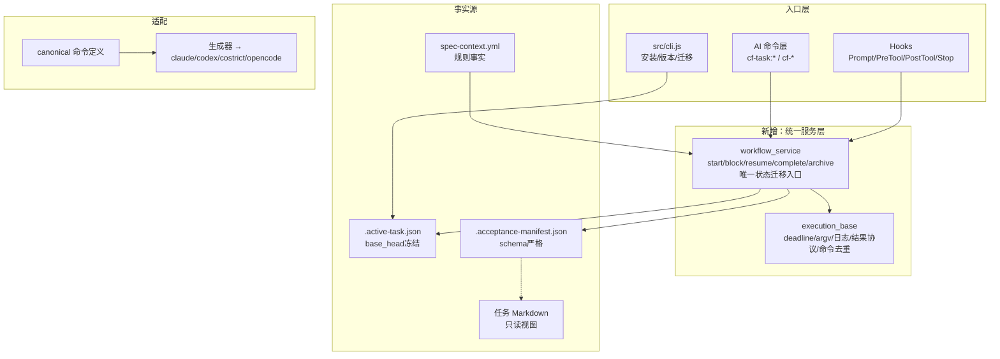

 # code-flow 审计整改模块需求与设计一体化文档

> **文档编号**: MOD-AUDITFIX-v1.0
> **文档版本**: v0.2
> **创建日期**: 2026-09-09
> **文档状态**: 草稿

**评审边界说明**:
- **需求评审**: 第 2 章（需求分析）→ 通过后锁定为需求基线 v1.0
- **设计评审**: 第 3-4 章（技术设计 + 部署运维）→ 通过后锁定设计基线 v1.x
- **交接契约**: 2.5 验收条件 — 需求定义 What，设计实现 How

**ID 体系**: US（用户故事）、FEAT（功能）、API（接口）、RULE（业务规则/系统约束）、TC（测试用例，复用 §2.5.2 场景 ID）、RISK（风险）、NFR（非功能指标）
场景编号：S-（正常）、E-（异常）、B-（边界）

**来源**: `report.md`（10 项 P0/P1 + 速度/衔接/测试章节）与 2026-09-09 深度 review 结论；用户确认三批全修、E2E 状态分离、统一 workflow service。
**模板类型**: Full（跨 CLI/脚本/适配器多域 + 架构收敛 + 状态机统一，属中大型重构）

---

## 目录

- [1. 文档控制](#1-文档控制)
- [2. 需求分析](#2-需求分析)
- [3. 技术设计](#3-技术设计)
- [4. 部署与运维](#4-部署与运维)
- [5. 风险与依赖](#5-风险与依赖)
- [6. 需求追溯矩阵](#6-需求追溯矩阵)
- [Spec Compliance Matrix](#spec-compliance-matrix)
- [附录：术语表](#附录术语表)

---

## 1. 文档控制

### 1.1 责任人

| 角色 | 姓名 | 职责范围 |
|------|------|---------|
| 开发负责人 | | 技术方案、代码实现 |
| 测试负责人 | | 回归测试、验收复验 |
| 架构师（如有） | | 状态机/验收事实源终审 |

### 1.2 修订历史

| 版本 | 日期 | 作者 | 变更描述 |
|------|------|------|---------|
| v0.1 | 2026-09-09 | | 初始草稿：覆盖 report.md 全部 P0/P1、性能与测试缺口 |
| v0.2 | 2026-09-09 | | 实施完成：13 TASK 全部 done，主线自动化一次通过，354 pytest + node 四套件全绿，偏差①②均关闭（见任务文件 Log） |

---

## 2. 需求分析

### 2.1 需求概述 [必填]

| 项目 | 内容 |
|------|------|
| **模块名称** | code-flow 审计整改（安装安全 / 验收可信 / 状态贯通 / 执行收敛） |
| **模块ID** | MOD-AUDITFIX |
| **所属系统/产品线** | code-flow（Node CLI + Python 脚本 + 四平台适配器） |
| **需求类型** | Bug修复 + 技术重构 + 性能优化（复合） |
| **业务背景** | 第三方审计 `report.md` 复现 10 项缺陷：普通 init 删用户 skills（数据丢失）、任务中途 commit 后 Done 漏检、无验收命令仍 pass、单 TASK 跑全量验收、切 TASK 注入丢失、Start 硬门禁缺失、E2E 链断裂、manifest 校验弱、单全局版本号、Stop 预算失控；另有路由过宽、重复执行、shell 注入、二次复杂度等问题 |
| **核心目标** | 一句话：让“安装不丢数据、提交不丢范围、无命令不放行、单 TASK 只验 own 场景、切 TASK 必重注、状态单点迁移、E2E 终态闭环”全部由程序保证，而非依赖 AI 自觉 |

### 2.2 痛点与价值 [必填]

| 维度 | 内容 |
|------|------|
| **目标用户** | 项目 owner（怕 init 删文件）、任务开发者/AI agent（要可信验收）、维护者（要单事实源） |
| **当前问题** | P0 数据丢失已复现（临时项目 `.claude/skills/my-custom-skill` 经 `init --platform=claude` 后消失，退出码仍 0）；commit 后 `current_owned_paths=()` 导致 `decision=pass, checked_files=0`；无 command manifest 直接 `pass`；切 TASK 二次注入为空；`rg "^Status:"` 永远匹配不到 `- **Status**:` |
| **业务影响** | 验收门禁不可信 → 错误 done/archive 进入归档；跨 TASK 返工（早 TASK 等晚 TASK、全量重跑）；用户自有 skills 有丢失风险 |
| **预期价值** | 回归测试全部覆盖复现路径后，同类事故不再发生；跨双 TASK 的 Plan→Start→提交→Complete→切 TASK→E2E→Archive 主线自动化跑通 |

**用户故事**

| 编号 | 用户故事 | 优先级 |
|------|---------|--------|
| US-01 | 作为项目 owner，我希望 `init/upgrade` 永远不动我自建的 skills/配置，以便敢升级 | P0 |
| US-02 | 作为任务开发者，我希望中途 commit 后 Done 仍检查我全部 TASK 变更，以便敢提交 | P0 |
| US-03 | 作为 AI agent，我希望切 TASK 后一定拿到新 TASK 的验收契约，以便不漏做 | P0 |
| US-04 | 作为维护者，我希望状态迁移只有一处入口、验收事实只有一处真相，以便不改四处 | P1 |

### 2.3 功能方案 [必填]

#### 2.3.1 功能清单

| 功能ID | 功能名称 | 功能描述 | 优先级 | 来源 |
|--------|---------|---------|--------|------|
| FEAT-01 | 安装内容保护与平台版本分离 | 受管清单 + 归属判定 + 删除前备份；core/各 adapter 独立版本；跨平台 init 互不干扰 | P0 | US-01 / report#1#9 |
| FEAT-02 | 任务变更范围完整性 | 范围 = 基线 HEAD→当前 HEAD 已提交 diff ∪ 暂存 ∪ 未暂存 ∪ 未跟踪；冻结基线 HEAD，transition 不再 rebase 丢弃 | P0 | US-02 / report#2 |
| FEAT-03 | 验收清单可执行化与空转阻断 | 草稿完整性检查 vs 执行验收分离；manifest 承载 `command/cwd/timeout/depends_on`；零可执行场景 → 执行验收 block；Plan/Start 设命令注册 + schema 门 | P0 | report#3 |
| FEAT-04 | 按 TASK owner 执行验收 | Done/Runner/人工检查按 active `task_id`（经 owner 字段）过滤；同 command 结果复用；需求终验仅 archive/E2E 入口跑全量 | P0 | report#4 |
| FEAT-05 | 跨 TASK 注入版本修复 | 注入版本键 = session + task_dir + task_id + context_sha + TASK 契约摘要；同 Context 切 TASK 必重注，同 TASK 同契约不重复 | P0 | US-03 / report#5 |
| FEAT-06 | 统一工作流状态机 | Python `workflow_service` 统一 start/block/resume/complete/archive 迁移；Start 硬门禁（blocked/NOTES/depends/stale/marker/归属 diff）；block/note/start 自动完成全部走同一接口并同步 Markdown↔marker | P0 | report#6 |
| FEAT-07 | E2E 延迟贯通与状态分离 | task 实现态 `done` 与需求验收终态 `verified` 分离；`verify-e2e` 修 `rg` 正则、补 Codex 命令、pure-e2e 语义（`--only-e2e`，`--include-e2e` 保持含 functional）；archive 终验要求 `verified` | P0 | report#7 |
| FEAT-08 | Manifest 校验强化与证据幂等 | manifest schema 校验 + 不可变字段（kind/level/boundary/owner/command）逐字段比对；证据按 revision/item 更新（幂等，失败不清 verified 但记失败日志）；修 Contract 换行 bug；Coverage 表同步更新；Runner 落失败 stdout/stderr（截断上限） | P0 | report#8 |
| FEAT-09 | 执行预算与命令执行收敛 | 唯一 deadline 自入口透传（Done→Runner→verifier→validator→子进程）；未执行项返回 `incomplete`；validator 改 argv 列表执行，消 `shell=True`；共享执行基础层（超时/日志/结果协议/命令去重） | P1 | report#10 + validator 注入 |
| FEAT-10 | 速度与维护收敛 | 路由收敛（候选发现全量、注入区分真 global）；执行计划去重（同版本证据复用）；pip 有界等待（单次+总超时+进度）；status/graph 程序化（任务索引/DAG 计算，区分可独立开发 vs 可同时激活）；`cf_stats` 线性化；opencode 子进程异步化 | P1 | report 速度章 |
| FEAT-11 | 适配器生成化与回归补齐 | canonical 命令定义生成四平台产物；parity 清单纳入 `verify-e2e` 并补语义绑定断言（替代纯行数比）；全部复现转正式回归测试 | P1 | report 测试章 |

> 来源：无 PRD，填需求描述/report 编号。

#### 2.3.2 字段约束 [按需]

本节为文件 schema 约束（无 DB 表，见 §3.3 数据设计）：

- `.active-task.json`: `baseline.head` 启动后冻结（FEAT-02 禁止 transition 改写）；新增 `base_head`（冻结）vs `last_seen_head`（观测）语义分离，见 §3.3。
- `.acceptance-manifest.json`: schema 升级见 §3.3（`command/cwd/timeout/depends_on/revision` 必填约束）。
- `.code-flow/.version` → 拆分为 `core` + `adapter.<platform>` 版本记录（FEAT-01，§3.3）。
- 会话注入状态：`injected_version` 取代裸 `injected_sha256`（FEAT-05，§3.3）。

### 2.4 范围与边界 [必填]

| 类别 | 内容 |
|------|------|
| **范围（In Scope）** | report.md §已确认的关键问题 1–10 全修；速度章 6 项性能源；测试章缺口补齐；`verify-e2e` 四平台补齐；`{files}` shell 注入修复 |
| **非范围（Out of Scope）** | 常驻 daemon（报告已建议不做）；整套重写为单语言；AI 生成 PRD/design 语义质量评测；Windows 真机兼容保证（仅不引入新不可移植写法） |
| **前置假设** | Node≥18、Python3、无网络时 pip 路径走有界失败；任务文件保持 `## TASK-xxx` + `Acceptance-Refs/Contract/Evidence/Coverage` 四件套结构 |
| **有意妥协 / 技术债** | manifest schema 升级需向前兼容旧 manifest（读旧写新，校验时提示重锁而非静默通过）；opencode 异步化首版只改 Stop/hook 转发，不动插件整体模型；统计口径修正（token 估算/修正率）只做标注+线性化，不重做度量体系 |

### 2.5 验收条件 [必填]

#### 2.5.1 业务规则与约束

| ID | 类型 | 描述 | 验证场景 |
|----|------|------|---------|
| RULE-01 | 系统约束 | 安装/升级不得删除或覆盖非受管用户内容，删受管旧文件前必须备份可恢复 | S-01, E-01, B-01 |
| RULE-02 | 业务规则 | TASK 范围 = 启动基线后全部已提交+未提交变更并集，提交不得缩小范围 | S-02, E-02 |
| RULE-03 | 业务规则 | 零可执行验收场景不得通过执行验收（草稿检查与执行验收分离） | S-03, E-03 |
| RULE-04 | 业务规则 | 单 TASK Done 只执行其 owner 场景；需求终验仅最终入口跑全量 | S-04, E-04 |
| RULE-05 | 系统约束 | 切 TASK（task_id 或契约摘要变）必须重注；同 TASK 同契约不重复注入 | S-05 |
| RULE-06 | 业务规则 | 全部状态迁移走统一 service 并同步 Markdown↔marker；Start 硬门禁 blocked/NOTES/depends | S-06, E-06 |
| RULE-07 | 业务规则 | task `done` ≠ 需求 `verified`；E2E 通过后需求终态才为 `verified`，archive 要求终态 | S-07, E-07 |
| RULE-08 | 系统约束 | manifest 不可变字段逐字段校验；证据写入幂等；失败保留日志 | S-08, E-08, B-08 |
| RULE-09 | 系统约束 | 单一 deadline 透传全链路；预算耗尽项标 `incomplete` 不得谎报 pass | S-09, E-09 |
| RULE-10 | 系统约束 | validator 不得经 shell 拼接执行；文件参数走 argv | S-10, E-10 |
| RULE-11 | 系统约束 | 四平台命令集合完整且语义绑定一致（含 verify-e2e） | S-11 |

#### 2.5.2 功能验收场景

**正常场景**

| 场景ID | 功能ID | 优先级 | 测试层级 | 关键真实边界 | 前置条件 | 操作步骤 | 预期结果 |
|--------|--------|--------|---------|-------------|---------|---------|---------|
| S-01 | FEAT-01 | P0 | integration | 真实 FS（含用户自建 skill） | 临时项目含 `.claude/skills/my-custom-skill/SKILL.md` | `init --platform=claude`（fresh/current/upgrade 各一）+ 跨平台 init codex | 自建 skill 全部保留；退出码 0；受管旧文件进备份 |
| S-02 | FEAT-02 | P0 | integration | 真实 git（HEAD diff + status） | 干净树启动 TASK | 改 `src/app.py`（print）→ commit → Done | Done `files=[src/app.py]`、`decision=block`（print 违规仍在）；多次提交/重命名/删除同样 |
| S-03 | FEAT-03 | P0 | integration | 真实 Runner（无 mock 执行） | 双 integration 场景 manifest 无 command | `run_manifest` + Done | `decision=block`（`not_configured` 不再放行）；配好 command 后 pass |
| S-04 | FEAT-04 | P0 | integration | 真实 Runner + manifest | TASK-001 S-01 已配并通过；TASK-002 S-02 未配 | 激活 TASK-001 跑 Done | TASK-001 pass 且不执行/不等待 S-02；同 command 多场景只执行一次 |
| S-05 | FEAT-05 | P0 | integration | 真实 Hook（Prompt+PreTool） | 同需求 TASK-001→TASK-002，同 Context hash，不同契约 | 先注 TASK-001，再切 TASK-002 同会话触发 | 第二次输出含 TASK-002 S-99 要求（非空）；同 TASK 重复 prompt 不重复注入 |
| S-06 | FEAT-06 | P0 | integration | 真实 `cf_spec_context` service | TASK blocked + 依赖 TASK-999 不存在 + 未解 `#NOTES` | 调统一 start | `ok=false` 阻断并指出三项缺口；block/resume 后 Markdown↔marker 一致，无 `active_exists` 残留 |
| S-07 | FEAT-07 | P0 | E2E | 真实 Runner `--only-e2e` + 任务文件状态 | 全 functional done，E2E deferred | `verify-e2e`（Codex 含）→ 全过 → archive | 任务终态 `verified`；archive 放行；`--include-e2e` 重跑 functional、`--only-e2e` 只跑 E2E |
| S-08 | FEAT-08 | P0 | integration | 真实 manifest + 任务文件 | 已锁 manifest | 改 manifest 内 kind→manual/boundary→mock；连跑两次成功同步 | 两次 `validate=false`（drift）；两次同步后 Contract 仅一条 `verified`、Evidence 无重复、Coverage 已 verified |
| S-09 | FEAT-09 | P1 | integration | 真实子进程超时 | Done budget 10ms + sleep 150ms 场景 | Stop 全链路 | Done `182ms` 超预算后标记 `incomplete`，verifier 不再静默跳过；长测试不被宿主无结论中断 |
| S-10 | FEAT-10 | P1 | integration | 真实 CLI/FS | 缺 PyYAML + 弱网 | init | 有界等待内给出进度并明确失败；`src/a b.py` 路径正确传参；特殊字符不被 shell 解释 |
| S-11 | FEAT-11 | P1 | integration | 真实四平台产物 | canonical 定义 | 生成 + parity 测试 | Codex 含 verify-e2e 且语义绑定通过；行数比断言保留仅作烟雾 |

**异常场景**

| 场景ID | 功能ID | 测试层级 | 关键真实边界 | 触发条件 | 系统行为 | 用户感知 |
|--------|--------|---------|-------------|---------|---------|---------|
| E-01 | FEAT-01 | integration | 真实 FS | skills 下既有受管旧文件又有用户文件 | 仅删受管旧文件并备份，用户文件保留 | 输出 removed+backup 路径 |
| E-02 | FEAT-02 | integration | 真实 git | 任务间隔离：TASK-A 提交后切 TASK-B | TASK-B 范围不含 A 的已提交 | 各自 Done 互不污染 |
| E-03 | FEAT-03 | unit | manifest schema | Coverage 表缺 ID/层级/边界/负责人任一 | `write_manifest` 失败 | 明确缺哪列 |
| E-04 | FEAT-04 | integration | 真实 Runner | 同 command 绑多场景其一失败 | 该 command 失败映射到全部绑定场景 | 一次执行，多场景 block |
| E-06 | FEAT-06 | integration | 真实 service | Markdown 已 done 但 marker 仍 active | 拒绝新 start 并给出 `doctor` 恢复步骤 | 无 `active_exists` 裸错 |
| E-07 | FEAT-07 | integration | 任务文件 | `rg` 旧模式残留调用 | 新命令按 `- **Status**:` 解析 | 状态检查恒真 |
| E-08 | FEAT-08 | integration | 任务文件 | 失败后重跑成功 | 失败日志保留，成功不堆叠 verified | Evidence 一 success + 一 failure（含日志） |
| E-09 | FEAT-09 | integration | validator | 预算耗尽时仍有 validator 未跑 | 标 `incomplete` 并列出未跑项 | 不报 pass |
| E-10 | FEAT-10 | unit | argv 执行 | 文件名含空格/引号/`$()` | 逐文件 argv 传递 | 无拆参、无执行注入 |

**边界场景**

| 场景ID | 测试层级 | 关键真实边界 | 字段/条件 | 边界值 | 预期行为 |
|--------|---------|-------------|----------|--------|---------|
| B-01 | integration | 真实 FS | skills 嵌套层级/符号链接/只读文件 | 深嵌套 + 只读 | 备份后逐文件处理，失败项 warning 不丢用户数据 |
| B-08 | integration | manifest | manifest 记录数 | 0 场景 / 500 场景 | 0 场景拒绝加锁；500 场景校验 <1s 且字段级比对正确 |

#### 2.5.3 非功能指标 [按需]

**性能指标**（均为趋势目标，修复后在实际负载重测，不套进程内缓存值）

| 指标ID | 指标名称 | 目标值 | 测量方法 |
|--------|---------|-------|---------|
| NFR-PERF-01 | 新进程 Hook P50（小项目） | 待定（以修复后实测为基线，当前约 54–69ms 量级） | 12 次新进程实测，中位 |
| NFR-PERF-02 | 500 Spec 显式路径注入 | 不劣于现状（当前约 285ms/34KB）且字符量收敛（去伪 global 后下降） | 合成 500 Spec + 注入字符计数 |
| NFR-PERF-03 | 10k 事件统计聚合 | ≤100ms（线性化后，现状约 995ms） | 合成历史 benchmark |

**可靠性指标**

| 指标ID | 指标名称 | 目标值 |
|--------|---------|-------|
| NFR-REL-01 | 双 TASK 主线自动化（Plan→Start→提交→Complete→切 TASK→E2E→Archive） | 100% 通过 |

**安全性要求**

| 指标ID | 安全域 | 验收标准 |
|--------|--------|---------|
| NFR-SEC-01 | 安装删除面 | 非受管路径零删除；受管删除必备份 |
| NFR-SEC-02 | 命令执行 | validator/Runner 全走 argv，无 `shell=True` 拼接用户路径 |

---

## 3. 技术设计

### 3.1 方案选型 [必填]

#### 备选方案对比

| 对比维度 | 权重 | 方案A（本设计） | 得分 | 方案B（最小补丁） | 得分 |
|---------|------|-------|------|-------|------|
| 功能完备性 | 30% | 11 FEAT 全闭环，状态机/E2E/预算一次到位 | 高 | 逐文件打补丁，Markdown↔marker 双写保留 | 中 |
| 性能预期 | 25% | deadline 透传+去重+线性化，重复执行消除 | 高 | 保留重复执行，仅调超时数字 | 低 |
| 实现复杂度 | 20% | 中高（新增 service + schema 升级 + 生成器） | 中 | 低 | 高 |
| 维护成本 | 15% | 单事实源，后续增提示词不扩维护面 | 高 | 双写+分支继续膨胀 | 低 |
| 风险评估 | 10% | 中（schema 兼容+版本拆分需迁移） | 中 | 低短期、高长期（误放行残留） | 中 |
| **最终得分** | **100%** | | **高** | | **中** |

#### 关键决策记录

| 决策点 | 选择 | 被否决项 | 理由 | 可逆性 |
|--------|------|---------|------|--------|
| 状态收敛 | 新增 `workflow_service` 统一迁移，Markdown 为视图 | 各命令继续直写 Markdown | 用户已选统一 service；双写是 #6 反复脱节根因 | 难回退（有意） |
| E2E 状态 | task `done` + 需求 `verified` 分离 | 放宽 archive 接受 `done` | 用户已选；否则 verified/done 语义继续混用，#7 复发 | 难回退（有意） |
| 范围语义 | 基线冻结 + 并集（FEAT-02） | transition rebase | rebase 即 #2 根因；冻结后“中途提交正常”与“范围不丢”兼得 | 易回退（字段保留） |
| manifest 校验 | 逐字段比对 + schema | 仅 hash+ID | hash 只防 task 改不防 manifest 改，已复现绕过 | 易回退 |
| 预算 | 唯一 deadline 透传 | 各段独立超时相加 | 独立相加必超宿主 35s，已算出 55s 上限 | 中 |
| 执行 | argv 列表 | `shell=True` 字符串拼接 | 注入面 + 空格拆参双缺陷 | 易回退 |
| 适配器 | canonical 生成 | 手工复制 + 行数比 | 行数比证明不了语义，已漏 verify-e2e | 中 |
| 性能 | 先修范围/去重/线性化，不上 daemon | 常驻 daemon 保启动毫秒 | 报告结论：返工成本 >> 几十毫秒启动；daemon 增生命周期成本 | 易 |

#### 技术栈

| 类别 | 选型 | 版本 | 选型理由 |
|------|------|------|---------|
| 语言 | Node（安装分发）+ Python（规则工作流），不引入新语言 | 现状 | 报告肯定方向，收敛而非重写 |
| 依赖 | CLI 零 npm 外部依赖（移除或使用 `@ccusage/codex` 需决议，见 §5） | — | 与 code-standards allowlist 对齐 |
| 测试 | pytest + node 单测 + /tmp 隔离复现转正 | 现状 | 现有 311 测试为基线 |

---

### 3.2 架构设计 [必填]



#### 技术分层


#### 外部依赖清单

| 外部系统 | 依赖类型 | 协议 | 超时 | 降级策略 |
|---------|---------|------|------|---------|
| pip（PyYAML） | 安装时 | subprocess | 单次 60s / 总 120s，有进度 | 明确失败 + 手动命令，不静默吞 |
| git | 范围计算 | subprocess | 5s | 非 git 项目走工作树快照路径并标注 |

---

### 3.3 数据设计 [必填]

无 DB 表，全部为文件 schema 演进。**兼容原则：读旧写新，旧 manifest/marker 可读，写回即新 schema。**

**1. `.active-task.json`（FEAT-02/FEAT-06）**

| 字段 | 类型 | 说明 |
|------|------|------|
| `baseline.head` | string‖null | **冻结**：start 时 HEAD，终身不变（删掉 transition rebase 逻辑） |
| `baseline.last_seen_head` | string‖null | 新增：观测位，仅诊断，不参与范围 |
| `baseline.preexisting_changes` | map | 保持：启动时未提交快照 |
| `status` | enum | `activating/active/paused/blocked/completed`，只经 service 迁移 |
| 范围公式 | — | `diff(base_head..HEAD) ∪ staged ∪ unstaged ∪ untracked − excluded`；`owned_paths` 退化为启动确认记录，不再是范围上限 |

**2. `.acceptance-manifest.json`（FEAT-03/FEAT-08）**

| 字段 | 类型 | 说明 |
|------|------|------|
| `schema` | int | `1→2`；2 要求每 scenario 含 `command/cwd/timeout/depends_on`（manual/e2e 可豁免 command 但须有 `confirm`/`env` 说明） |
| `scenarios[].kind/level/boundary/owner/command` | — | 不可变字段，`validate` 逐字段与 task 重提值比对（防 JSON 私改；已复现绕过） |
| `scenarios[].revision/evidence` | — | 证据按 revision 更新：`{rev, command_sha, code_sha, at, log_ref, result}`；失败亦落盘（截断 4KB），不堆叠 `verified` 字符串 |
| 草稿 vs 执行 | — | 新增 `executable: bool`（全无 command → 执行验收直接 block，草稿检查仍可 pass） |

**3. 任务 Markdown（FEAT-08 连带修复）**

- `_sync_task_evidence` 改为按 `scenario_id` 行替换（幂等），补缺失的 Contract 尾换行（已复现 `verified### Acceptance` 粘连）；
- 同步范围扩大到 `Acceptance Coverage` 表（Runner 成功即置 `verified`，否则 Stop 三处校验恒败）。

**4. 版本记录（FEAT-01）**

| 文件 | 说明 |
|------|------|
| `.code-flow/.version` | 保留作 core 版本（兼容旧项目） |
| `.code-flow/.adapter-versions.json` | 新增：`{core, claude, codex, costrict, opencode, managed_files_sha}`；升级按平台独立判定，缺文件同版本亦修复 |

**5. 注入版本键（FEAT-05）**

```
injected_version = sha(session_id ‖ task_dir ‖ task_id ‖ context_sha256 ‖ task_contract_digest)
```

`task_contract_digest` = 当前 TASK 的 Acceptance-Refs+Contract+Evidence 摘要；取代裸 `injected_sha256`。Router 投影缓存（已含 task_id）保持，Hook 去重与 PreTool 去重统一用此键。

**容量预估**

| 维度 | 预估值 |
|------|--------|
| manifest 500 场景校验 | <1s（含逐字段比对，B-08） |
| 10k 事件统计 | ≤100ms（线性化后） |

---

### 3.4 接口设计 [必填]

> 按入口类型三选一：CLI 命令 + 函数/库接口（无 HTTP API，删除该形态）。

#### 形态 B：CLI 命令

| 命令 | 参数 / Flag | 说明 | 退出码 |
|------|------------|------|--------|
| `code-flow init [--force] [--platform=...] [--backup-dir=]` | 新增 `--backup-dir` | 受管删除先进备份；跨平台只动本平台路径 | 0=成功 / 非0=失败 |
| `cf_spec_context.py start --task-dir --root --task --task-file` | 行为变更 | 经 service 硬门禁（blocked/NOTES/depends/stale/marker/归属） | 0/`3` 阻断 |
| `cf_spec_context.py active {start/pause/resume/block/complete/doctor}` | 收敛 | 全部转调 service，Markdown 同步由 service 做 | 同上 |
| `cf_acceptance_runner.py --manifest --root [--include-e2e] [--only-e2e] [--deadline=]` | 新增 `--only-e2e/--deadline` | `--include-e2e`=含 E2E 重跑 functional；`--only-e2e`=仅 E2E | 0/`3` |
| `cf_task_runtime run_done_gate(root, task_dir, task_id, deadline)` | 新增 task_id/deadline | 按 owner 过滤 + 命令去重 + 预算透传 | pass/block/incomplete |
| `cf_stop_hook` | 行为变更 | 单 deadline（Done+validators+verifier 共享）；validator argv 执行 | block 载 `incomplete` 明细 |

> stdout 机器输出保持 `json.dumps(..., ensure_ascii=False)` 单行 JSON；`--json` 约定不变；错误走 `{"ok":false,"error":{"code"}}`。

#### 形态 C：函数 / 库接口

| 函数签名 | 入参 | 返回 | 错误处理 |
|---------|------|------|---------|
| `workflow_service.transition(root, action, task_id, actor)` | action∈start/block/resume/complete/archive | 新 marker + 下一步指令 | `active_exists/blocked/notes_unresolved/depends_unmet/drift` 显式码 |
| `scope_since_baseline(root, base_head) -> files` | base_head 冻结值 | 并集文件集 | git 不可用时降级快照并标注 |
| `validate_manifest_strict(task_file, manifest) -> (bool, reason)` | 双路径 | `drift/scenarios_changed/field_changed(owner/kind/boundary/command)` | 缺 schema 即 invalid |
| `run_validators_argv(validators, files, deadline)` | argv 列表 | failures + truncated + incomplete | 超时标 incomplete，不谎报 |

---

### 3.5 质量实现方案 [必填]

#### 性能设计

| 指标ID | 热点路径 | 目标值 | 实现方案（含被放弃的较慢方案） |
|--------|---------|-------|------------------------------|
| NFR-PERF-01 | Hook 启动 + 注入 | 基线不劣化且字符量降 | 路由：候选发现全量但注入仅真 global+path（弃：全量注入）；跨进程索引只在 100+ Spec 时启用（弃：常驻 daemon） |
| NFR-PERF-02 | Stop 重复执行 | 随 TASK 数线性降 | 统一执行计划：同版本命令结果复用（弃：Start/Stop/Archive 各跑一遍） |
| NFR-PERF-03 | cf_stats | ≤100ms/10k | 倒序单扫 + 会话/文件/check 状态表（弃：每 violation 全片遍历） |
| — | opencode | 不堵事件线程 | `spawn` 异步 + 反馈队列分离（弃：`spawnSync` 35s 占线程） |

#### 可靠性设计

| 风险ID | 失效模式 | 影响 | 应对措施 | 验证场景 |
|--------|---------|------|---------|---------|
| RISK-01 | init 误删 | P0 数据丢失 | 受管清单 + 平台隔离 + 先备份后删 + 回归 S-01/E-01/B-01 | S-01 |
| RISK-02 | 范围丢失 | 误放行 | 基线冻结 + 并集 + 任务隔离测试 | S-02/E-02 |
| RISK-03 | 空验收放行 | 误 done | executable 门 + schema 门 | S-03/E-03 |
| RISK-04 | 切 TASK 漏注 | 漏做 | 版本键 + 切换/压缩恢复专项测试 | S-05 |
| RISK-05 | 预算超宿主 | 无结论中断 | 单 deadline + incomplete 语义 | S-09/E-09 |

#### 安全性设计

| 指标ID | 验收标准 | 实现方案 |
|--------|---------|---------|
| NFR-SEC-01 | 非受管零删除 | `MANAGED_FILES` 清单 + 归属判定（路径前缀+内容指纹）+ `--backup-dir` |
| NFR-SEC-02 | 无 shell 拼接 | validator/Runner 全 argv；`{files}` 展开为多参数；含引号/`$()` 路径回归 E-10 |

#### 可观测性设计

| 场景 | 实现方案 |
|------|---------|
| 失败排障 | Runner 落失败 stdout/stderr（4KB 截断）+ `log_ref`；Stop `incomplete` 列未跑项 |
| 预算可见 | 各阶段 `phase_timing` 保留并上报剩余预算 |
| 降级可见 | `degrade` 事件保留触发源，不静默跳过 |

---

## 4. 部署与运维

### 4.1 部署架构

| 环境 | 配置 | 实例数 | 用途 |
|------|------|--------|------|
| 本地项目 | `code-flow init/upgrade` 幂等 | N/A | 先备后写；版本文件拆分自动迁移 |

### 4.2 发布与回滚 [按需]

**发布策略**

| 阶段 | 范围 | 进入条件 | 回滚条件 |
|------|------|---------|---------|
| 补丁发布 | 全量（semver patch/minor） | §2.5 S-01–S-11 全过 + 旧 311 测试全过 | 任一 P0 回归失败即回滚 |

**回滚步骤**: `upgrade` 前备份恢复 + 版本文件回写；manifest schema 2 可被旧版读（旧版见未知字段忽略并提示重锁，不静默 pass）。

### 4.3 监控告警 [按需]

| 指标 | 阈值 | 级别 | 处理SLA |
|------|------|------|---------|
| 空验收 pass | 出现即 P0 | P0 | 立即修复 |
| 切 TASK 空注入 | 出现即 P0 | P0 | 立即修复 |

### 4.4 数据迁移 [按需]

| 阶段 | 操作 | 验证方法 |
|------|------|---------|
| 1 | `.version` → 补写 `.adapter-versions.json`（按已安装平台探测） | 双文件一致 |
| 2 | manifest v1 → v2（补 `command/cwd/timeout` 空位并重锁） | `validate_strict` 通过 |
| 3 | 会话 `injected_sha256` → `injected_version`（懒迁移，未命中即重注） | 切 TASK 复测 S-05 |

---

## 5. 风险与依赖

### 5.1 项目依赖

| 依赖模块/团队 | 依赖内容 | 状态 | 风险等级 |
|-------------|---------|------|---------|
| 现有 311 pytest + node 单测 | 基线不破 | 通过 | 中（范围改动触 Done 门） |
| 四平台宿主（Claude/Codex/Costrict/OpenCode） | Hook 超时/协议 | 仅 Stop 35s 已知 | 中 |

### 5.2 风险识别

| 风险ID | 类型 | 描述 | 概率 | 影响 | 应对措施 | 验证场景 |
|--------|------|------|------|------|---------|---------|
| RISK-06 | 兼容 | manifest v2 旧项目校验失败 | 中 | 中 | 读旧写新 + 明确重锁提示 | E-03 |
| RISK-07 | 语义 | `done`/`verified` 存量混用 | 高 | 中 | 一次性迁移脚本 + archive 门同时识旧 `done` 并提示补 E2E | S-07 |
| RISK-08 | 依赖 | `@ccusage/codex` 在 package.json 但 src 无引用，与零依赖规范冲突 | 确认 | 低 | 本设计不私自删：plan 前决议移除或加 allowlist 备注 | S-11 |
| RISK-09 | 性能 | 范围并集在大仓库 `git diff` 变重 | 中 | 低 | diff 按基线增量 + 路径裁剪；超阈提示拆 TASK | NFR-PERF-01 |

---

## 6. 需求追溯矩阵

| 用户故事 | 功能ID | 接口ID | 测试用例ID | 测试层级 | 状态 |
|---------|--------|--------|-----------|---------|------|
| US-01 | FEAT-01 | `init`, 版本文件 | S-01, E-01, B-01 | integration | 待实现 |
| US-02 | FEAT-02 | `scope_since_baseline`, transition | S-02, E-02 | integration | 待实现 |
| 需求描述 | FEAT-03 | `write_manifest`, `run_manifest` | S-03, E-03 | integration/unit | 待实现 |
| 需求描述 | FEAT-04 | `run_done_gate(task_id)` | S-04, E-04 | integration | 待实现 |
| US-03 | FEAT-05 | Prompt/PreTool 注入 | S-05 | integration | 待实现 |
| 需求描述 | FEAT-06 | `workflow_service.transition`, start | S-06, E-06 | integration | 待实现 |
| 需求描述 | FEAT-07 | `verify-e2e`, archive | S-07, E-07 | E2E/integration | 待实现 |
| 需求描述 | FEAT-08 | `validate_manifest_strict`, `_sync_task_evidence` | S-08, E-08, B-08 | integration | 待实现 |
| 需求描述 | FEAT-09 | `run_validators_argv`, deadline | S-09, E-09 | integration | 待实现 |
| 需求描述 | FEAT-10 | 路由/stats/opencode | S-10, E-10, NFR-PERF | integration/unit | 待实现 |
| 需求描述 | FEAT-11 | canonical 生成器, parity | S-11 | integration | 待实现 |
| RULE-01–11 | FEAT-01–11 | — | S-01–S-11/E-01–E-10 | 见上 | 待实现 |

> TC 直接引用 §2.5.2 场景 ID，无另造编号；RULE 与高影响 RISK（RISK-01–05）均已映射场景。

---

## Spec Compliance Matrix

> 无 PRD 新建模式：先 catalog/bind 再写 Design（本稿为设计草稿，plan 前须回填 artifact 与 hash 并过 Design Gate）。

| Spec/Rule | enforcement | 设计影响 | 设计落点 | 验证场景 | 状态/N/A 理由 |
|-----------|-------------|---------|---------|---------|----------------|
| `cli-code-standards#RULE-cli-user-content-preservation-001` | required | FEAT-01 受管清单+备份为硬要求 | §2.5 RULE-01 / §3.3 版本记录 / §3.4 init | S-01, E-01, B-01 + verifier 部署检查 | 待 bind 回填 artifact |
| `cli-code-standards#RULE-cli-platform-parity-001` | required | FEAT-11 生成器 + Codex verify-e2e | §3.2 适配 / §2.5 RULE-11 | S-11 + parity 语义断言 | 待 bind 回填 |
| `cli-code-standards#RULE-cli-migration-transaction-001` | required | 版本拆分/备份/幂等迁移 | §4.2 / §4.4 | S-01, S-07 | 待 bind 回填 |
| `cli-code-standards#RULE-cli-hook-guard-001` | required | Hook 安全解析 + 项目外 no-op | §3.5 / FEAT-09 | S-09, S-10 | 待 bind 回填 |
| `cli-code-standards#RULE-cli-dependency-allowlist-001` | required | pip 有界 + `@ccusage/codex` 决议 | §3.1 / §5 RISK-08 | S-10, S-11 | 待 bind 回填 |
| `scripts-code-standards#RULE-scripts-context-gate-001` | required | FEAT-02/03/04/06/07/08 全部门禁 fail-closed | §2.5 RULE-02–08 / §3.3–3.4 | S-02–S-08, E-02–E-08 | 待 bind 回填 |
| `scripts-code-standards#RULE-scripts-hook-protocol-001` | required | JSON 协议 + no-op + stderr 诊断；修 validator shell | §3.4–3.5 / RULE-09–10 | S-09, S-10, E-09, E-10 | 待 bind 回填 |
| `scripts-code-standards#RULE-scripts-canonical-parity-001` | required | canonical 生成 + 部署同步 + 旧残留清理 | §3.2 / FEAT-11 | S-11 | 待 bind 回填 |
| `scripts-code-standards#RULE-scripts-no-print-debug-001` | required | 新增 service/Runner 代码禁 print | §3.5 | 现有 hook 协议测试 | 待 bind 回填 |
| `scripts-code-standards#RULE-scripts-no-bare-except-001` | required | 全部新 except 显式类型 + 降级记事件 | §3.4–3.5 | 现有单测 | 待 bind 回填 |

---

## 附录：术语表

| 术语 | 定义 |
|------|------|
| US | User Story，用户故事 |
| FEAT | Feature，功能项 |
| API | Application Programming Interface，接口（含 CLI/函数形态） |
| RULE | 业务规则或系统约束 |
| TC | Test Case，测试用例（本文直接复用 S-/E-/B-） |
| RISK | 风险项 |
| NFR | Non-Functional Requirement，非功能性需求 |
| ADR | Architecture Decision Record，架构决策记录（见 §3.1） |
| executable | 可执行验收（有 command 的场景集合）vs 草稿完整性检查 |

---

*文档结束*
