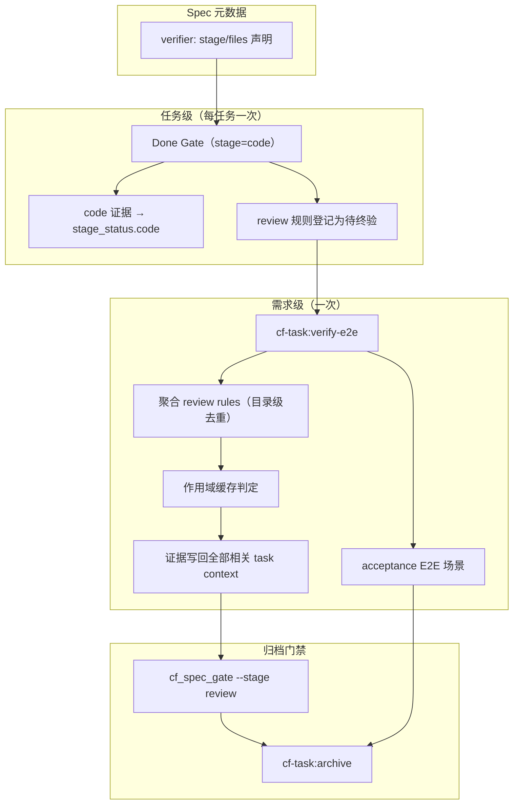
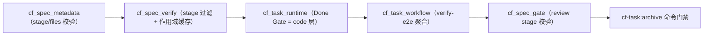

# 验证分层（code/review + 需求级终验）模块需求与设计一体化文档

> **文档编号**: MOD-VERIFY-STAGE-1.0
> **文档版本**: v0.1
> **创建日期**: 2026-09-29
> **文档状态**: 设计评审中（Design Gate: pass）

**评审边界说明**:
- **需求评审**: 第 2 章（需求分析）→ 通过后锁定为需求基线 v1.0
- **设计评审**: 第 3-4 章（技术设计 + 部署运维）→ 通过后锁定设计基线 v1.x
- **交接契约**: 2.5 验收条件 — 需求定义 What，设计实现 How

**ID 体系**: US（用户故事，来自 PRD）、FEAT（功能）、API（接口）、RULE（业务规则/系统约束）、TC（测试用例）、RISK（风险）、NFR（非功能指标）
场景编号：S-（正常）、E-（异常）、B-（边界，按需）

---

## 1. 文档控制

### 1.1 责任人

| 角色 | 姓名 | 职责范围 |
|------|------|---------|
| 产品经理 | jahan | 需求定义、业务验收 |
| 开发负责人 | jahan | 技术方案、代码实现 |
| 测试负责人 | jahan | 测试策略、质量保证 |

### 1.2 修订历史

| 版本 | 日期 | 作者 | 变更描述 |
|------|------|------|---------|
| v0.1 | 2026-09-29 | agent | 初始草稿（PRD 派生） |
| v0.2 | 2026-09-29 | agent | 设计定稿：review stage 分层、verify-e2e 聚合终验、显式作用域缓存、Design Gate pass |

---

## 2. 需求分析

### 2.1 需求概述 [必填]

| 项目 | 内容 |
|------|------|
| **模块名称** | 验证分层（code/review 阶段 + 需求级终验） |
| **模块ID** | MOD-VERIFY-STAGE |
| **所属系统/产品线** | code-flow（cf-task 工作流内核） |
| **需求类型** | 架构演进 + 性能优化 |
| **业务背景** | 任务 Done Gate 全量执行绑定 spec 的 command/test verifier：零缓存 + 全局 diff 失效 + 复合命令，实测单任务 25 分钟；重型 e2e 与并行 worktree 争用 PG/Redis 产生假失败 |
| **核心目标** | 按阶段分层验证：任务 Done 只付 code 层（本地/确定性）；review 层（e2e/acceptance/构建）在需求级终验一次性执行；未受影响的验证结果按输入作用域跨任务复用 |

---

### 2.2 痛点与价值 [必填]

| 维度 | 内容 |
|------|------|
| **目标用户** | code-flow 的四平台开发者用户；多 spec 绑定 + 重型验收 + 并行任务的项目 |
| **当前问题** | 单任务 Done 25 分钟；`RULE-test-001` 单条含 acceptance(17min)+build+e2e；并行会话抢资源造成假失败 |
| **业务影响** | 任务迭代被验证阻塞；并行收益被验证成本抵消；假失败消耗定位成本、削弱门禁可信度 |
| **预期价值** | 任务 Done 与 review 层解耦；e2e 每需求一次且与并行隔离；未受影响验证跨任务复用；归档前无未验证遗漏 |

**用户故事**

| 编号 | 用户故事 | 优先级 |
|------|---------|--------|
| US-01 | 作为使用 cf-task 的开发者，我希望任务 Done 只执行本地快速验证，以便不被重型 e2e 阻塞每个任务 | P0 |
| US-02 | 作为开发者，我希望重型/环境依赖验证在需求级终验统一执行一次，以便 e2e 不重复执行、也不与并行任务争资源 | P0 |
| US-03 | 作为开发者，我希望未受影响的验证结果能被复用，以便改动局部代码时不重跑无关验证 | P0 |
| US-04 | 作为维护者，我希望归档前 review 层验证必须通过且证据可审计，以便"延后"不会变成"遗漏" | P0 |
| US-05 | 作为 spec 作者，我希望通过声明 verifier 的阶段与输入作用域来表达"何时验证、验证什么"，以便工具正确分层与缓存 | P1 |
| US-06 | 作为 code-flow 仓库维护者，我希望把本仓库的复合 verifier 拆解并声明阶段/作用域，以便自身开发立即享受分层收益 | P1 |

---

### 2.3 功能方案 [必填]

#### 2.3.1 功能清单

| 功能ID | 功能名称 | 功能描述 | 优先级 | 来源 |
|--------|---------|---------|--------|------|
| FEAT-01 | verifier 阶段声明与证据分层 | verifier 可声明 `stage: code/review`（默认 code）；Done Gate 只执行 code 层并把 review 层登记为待终验；证据写入对应 stage_status | P0 | US-01, US-05 |
| FEAT-02 | 需求级终验（扩展 verify-e2e） | 扩展 `cf-task:verify-e2e`：聚合需求目录内所有任务 context 的 review 层 rules，去重执行一次，证据写回全部相关 context；同时执行 acceptance E2E | P0 | US-02, US-04 |
| FEAT-03 | archive 阶段门禁 | code + review + acceptance manifest 全部 verified 才允许归档；未终验时明确阻断并提示 verify-e2e | P0 | US-04 |
| FEAT-04 | 输入作用域与结果缓存 | verifier 可声明 `files` glob；command/test 结果按"spec/rule/配置/stage + 作用域内文件与 diff"缓存；未声明作用域者保持全量执行 | P0 | US-03, US-05 |
| FEAT-05 | 本仓库 spec 拆解与声明 | 为 `.code-flow/specs/cli|scripts` 的 verifier 补充 `files` 作用域、复核原子性；全部保持 code 层 | P1 | US-06 |
| FEAT-06 | 可观测性 | finish 输出 review 延后数量与 verify-e2e 入口；verify-e2e 输出执行/复用/失败明细；status 展示 code/review 进度 | P1 | US-01, US-02 |

#### 2.3.2 字段约束

**FEAT-01 / FEAT-04 verifier 配置字段**

| 字段名 | 字段类型 | 必填 | 约束 | 说明 |
|--------|---------|------|------|------|
| `stage` | string | 否 | `code` \| `review`；默认 `code`；其他值 fail-closed | 声明验证所属阶段 |
| `files` | string[] | 否 | 非空字符串数组；相对仓库根；禁止绝对路径与 `..`；未声明则每次执行 | 输入作用域 glob，用于缓存失效判定 |
| `config.argv` | string[] | 是（test/command） | 非空字符串数组 | 沿用现有约束 |
| `config.timeout` | number | 否 | 正数秒 | 沿用现有约束 |

---

### 2.4 范围与边界 [必填]

| 类别 | 内容 |
|------|------|
| **范围（In Scope）** | verifier 阶段声明与证据分层；verify-e2e 扩展为需求级终验（目录级聚合/去重/写回）；archive review 门禁；显式 `files` 作用域与 command/test 缓存；本仓库 cli/scripts spec 作用域声明；四平台命令文档同步与可观测性输出 |
| **非范围（Out of Scope）** | 存量项目迁移工具/自动改写 verifier 配置（无存量项目）；自动拆解用户项目复合 verifier（仅指南）；替换 acceptance manifest 既有 E2E 机制（复用）；跨 worktree 缓存合并；并行执行 verifier |
| **前置假设** | 现有 `code/review` stage 数据结构可用（review 目前无 gate 使用）；archive 为命令文档驱动 + `cf_spec_gate` 脚本门禁；并行 worktree 流程保持现状 |
| **有意妥协 / 技术债** | ① 缓存文件 per-root：并行 worktree 各自缓存，合并后终验首次可能重跑一次（后续如需可做缓存合并，本次不承诺）；② 未声明 `files` 的 verifier 不缓存（安全默认，收益需 spec 显式声明）；③ 作用域交集为空且无缓存时仍执行一次（保证 bound rule 有证据） |

---

### 2.5 验收条件 [必填]

#### 2.5.1 业务规则与约束

| ID | 类型 | 描述 | 验证场景 |
|----|------|------|---------|
| RULE-01 | 系统约束 | 未声明 `stage` 的 verifier 默认 code，且行为与现状完全一致 | S-05, B-02 |
| RULE-02 | 系统约束 | `stage: review` 的 verifier 不得在任务 Done Gate 执行 | S-01 |
| RULE-03 | 系统约束 | archive 必须 code + review + acceptance manifest 全部 verified | S-04, E-01 |
| RULE-04 | 系统约束 | 仅 verified 结果入缓存；未声明 `files` 不缓存；失败结果必须重跑 | S-03, E-03 |
| RULE-05 | 系统约束 | 终验失败只阻塞归档，不反转任务 done 状态；重跑仅执行失败/输入变化项 | E-01 |
| RULE-06 | 系统约束 | verifier 配置非法（stage/files）时 metadata 加载 fail-closed 并报明确错误 | E-02, B-02 |

#### 2.5.2 功能验收场景

**正常场景**

| 场景ID | 功能ID | 优先级 | 测试层级 | 关键真实边界 | 前置条件 | 操作步骤 | 预期结果 |
|--------|--------|--------|---------|-------------|---------|---------|---------|
| S-01 | FEAT-01 | P0 | integration | 真实 git 仓库 + spec-context + 真实 verifier 命令 | 任务绑定 code+review 两类 verifier | 执行 `cf_task_workflow.py finish` | 仅 code 类执行；review 类未执行且 review 状态 pending；finish 输出延后条数与 verify-e2e 提示 |
| S-02 | FEAT-02 | P0 | integration | 真实多 task context + 真实命令（含 marker 文件计数） | 需求目录两个 task 绑定同一 review rule | 执行 `verify-e2e` | 该 rule 只执行一次；两个 context 的 review 证据均 verified；acceptance E2E 同时执行；输出 executed/reused 计数 |
| S-03 | FEAT-04 | P0 | integration | 真实 git 仓库 + 任务 owned files | 任务 A 已验证某 `files` 作用域 rule；任务 B 的变更不涉及该作用域 | 任务 B 执行 `finish` | 该 rule 命中缓存不执行；修改作用域内文件后再跑则重新执行 |
| S-04 | FEAT-03 | P0 | integration | 真实需求目录 + `cf_spec_gate` | code 全 verified，review 未验证 | 执行 archive 前校验流程 | refresh + code gate 通过；archive 因 review 未 verified 阻断并输出 verify-e2e 命令；终验后放行 |
| S-05 | FEAT-01 | P0 | integration | 真实旧格式 spec（无 stage/files） | 现有 spec 未做任何声明 | 执行 `finish` | 全部 verifier 在 Done Gate 执行，行为与升级前一致 |
| S-06 | FEAT-05 | P1 | integration | 真实 `.code-flow/specs/cli|scripts` | 已补 `files` 声明 | 修改作用域外文件跑 finish；修改作用域内文件跑 finish | 前者命中缓存；后者重跑 |

**异常场景**

| 场景ID | 功能ID | 测试层级 | 关键真实边界 | 触发条件 | 系统行为 | 用户感知 |
|--------|--------|---------|-------------|---------|---------|---------|
| E-01 | FEAT-02 | integration | 真实 review 命令（退出码 1）+ 真实上下文写回 | 终验时某 review rule 失败 | 不写 verified；archive 保持阻断；修复后重跑仅执行失败/输入变化项 | 输出失败规则与命令；已 done 任务状态不变 |
| E-02 | FEAT-04 | unit | metadata 加载器 | `stage` 非法值 / `files` 含绝对路径或 `..` | 加载 fail-closed，报字段级错误 | 明确错误信息与修复指引 |
| E-03 | FEAT-04 | integration | 真实命令先失败后修复 | 首次执行失败；修复后重跑 | 失败不入缓存，重跑必须真实执行 | 第二次仍执行；通过后才入缓存 |

**边界场景**

| 场景ID | 测试层级 | 关键真实边界 | 字段/条件 | 边界值 | 预期行为 |
|--------|---------|-------------|----------|--------|---------|
| B-01 | integration | 缓存与作用域交集 | owned files ∩ `files` = ∅ | 无缓存条目 | 执行一次并缓存；之后命中复用 |
| B-02 | unit | verify-e2e 空操作 | 需求目录无 review rules 且无 acceptance | 空集 | decision=pass，行为与现状一致 |
| B-03 | unit | 缓存文件为 per-root | 两个 worktree 各自缓存 | 合并后主 root 无条目 | 首次终验重跑并写缓存；不报错 |
| B-04 | unit | `cf_spec_context status` 输出结构 | rule 同时声明 code/review | code=verified, review=pending | 两级状态均展示，不遗漏 review |

#### 2.5.3 非功能指标

**性能指标**

| 指标ID | 指标名称 | 目标值 | 测量方法 |
|--------|---------|-------|---------|
| NFR-PERF-01 | 单任务 Done 执行的 review 层 verifier 条数 | 0 | finish 输出字段 `deferred_review` |
| NFR-PERF-02 | 作用域内文件与相关内容未变时 command/test 重跑次数 | 0（命中缓存） | verify-e2e 输出 `reused` 计数与 `.verifier-cache.json` |

**可靠性指标**

| 指标ID | 指标名称 | 目标值 |
|--------|---------|-------|
| NFR-REL-01 | 延后验证悬空率 | 0（archive 硬门禁：review 未 verified 不可归档） |
| NFR-REL-02 | 失败结果误复用 | 0（仅 verified 入缓存） |

**兼容性要求**

| 指标ID | 安全域 | 验收标准 |
|--------|--------|---------|
| NFR-COMPAT-01 | 向后兼容 | 未声明 stage/files 的 spec 行为不变；旧 spec-context.yml 可直接加载（缺 review status 时按声明补 pending） |

---

## 3. 技术设计

### 3.1 方案选型 [必填]

#### 备选方案对比

| 对比维度 | 权重 | 方案A（review stage 分层） | 得分 | 方案B（新增 defer 标记） | 得分 |
|---------|------|---------------------------|------|-------------------------|------|
| 功能完备性 | 30% | 复用现有 stage 模型，覆盖全部需求 | 9 | 需新增概念且与 stage 语义重叠 | 6 |
| 性能预期 | 25% | Done 零 review 执行 + 作用域缓存复用 | 9 | 同等 | 9 |
| 实现复杂度 | 20% | 仅扩展现有 gate/runtime/cache | 8 | 新 schema + 迁移语义 | 5 |
| 维护成本 | 15% | 概念最少，审计面清晰 | 9 | 两套"延后"语义并存 | 5 |
| 风险评估 | 10% | archive 门禁兜底，可逆 | 8 | 语义混淆风险高 | 5 |
| **最终得分** | **100%** | | **8.7** | | **6.2** |

#### 关键决策记录

| 决策点 | 选择 | 被否决项 | 理由 | 可逆性 |
|--------|------|---------|------|--------|
| 重型验证承载方式 | 使用已有 `review` stage | 新增 verifier `defer` 标记 | stage 数据模型已存在且无 gate 使用；避免两套"延后"概念 | 易回退 |
| 缓存失效语义 | 显式 `files` + owned∩files 交集 | 自动按 path_mapping 推导；全局 diff 对比 | 显式声明可审计、无隐藏行为；交集判定精准；未声明保持安全默认 | 易回退 |
| 终验用户入口 | 扩展 `cf-task:verify-e2e`（名称不变） | 新增 `cf-task:verify` | 命令面不膨胀；既有用户习惯不变（用户已确认） | 易回退 |
| 终验失败语义 | 只阻塞 archive + 增量重跑 | 回退任务为 in-progress | 环境类失败不应反复翻转已完成的实现事实；归档门禁保证不遗漏 | 易回退 |
| 用户项目迁移 | 不提供迁移工具（无存量项目） | 只读检查 + 自动改写 | 用户确认无存量；兼容默认行为不变 | 易回退 |

#### 技术栈

| 类别 | 选型 | 版本 | 选型理由 |
|------|------|------|---------|
| 语言 | Python | 3.9+ | 现有 code-flow 脚本体系，零新依赖 |
| 框架 | 无（标准库） | - | AGENTS.md 禁止 CLI 外部依赖 |
| 数据库 | 无（JSON 状态文件） | - | `.verifier-cache.json` / `spec-context.yml` 均为文件状态，沿用现有模式 |

---

### 3.2 架构设计 [必填]



#### 技术分层



---

### 3.3 数据设计 [必填]

**状态文件 1: `spec-context.yml`（已有结构，语义扩展）**

| 字段 | 类型 | 说明 |
|------|------|------|
| `bindings[].rules[].stage_status.code` | object | Done Gate 证据（不变） |
| `bindings[].rules[].stage_status.review` | object | 终验证据；按规则声明的 stages 生成；缺失时加载补 `pending` |
| `stage_status.<stage>.evidence[]` | object[] | `executed_at` / `status` / `rule_text_sha256` / `artifact_sha256` / `diff_sha256` / `result_sha256` / `error_code` / `details` |

**状态文件 2: `.verifier-cache.json`（运行时，per-root）**

| 字段 | 类型 | 说明 |
|------|------|------|
| `<cache_key>` | object | `VerificationEvidence.__dict__` 序列化；仅 verified 写入 |
| cache_key | string | `sha256(spec_hash, rule_hash, type, config, stage, relevant_files, relevant_diff)` |

- 容量：沿用上限 2048 条 + 先进先出淘汰。
- `relevant_files` = 任务 owned files ∩ verifier `files` 作用域（未声明 files → 不缓存）。
- `relevant_diff` = 上述文件集合的内容 hash。
- 文件不进 git（`.code-flow/.*cache*` 已排除）；跨 worktree 不共享（有意妥协，见 §2.4）。

**verifier 配置扩展（spec 元数据）**

| 字段 | 类型 | 默认 | 校验 |
|------|------|------|------|
| `stage` | string | `code` | 枚举 code/review，非法 fail-closed |
| `files` | string[] | 无 | 非空、相对路径、无 `..`/绝对路径，fnmatch 可用 |

**容量预估**

| 维度 | 预估值 |
|------|--------|
| 单项目缓存条目 | ≤ 2048（与现有上限一致） |
| 单条证据大小 | < 1 KB |

---

### 3.4 接口设计 [必填]

#### 形态 B：CLI 命令

| 命令 | 参数 / Flag | 说明 | 退出码 |
|------|------------|------|--------|
| `cf_task_workflow.py finish` | `--root --task-dir --task --json` | 行为收窄：只执行 code 层 verifier；JSON 输出新增 `deferred_review`（延后条数） | 0=pass / 非 0=block（不变） |
| `cf_task_workflow.py verify-e2e` | `--root --task-dir --json` | 职责扩展：目录级聚合 review rules（去重）+ acceptance E2E；输出 `executed` / `reused` / `failed` 计数 | 0=pass / 非 0=block |
| `cf_spec_gate.py` | `--task-dir --stage code\|review --json` | 复用现有 CLI；review 阶段由 archive 流程调用 | 0=pass / 非 0=block |
| `cf_spec_context.py status` | `--task-dir --root --json` | 每 rule 输出 code/review 两级状态（可观测性） | 0 |
| `cf_spec_metadata.py`（加载器） | - | 校验 verifier `stage`/`files`，非法即抛字段级错误 | - |

> stdout JSON、stderr 诊断、无 print 调试（沿用现有脚本协议）。

#### 形态 C：函数 / 库接口

| 函数签名 | 入参 | 返回 | 错误处理 |
|---------|------|------|---------|
| `run_all_verifiers(metadata, scope, confirmations, skip_command, timeout_budget, stage="code")` | 新增 `stage` 过滤 | `VerificationResult` | 现有异常策略不变 |
| `_cached_or_run(metadata, rule, verifier, scope, confirmation, stage)` | command/test 纳入缓存；key 按作用域 | `VerificationEvidence` | 缓存 IO 失败降级（显式 except Exception + stderr），不影响门禁判定 |
| `scoped_files(verifier, owned_files) -> tuple[str, ...]` | `files` 声明与 owned 交集 | 相关文件列表 | 未声明 files → 返回 `None` 语义（不缓存） |
| `collect_review_bindings(directory) -> tuple[ReviewBinding, ...]` | 需求目录 | 全部 task context 的 review 绑定（去重前） | 读取失败 fail-closed，报文件与原因 |
| `verify_e2e(root, directory) -> dict` | 需求目录 | `{decision, executed, reused, failed, results}` | 失败不写 verified；返回明确失败清单 |

**示例（spec 声明）**

```yaml
verifiers:
  - rule: RULE-test-001
    type: test
    stage: review
    files:
      - "tests/acceptance/**"
      - "src/runtime/**"
    config:
      argv: [python3, -m, pytest, -q, tests/acceptance]
      timeout: 1800
```

---

### 3.5 质量实现方案 [必填]

#### 性能设计 [按需]

| 指标ID | 热点路径 | 目标值 | 实现方案（含被放弃的较慢方案） |
|--------|---------|-------|------------------------------|
| NFR-PERF-01 | 任务 Done Gate | review 执行 0 条 | stage 过滤：Done 仅调度 code；review 仅登记。被放弃：Done 全量执行（现状，25min/任务） |
| NFR-PERF-02 | 重复验证 | 命中即 0 次执行 | 作用域交集 + 持久缓存键绑定 spec/rule/config/相关 diff。被放弃：全局 diff 缓存（任何改动全失效）、自动 path_mapping 推导（不可审计） |
| NFR-PERF-03 | 需求级终验 | 每规则最多一次 | 目录级聚合去重 + 缓存复用；与并行 worktree 解耦（串行单次执行）。被放弃：并行执行 verifier（环境争用、假失败，已实测） |

#### 可靠性设计 [按需]

| 风险ID | 失效模式 | 影响 | 应对措施 | 验证场景 |
|--------|---------|------|---------|---------|
| RISK-01 | review 延后被遗漏 | 未验证归档 | archive 硬门禁 `--stage review` + finish 输出提示 + 状态可见 | S-04, E-01 |
| RISK-02 | 作用域声明过窄漏验 | 回归逃逸 | 未声明=全量；显式声明需 spec 作者保守；文档强调依赖需纳入作用域 | S-03, S-06 |
| RISK-03 | 缓存陈旧结果复用 | 验证失真 | key 绑定 spec/rule/config/相关文件+diff；仅 verified 入缓存 | E-03, B-01 |
| RISK-04 | 非法 stage/files 配置 | 验证行为不确定 | 加载 fail-closed + 字段级错误 | E-02 |
| RISK-05 | 分层改动破坏旧行为 | 现有验证被削弱 | 未声明默认 code 全量；专项兼容回归 | S-05, B-02 |

#### 安全性设计 [按需]

| 指标ID | 验收标准 | 实现方案 |
|--------|---------|---------|
| NFR-SEC-01 | 无新增外部面 | 仅本地文件状态；不引入凭据/网络调用；缓存文件与证据均为运行时数据 |

#### 可观测性设计 [按需]

| 场景 | 实现方案 |
|------|---------|
| 任务 Done | finish JSON 增加 `deferred_review`；文本摘要输出 review 延后条数与 `verify-e2e` 提示 |
| 需求终验 | verify-e2e 输出 `executed/reused/failed` 与逐规则结果 |
| 状态查看 | `cf_spec_context.py status` 展示每 rule 的 code/review 状态 |
| 事件日志 | 复用 `cf_log` 记录 review 执行事件（可选，不新增依赖） |

---

## 4. 部署与运维

### 4.1 部署架构

| 环境 | 配置 | 实例数 | 用途 |
|------|------|--------|------|
| 开发仓库 | 本地 | 1 | code-flow 自身 dual-copy（`src/core/code-flow/scripts` ↔ `.code-flow/scripts`，`cf_sync`） |
| 用户项目 | 本地 | 1 | `code-flow init` 部署脚本与四平台命令 |

- 四平台命令文档同步：`src/adapters/{claude,costrict,opencode,codex}` + 部署副本（`.claude/.costrict/.opencode/.agents`）。
- 模板：`src/core/code-flow/specs/**`（通用模板）不新增 stage/files 示例的必要性由实现评估；本仓库 `.code-flow/specs/**` 属项目自有，直接声明。

### 4.2 发布与回滚 [按需]

**发布策略**

| 阶段 | 范围 | 进入条件 | 回滚条件 |
|------|------|---------|---------|
| 本地验证 | code-flow 仓库 | 全部回归 + 新增场景通过 | 任一门禁失败 |
| npm 发版 | `@michaelxwb/code-flow` patch | PRD/Design/Plan/任务全 verified | 用户反馈异常 |

**回滚步骤**: 回退 npm 版本即可；`spec-context.yml` 向后兼容（新字段仅在显式声明时生效），无需数据回滚。

---

## 5. 风险与依赖

### 5.1 项目依赖

| 依赖模块/团队 | 依赖内容 | 状态 | 风险等级 |
|-------------|---------|------|---------|
| acceptance manifest / verify-e2e | 终验需与既有 E2E 延迟机制协同（同一入口） | 现有能力 | 中 |

### 5.2 风险识别

| 风险ID | 类型 | 描述 | 概率 | 影响 | 应对措施 | 验证场景 |
|--------|------|------|------|------|---------|---------|
| RISK-01 | 流程 | review 延后被遗漏 | 低 | 高 | archive 硬门禁 + 输出提示 | S-04, E-01 |
| RISK-02 | 正确性 | 作用域过窄漏验 | 中 | 高 | 未声明全量；保守声明指南；依赖纳入作用域 | S-03, S-06 |
| RISK-03 | 正确性 | 缓存陈旧复用 | 低 | 高 | key 绑定输入；仅 verified 缓存 | E-03, B-01 |
| RISK-04 | 兼容 | 分层改动影响旧行为 | 低 | 中 | 默认 code 全量 + 回归 | S-05, B-02 |

---

## 6. 需求追溯矩阵

| 用户故事 | 功能ID | 接口ID | 测试用例ID | 测试层级 | 状态 |
|---------|--------|--------|-----------|---------|------|
| US-01 | FEAT-01 | CFR-01 finish / CFR-04 run_all_verifiers | S-01, S-05 | integration | 待实现 |
| US-01 | FEAT-06 | CFR-01 finish 输出 | S-01 | integration | 待实现 |
| US-01 | FEAT-06 | CFR-07 status | B-04 | unit | 待实现 |
| US-02 | FEAT-02 | CFR-02 verify-e2e | S-02, E-01 | integration | 待实现 |
| US-03 | FEAT-04 | CFR-03 scoped_files / CFR-04 cache | S-03, E-03, B-01 | integration | 待实现 |
| US-04 | FEAT-02 | CFR-02 verify-e2e | S-02, E-01 | integration | 待实现 |
| US-04 | FEAT-03 | CFR-05 gate review | S-04 | integration | 待实现 |
| US-05 | FEAT-01 | CFR-06 metadata 校验 | E-02, B-02 | unit | 待实现 |
| US-05 | FEAT-04 | CFR-06 metadata 校验 | E-02 | unit | 待实现 |
| US-06 | FEAT-05 | 本仓库 spec 声明 | S-06 | integration | 待实现 |

---

## Spec Compliance Matrix

> 从需求目录 `spec-context.yml` 继承并逐 Rule 回填。required Rule 必须有具体设计落点和 verifier/验收场景；N/A 只接受逐项用户确认。

| Spec/Rule | enforcement | 设计影响 | 设计落点 | 验证场景 | 状态/N/A 理由 |
|-----------|-------------|---------|---------|---------|----------------|
| `scripts-code-standards#RULE-scripts-no-print-debug-001` | required | 新增缓存/gate 代码不得用 print 调试；JSON 走 stdout | §3.4 接口设计、§3.5 可观测性 | 既有 regex check（`*_hook.py`）+ S-01/E-01 测试代码 | applied |
| `scripts-code-standards#RULE-scripts-no-bare-except-001` | required | 缓存 IO/上下文读取失败必须显式捕获 Exception 并写 stderr，不得吞异常 | §3.4 `_cached_or_run` 错误处理、§3.5 可靠性 | E-02、E-03、B-01 | applied |
| `scripts-code-standards#RULE-scripts-hook-protocol-001` | required | 不改动 hook stdout 协议与静默 no-op；finish/verify-e2e 变更不影响 stop/post hook 行为 | §3.2 技术分层、§3.4 CLI | 既有 tests/test_hook_command_robustness.py、test_cf_user_prompt_hook.py、test_cf_post_hook.py（回归） | applied |
| `scripts-code-standards#RULE-scripts-context-gate-001` | required | stage 过滤、作用域缓存、review 门禁必须确定性且 fail-closed；非法配置阻断 | §3.3 数据设计、§3.4 接口、§3.5 可靠性 | S-01、S-03、S-04、E-02、E-03（扩展 tests/test_cf_spec_gate.py、test_cf_task_runtime.py） | applied |
| `scripts-code-standards#RULE-scripts-canonical-parity-001` | required | 双副本同步（cf_sync）+ 四平台命令 parity + 模板/残留检查 | §4.1 部署架构 | tests/test_adapter_parity.py、test_spec_workflow_templates.py、test_spec_workflow_residue.py、test_cf_sync.py | applied |

> 备注：`cli-code-standards` 在 catalog 中为 `unmatched`（预计实现路径不涉及 `src/cli.js`/adapters JSON/TOML），未绑定；若实现期间触及，scope expansion 会自动绑定并按 Rule 门禁。

---

## 附录：术语表

| 术语 | 定义 |
|------|------|
| US | User Story，用户故事（来自 PRD） |
| FEAT | Feature，功能项 |
| RULE | 业务规则或系统约束 |
| TC | Test Case，测试用例 |
| RISK | 风险项 |
| NFR | Non-Functional Requirement，非功能性需求 |
| Done Gate | 任务 finish 时的验证门禁（本设计后只执行 code 层） |
| 需求级终验 | verify-e2e 扩展后的阶段：聚合 review verifier + acceptance E2E，一次执行 |
| 作用域缓存 | 按 verifier `files` 声明与任务 owned files 交集判定失效的验证结果缓存 |

---

*文档结束*
