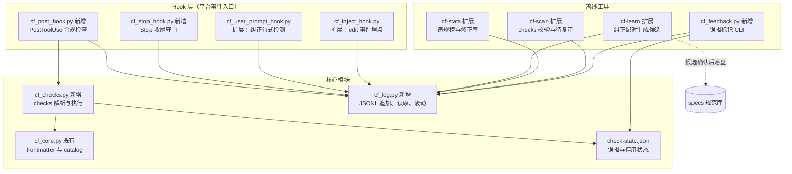

# Spec 质量双闭环 模块需求与设计一体化文档

> **文档编号**: MOD-QLOOP-v0.1
> **文档版本**: v0.1
> **创建日期**: 2026-06-12
> **文档状态**: 草稿

**评审边界说明**:
- **需求评审**: 第 2 章（继承自 PRD-2026-06-12-001 v0.2，已评审）
- **设计评审**: 第 3-4 章（技术设计 + 部署运维）
- **交接契约**: 2.5 验收条件 — 需求定义 What，设计实现 How

**ID 体系**: US（来自 PRD）、FEAT、API、RULE、TC（引用 S-/E-/B- 场景 ID）、RISK、NFR
**来源 PRD**: `.code-flow/tasks/2026-06-12/spec-quality-loop.prd.md`（同目录配对归档）

---

## 1. 文档控制

### 1.1 责任人

| 角色 | 姓名 | 职责范围 |
|------|------|---------|
| 产品经理 | 徐文彬 | 需求定义、业务验收 |
| 开发负责人 | 徐文彬 | 技术方案、代码实现 |
| 测试负责人 | 徐文彬 | 测试策略、质量保证 |

### 1.2 修订历史

| 版本 | 日期 | 作者 | 变更描述 |
|------|------|------|---------|
| v0.1 | 2026-06-12 | 徐文彬 | 初始草稿（PRD 派生，覆盖全部 8 FEAT + 前置会话日志） |
| v0.2 | 2026-06-12 | 徐文彬 | D-02 spike 回填：四平台事件能力矩阵实测全量支持，修订 §3.2 外部依赖清单 |

---

## 2. 需求分析

### 2.1 需求概述 [必填]

| 项目 | 内容 |
|------|------|
| **模块名称** | Spec 质量双闭环（合规反馈 + 学习沉淀） |
| **模块ID** | MOD-QLOOP |
| **所属系统/产品线** | code-flow（npm `@jahanxu/code-flow`，v0.5.0 catalog 注入地基之上） |
| **需求类型** | 新功能 |
| **业务背景** | spec 注入即结束：违规零后果（合规闭环缺失）、用户对话纠正全部丢弃（学习闭环缺失）；面向公开 npm 用户发布需默认安全可降级 |
| **核心目标** | 建立"注入 → 机检 → 反馈 → 修正"与"纠正 → 采集 → 候选 → 确认"两个闭环，公开用户开箱即用 |

### 2.2 痛点与价值 [必填]

| 维度 | 内容 |
|------|------|
| **目标用户** | 公开 npm 用户（四平台 AI 编码用户，零配置预期）+ 规范维护者 |
| **当前问题** | 违规只能 code review 人工兜底；cf-learn 实际运行 <1 次/周，纠正信号 100% 丢弃；无任何违规/有效性度量 |
| **业务影响** | 规范形同建议，规范库腐化（僵尸规则占据 1700 token 预算） |
| **预期价值** | 违规当场修正；纠正一次即沉淀；规范库自动演进且会做减法 |

**用户故事**：US-01~09 见 PRD §3.2，本文不重复（追溯见 §6 矩阵）。

### 2.3 功能方案 [必填]

#### 2.3.1 功能清单

| 功能ID | 功能名称 | 功能描述 | 优先级 | 来源 |
|--------|---------|---------|--------|------|
| FEAT-00 | 会话活动日志（前置依赖并入） | JSONL 事件日志：inject/edit/violation/correction/degrade，30 天/5MB 滚动 | P0 | PRD-2026-04-21 FEAT-02（US-01/05/06/07 数据地基） |
| FEAT-01 | PostToolUse 合规反馈 | frontmatter checks 机检变更内容，违规经 additionalContext 反馈，只提示不阻断 | P0 | US-01, US-02 |
| FEAT-02 | 发布护栏 | 能力开关 + 自动降级 + 误报对话反馈与自动降敏 | P0 | US-02, US-03 |
| FEAT-03 | Stop 收尾守门 | Stop hook 按 validation.yml 对会话变更文件跑校验 | P1 | US-04 |
| FEAT-04 | 纠正信号采集 | 纠正句式检测 + 离线配对 agent 修正编辑，喂 cf-learn 候选流 | P1 | US-05 |
| FEAT-05 | 违规度量 | cf-stats 输出 Top 违规规则榜（次数/趋势/域） | P1 | US-06 |
| FEAT-06 | spec 有效性复审标记 | cf-scan 输出待复审清单（未命中/违规不降/被否定） | P1 | US-07 |
| FEAT-07 | spec 示例化模板 | 模板与 cf-learn 候选支持 ✅/❌ 代码对照段 | P2 | US-08 |
| FEAT-08 | 任务-规范联动 | cf-task:start 将 design 验收节转为会话级临时 catalog 条目 | P2 | US-09 |

#### 2.3.2 字段约束 [按需]

**FEAT-01 checks 标注字段**（spec frontmatter，详见 API-01）

| 字段名 | 类型 | 必填 | 约束 | 说明 |
|--------|------|------|------|------|
| id | str | Y | kebab-case，spec 内唯一 | check 标识，误报治理/度量的主键 |
| type | str | Y | `regex`（P0）/`ast`/`cmd`（P1 扩展） | 机检方式，未知值跳过该条 |
| pattern | str | Y(regex) | 合法 Python re | 按行匹配变更内容 |
| files | str | N，默认 `**/*` | fnmatch glob | 适用文件过滤 |
| message | str | Y | ≤200 字符 | 反馈给 agent 的修正指引 |
| severity | str | N，默认 `warn` | `warn`/`info` | 无 `error`：本期只提示不阻断（PRD Out-of-Scope） |

### 2.4 范围与边界 [必填]

| 类别 | 内容 |
|------|------|
| **范围（In Scope）** | FEAT-00~08 全部；四平台 hook 注册模板；cf-stats/cf-scan 聚合；测试（单测 + golden 扩展） |
| **非范围（Out of Scope）** | LLM 语义判违规；候选自动落盘；阻断式拦截；CI/远程集成；ast/cmd 检查器的规则库建设（本期只留接口，内置规则仅 regex） |
| **前置假设** | Claude/Costrict 有 PostToolUse+Stop；codex/opencode 能力矩阵实施第一周验证（D-02）；用户修正经对话发生（团队约定） |
| **有意妥协 / 技术债** | ① ast/cmd 检查器接口先行、实现后置（避免过度设计）；② 配对算法用"同会话事件窗口"启发式而非语义匹配，误配对由 cf-learn 置信度 + 用户确认兜底；③ check-state 与 inject-state 暂为两个状态文件，未来若状态膨胀合并为 .state/ 目录 |

### 2.5 验收条件 [必填]

#### 2.5.1 业务规则与约束

| ID | 类型 | 描述 |
|----|------|------|
| RULE-01 | 系统约束 | 任何新能力异常不得使 hook 退出码 ≠0 或 stdout 非 JSON（NFR-REL-01） |
| RULE-02 | 业务规则 | 违规只反馈不阻断；severity 无 error 级 |
| RULE-03 | 业务规则 | 候选规范落盘必须用户确认；纠正信号仅本地存储 |
| RULE-04 | 系统约束 | 单 check 误报标记 ≥3 次或误报率 >10% 自动停用并在 cf-stats 标注 |
| RULE-05 | 系统约束 | 日志 30 天/5MB 滚动；损坏行读取时跳过不报错 |
| RULE-06 | 系统约束 | 全部新能力可经 `quality_loop.enabled: false` 一键回到 v0.5 行为 |

#### 2.5.2 功能验收场景

**正常场景**

| 场景ID | 功能ID | 优先级 | 前置条件 | 操作步骤 | 预期结果 |
|--------|--------|--------|---------|---------|---------|
| S-01 | FEAT-01 | P0 | spec 含 `no-print-debug` check | agent Edit 写入 `print("x")` | PostToolUse 输出含 check message 与规则原文的 additionalContext |
| S-02 | FEAT-00/01 | P0 | S-01 发生后 | agent 修正该文件且检查通过 | 日志含 violation→edit 序列，cf-stats 修正率分子 +1 |
| S-03 | FEAT-02 | P0 | S-01 反馈出现 | 用户回复"这不是调试代码，忽略"，agent 执行 `cf_feedback.py ignore no-print-debug` | false_positive 事件落日志；达 RULE-04 阈值后该 check 停用 |
| S-04 | FEAT-02 | P0 | 全新 `code-flow init` 项目 | 不改任何配置直接使用 | FEAT-01 生效、FEAT-04 采集生效、无需用户动作 |
| S-05 | FEAT-03 | P1 | validation.yml 含 `tests/**/*.py → pytest` | 会话编辑过测试文件后收尾 | Stop hook 执行 pytest 并反馈结果；全过则静默 |
| S-06 | FEAT-04 | P1 | — | 用户说"不要用 print 调试，改回去" | correction 事件落日志（原句+上下文文件） |
| S-07 | FEAT-04 | P1 | S-06 后 agent 修正了文件 | 运行 `cf-learn --review` | 候选含纠正原文 + 修正前后对照证据，标注置信度 |
| S-08 | FEAT-05 | P1 | 日志含 ≥2 种 violation | 运行 cf-stats | 输出 Top 违规榜（check_id/次数/spec/域） |
| S-09 | FEAT-06 | P1 | 某 spec 30 天未命中注入 | 运行 cf-scan | 待复审清单含该条目及原因"未命中 30 天" |
| S-10 | FEAT-07 | P2 | — | cf-init 部署骨架 spec | 含 `## Examples` ✅/❌ 段且注入压缩不破坏代码块 |
| S-11 | FEAT-08 | P2 | 任务 design 含验收节 | `/cf-task:start` 该任务 | Spec Catalog 出现临时条目；archive 后消失 |

**异常场景**

| 场景ID | 功能ID | 触发条件 | 系统行为 | 用户感知 |
|--------|--------|---------|---------|---------|
| E-01 | FEAT-01 | check pattern 非法正则 | 跳过该条 + cf-scan 报"checks 语法错误" | 无打扰，scan 时可见 |
| E-02 | FEAT-01 | 单 check 超时（>2s） | 跳过 + degrade 计数 | 无感知 |
| E-03 | FEAT-00 | 日志目录不可写 | 全部事件静默丢弃 + stderr 记录，主流程不受影响 | 无感知，cf-stats 显示 degraded |
| E-04 | 全部 | 平台无 PostToolUse/Stop 事件 | 该能力降级，cf-stats 标注平台原因 | 该平台仅享受注入+纠正采集 |
| E-05 | FEAT-03 | 项目无 validation.yml | 静默跳过 | 无感知 |
| E-06 | FEAT-04 | 用户说"不要紧"（句式误判） | 保守词表不命中；即使命中也仅日志事件，聚合阈值挡住候选生成 | 无任何可见噪音 |
| E-07 | FEAT-01 | spec 文件损坏/frontmatter 解析失败 | 该 spec 的 checks 跳过，注入不受影响 | 无感知 |
| E-08 | FEAT-08 | 任务 design 无验收节 | 静默跳过临时条目 | 无感知 |

**边界场景**

| 场景ID | 字段/条件 | 边界值 | 预期行为 |
|--------|----------|--------|---------|
| B-01 | 被编辑文件大小 | >256KB | 跳过检查（性能护栏），degrade 计数 |
| B-02 | 日志文件大小 | 达 5MB | 滚动归档至 `sessions/YYYY-MM/`，新文件继续 append |
| B-03 | 误报标记次数 | 第 3 次 ignore | 恰好触发 RULE-04 自动停用 |
| B-04 | check message 长度 | >200 字符 | cf-scan 告警，运行时截断输出 |

#### 2.5.3 非功能指标

继承 PRD §5 全部 8 条 NFR；其中量化项：

| 指标ID | 指标名称 | 目标值 | 测量方法 |
|--------|---------|-------|---------|
| NFR-PERF-01 | PostToolUse 检查 P95 增量 | ≤150ms（单 check 超时 2s 可配） | CF_DEBUG 埋点对比分布 |
| NFR-PERF-02 | Stop 收尾校验总耗时 | ≤30s（可配），超时输出已完成部分 | 同上 |
| NFR-REL-01/02 | hook 协议不破坏 / 降级等价未启用 | 100% | 故障注入测试（E-01~E-08） |

---

## 3. 技术设计

### 3.1 方案选型 [必填]

#### 关键决策记录（ADR）

| 决策点 | 选择 | 被否决项 | 理由 | 可逆性 |
|--------|------|---------|------|--------|
| checks 载体 | spec frontmatter `checks:` 列表 | 独立 checks.yml；规则行内标记 | 规则文本与机检定义同文件同 PR 评审，不脱节（config 集中词表与 spec 脱节是 D1 教训）；frontmatter 解析通道已存在（v0.5 `parse_spec_frontmatter`） | 易：解析层抽象，可加 checks.yml 兼容层 |
| 误报治理交互 | 对话即反馈（反馈文案自带提示，agent 代执行 `cf_feedback.py ignore`） | config 手动停用；新增 /cf-ignore 命令 | 与用户"全部经对话纠正"协作模式一致（memory: corrections-via-dialogue）；零新命令、四平台零适配 | 易：config `disabled_checks` 同时支持手动 |
| 日志格式 | JSONL append-only | 整文件 JSON 重写（inject-state 模式） | O(1) 追加、损坏隔离到单行、5MB 滚动天然支持；整文件重写在高频 edit 事件下放大 IO 与损坏面 | 难回退（schema 沉淀后迁移成本高），故 schema 留 `v` 字段 |
| 纠正配对时机 | cf-learn 离线配对（hook 只记原始事件） | hook 实时配对 | hook 热路径零额外开销（NFR-PERF-01）；配对启发式可离线迭代不动 hook | 易 |
| check 运行时状态 | 独立 `.code-flow/.check-state.json` | 写回 config.yml | 不碰用户配置文件（fileCategory user 保护；自动写 config 会破坏注释与排版） | 易 |
| 检查范围 | 仅本次编辑文件 + 匹配 domain 的 checks | 全量扫描工作区 | 增量检查 O(checks×1 文件)，全量是 O(checks×N) 且与"当场反馈"语义不符 | 易：cf-scan 可后续提供全量模式 |

#### 技术栈

| 类别 | 选型 | 版本 | 选型理由 |
|------|------|------|---------|
| 语言 | Python 标准库 + pyyaml | ≥3.8 | 既有约束（NFR-COMPAT-01），re/json/os 足够 |
| 数据 | JSONL 平文件 | — | 本地单机，无并发写热点（hook 串行触发） |
| 分发 | npm 模板部署 | 0.6.0 | 沿用 cli.js processDir/fileCategory 机制 |

### 3.2 架构设计 [必填]

#### 外部依赖清单（D-02 能力矩阵，2026-06-12 spike 实测）

| 平台 | PostToolUse 等价 | Stop 等价 | 验证方式 | 结论 |
|------|-----------------|----------|---------|------|
| Claude Code | PostToolUse ✓ | Stop ✓ | 官方协议 | 全量支持 |
| Costrict | PostToolUse ✓（Claude 协议兼容） | Stop ✓ | 同左 | 全量支持 |
| codex (0.138.0) | `post_tool_use` ✓ | `stop_hook` / `session_end` ✓ | 二进制事件标识探测 + hooks.state 命名规则（PascalCase key → snake_case 归一） | 全量支持；事件 key 命名待真机冒烟（R-04 余项） |
| opencode (1.15.13) | `tool.execute.after` ✓（插件转发） | `session.idle` ✓ | 官方插件文档 | 全量支持；反馈经下一轮 system.transform 注入（延迟一轮） |

| 外部系统 | 依赖类型 | 协议 | 超时 | 降级策略 |
|---------|---------|------|------|---------|
| validation.yml | FEAT-03 校验命令 | 子进程 | 30s 总额 | 缺失/超时跳过 |

> 设计原假设"codex/opencode 仅享受注入+纠正采集"被 spike 推翻——四平台全量覆盖；E-04 降级路径保留作为未知版本的兜底。

### 3.3 数据设计 [必填]

**新增 `.code-flow/.session-log.jsonl`**（事件一行一条；`v` 为 schema 版本）

| 字段名 | 类型 | 可空 | 说明 |
|--------|------|------|------|
| v | int | N | schema 版本，当前 1 |
| ts | str | N | ISO8601 秒级 |
| sid | str | N | resolve_session_id 结果 |
| event | str | N | `inject` / `edit` / `violation` / `correction` / `false_positive` / `degrade` / `stop_check` |
| data | object | N | 按事件类型的载荷（见下） |

事件载荷约定：`inject{specs[],mode,source}`；`edit{file,tool}`；`violation{check_id,spec,file,severity}`；`correction{phrase,prompt_head(≤200 字符),files[]}`；`false_positive{check_id}`；`degrade{component,error}`；`stop_check{trigger,cmd,passed}`

**新增 `.code-flow/.check-state.json`**（小文件，整写）

| 字段名 | 类型 | 说明 |
|--------|------|------|
| `<check_id>.fp_count` | int | 误报标记累计 |
| `<check_id>.hit_count` | int | 触发累计（误报率分母） |
| `<check_id>.disabled` | bool | RULE-04 自动停用或用户手动 |

**滚动策略**：append 前检查大小，≥5MB 重命名为 `sessions/YYYY-MM/session-log-<ts>.jsonl`；读取窗口默认 30 天（含归档当月）。

**容量预估**：单事件 ~200B；重度会话 ~500 事件/天 ≈ 100KB/天，5MB ≈ 50 天，滚动策略充分。

### 3.4 接口设计 [必填]

#### 形态 C：函数 / 库接口

| 接口ID | 函数签名 | 入参 | 返回 | 错误处理 | 实现 FEAT |
|--------|---------|------|------|---------|----------|
| API-01 | `cf_checks.parse_spec_checks(content: str) -> list` | spec 全文 | Check 列表（字段见 §2.3.2） | 非法条目跳过并附 parse_errors | FEAT-01 |
| API-02 | `cf_checks.run_checks(checks: list, rel_path: str, content: str, state: dict) -> list` | 预编译 checks、文件、变更内容、check-state | Violation 列表 | 单条超时/异常跳过，degrade 计数 | FEAT-01 |
| API-03 | `cf_log.append_event(root: str, event: str, data: dict, sid: str) -> bool` | — | 成败 | 失败 swallow + stderr，返回 False | FEAT-00 |
| API-04 | `cf_log.read_events(root: str, days: int = 30, events: tuple = ()) -> list` | 过滤窗口与类型 | 事件列表 | 损坏行跳过 | FEAT-00/05/06 |
| API-05 | `cf_checks.detect_correction(prompt: str) -> dict \| None` | prompt 全文 | `{phrase, span}` 或 None | 保守词表，宁漏勿误 | FEAT-04 |

#### 形态 B：CLI / Hook 入口

| 命令 | 参数 / Flag | 说明 | 退出码 |
|------|------------|------|--------|
| `cf_post_hook.py` | stdin: PostToolUse JSON（tool_name/tool_input/session_id） | 编辑文件 → 匹配 domain checks → 违规输出 `hookSpecificOutput.additionalContext`（含 message + 规则原文 + "误报可直接告诉我"提示）；无违规静默 | 恒 0（RULE-01） |
| `cf_stop_hook.py` | stdin: Stop JSON | 读日志取本会话 edit 文件 → 匹配 validation.yml trigger → 子进程跑校验 → 未过项输出反馈 | 恒 0 |
| `cf_feedback.py ignore <check-id>` | check id | 记 false_positive 事件 + 更新 check-state；达 RULE-04 阈值置 disabled | 0 / 2（未知 id） |
| `cf-stats`（扩展） | `--human` | 新增节：Top 违规榜、修正率、误报率、degraded 组件、平台能力矩阵 | 沿用 |
| `cf-scan`（扩展） | — | 新增 issues：checks 语法错误、message 超长、待复审清单（原因标注） | 沿用 |

> 反馈文案模板（FEAT-01 输出契约）：`⚠ <message>（规则: <spec>#<check_id>）\n违规行: <line_no>: <line>\n如认为误报，直接告诉我"这是误报"，我会标记忽略。`

#### FEAT-08 约定（命令文档层，无新脚本）

`cf-task:start` 提取 design §2.5 验收表生成 `.code-flow/specs/_session/task-<name>.md`（frontmatter description = "当前任务 <name> 的验收约束"）；`build_spec_catalog` 既有目录扫描自动纳入；`cf-task:archive` 删除该文件。`_session/` 加入 cf-scan 豁免（临时文件不计预算告警）。

### 3.5 质量实现方案 [必填]

#### 性能设计

| 指标ID | 热点路径 | 目标值 | 实现方案（含被放弃的较慢方案） |
|--------|---------|-------|------------------------------|
| NFR-PERF-01 | 每次 Edit/Write 后的 cf_post_hook | P95 增量 ≤150ms | ① 仅检查本次编辑文件（放弃全量扫描 O(N)）；② regex 模块加载时预编译 + frontmatter mtime 缓存（沿用 v0.5 catalog 缓存模式，放弃每次重析）；③ >256KB 文件跳过；④ 日志 append 单次 write 调用，放弃读-改-写 |
| NFR-PERF-02 | Stop 收尾校验 | 总额 ≤30s | 仅会话内 edit 过的文件触发 trigger（从日志取，放弃 git status 全扫）；命令并发=1 串行跑（简单优先，慢了再并发） |

#### 可靠性设计

| 风险ID | 失效模式 | 影响 | 应对措施 |
|--------|---------|------|---------|
| RISK-01 | 日志写失败/损坏 | 度量与学习数据缺失 | append 失败 swallow（E-03）；读取按行容错（RULE-05）；schema v 字段留迁移口 |
| RISK-02 | check 正则灾难性回溯 | hook 卡顿 | 单条超时 2s（signal/线程池二选一，design 定 `concurrent.futures` 单 worker）+ 停用计数 |
| RISK-03 | 平台事件缺失 | 能力不可用 | 启动探测 + cf-stats 平台矩阵标注（E-04） |

#### 安全性设计

| 指标ID | 验收标准 | 实现方案 |
|--------|---------|---------|
| NFR-SEC-01 | 纠正信号/违规事件不出本地 | 仅写 `.code-flow/`；correction 的 prompt_head 截断 200 字符（最小化存储）；README 显式声明 + 采集开关 |

#### 可观测性设计

| 场景 | 实现方案 |
|------|---------|
| 能力健康 | cf-stats：每能力 enabled/degraded_count/last_error |
| 调试 | 沿用 CF_DEBUG=1 → .debug.log，新 hook 同通道 |

---

## 4. 部署与运维

### 4.2 发布与回滚

| 阶段 | 范围 | 进入条件 | 回滚条件 |
|------|------|---------|---------|
| 0.6.0-beta（npm tag beta） | 维护者 + 内部试用 | 全量测试绿 + 故障注入过 | hook 协议破坏 / P95 超护栏 |
| 0.6.0 正式 | 公开用户 | beta 2 周基线报告（误报率 ≤10% 验证） | `quality_loop.enabled: false` 一键回 v0.5 行为 |

**配置开关**（config.yml，遵循 literal-only 解析惯例）：`quality_loop.{enabled, post_check, stop_check, correction_capture}` 全部缺省安全值；模板默认开、存量升级用户不被 merge 注入（顶层 key 合并规则）→ changelog 注明 opt-in 方式。

### 4.4 数据迁移

无存量数据迁移；`.session-log.jsonl` / `.check-state.json` 首次使用自动创建，加入 `.gitignore` 模板。

---

## 5. 风险与依赖

### 5.1 项目依赖

| 依赖模块/团队 | 依赖内容 | 状态 | 风险等级 |
|-------------|---------|------|---------|
| D-01 上游 hook 协议 | PostToolUse/Stop stdin schema | Claude/Costrict 已知可用 | 中 |
| D-02 codex/opencode 能力矩阵 | 事件子集验证 | **实施第一周完成验证** | 中 |
| D-03 v0.5 catalog 地基 | frontmatter 解析、catalog 扫描 | 已交付 | 低 |

### 5.2 风险识别

继承 PRD §7.2 R-01~R-06；设计层补充：

| 风险ID | 类型 | 描述 | 概率 | 影响 | 应对措施 |
|--------|------|------|------|------|---------|
| RISK-04 | 设计 | frontmatter checks 让 spec 文件变重，作者维护意愿下降 | 中 | 中 | checks 全可选；cf-learn 候选自动生成 checks 草稿降低手写成本 |
| RISK-05 | 设计 | 反馈文案占用上下文 token | 低 | 低 | 单次反馈 ≤300 token；同 check 同文件会话内只报一次 |

---

## 6. 需求追溯矩阵

| 用户故事 | 功能ID | 接口ID | 测试用例ID | 状态 |
|---------|--------|--------|-----------|------|
| US-01 | FEAT-01 | API-01/02、cf_post_hook | S-01, S-02, E-01, E-02, E-07, B-01, B-04 | 待开发 |
| US-02 | FEAT-02, FEAT-00 | API-03/04、配置开关 | S-04, E-03, E-04, B-02 | 待开发 |
| US-03 | FEAT-02 | cf_feedback.py | S-03, B-03 | 待开发 |
| US-04 | FEAT-03 | cf_stop_hook | S-05, E-05 | 待开发 |
| US-05 | FEAT-04 | API-05、cf-learn 扩展 | S-06, S-07, E-06 | 待开发 |
| US-06 | FEAT-05 | cf-stats 扩展 | S-08 | 待开发 |
| US-07 | FEAT-06 | cf-scan 扩展 | S-09 | 待开发 |
| US-08 | FEAT-07 | 模板 + cf-learn 输出 | S-10 | 待开发 |
| US-09 | FEAT-08 | cf-task:start/archive 约定 | S-11, E-08 | 待开发 |

> 矩阵闭合自检：9 US 全覆盖；FEAT-00 作为 US-02（零配置可靠）与数据地基挂接；全部 TC 引用 §2.5.2 场景 ID，无断点。

---

## 附录：术语表

沿用 PRD 术语表；补充：

| 术语 | 定义 |
|------|------|
| check-state | `.code-flow/.check-state.json`，check 触发/误报/停用的运行时状态 |
| 事件窗口配对 | cf-learn 离线将 correction 事件与同会话其后的 edit 事件关联为证据对 |
| `_session/` | 会话级临时 spec 目录，cf-task:start 写入、archive 清理 |

---

*文档结束*
