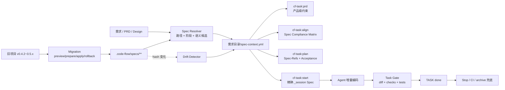
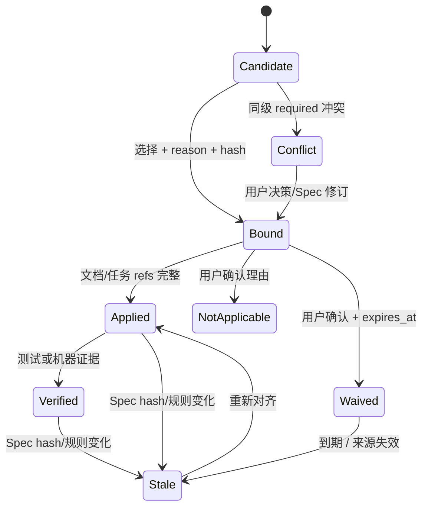
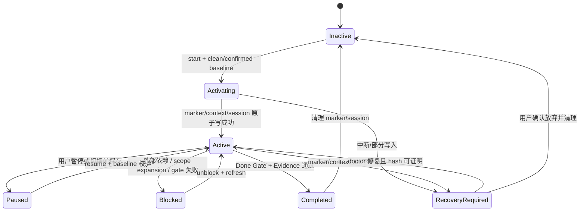
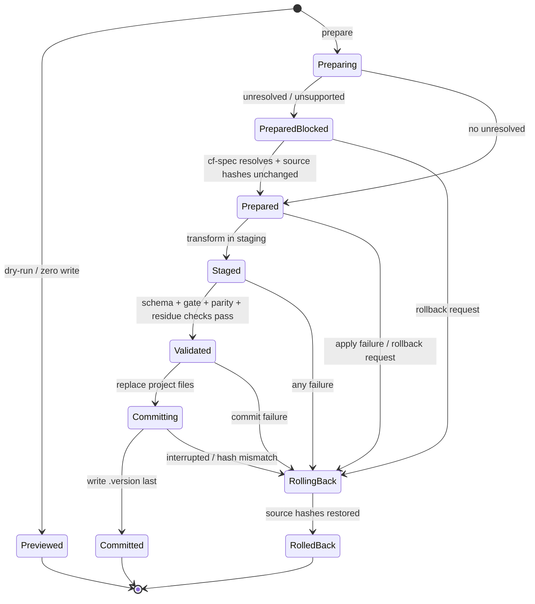

# Spec 驱动开发工作流模块需求与设计一体化文档

> **文档编号**: MOD-SDD-v0.1
> **文档版本**: v0.3
> **创建日期**: 2026-07-16
> **文档状态**: 草稿（六项阻塞设计已闭合，待设计确认）
> **来源**: 2026-07-16 对话对齐，无独立 PRD

**评审边界说明**:
- **需求评审**: 第 2 章，确认“从 PRD/Design/Plan 开始消费已有 Specs，而非编码完成后首次检查”的目标与范围。
- **设计评审**: 第 3-4 章，确认任务级 Spec Context、阶段门禁、增量验证、兼容与发布方案。
- **交接契约**: §2.5 验收场景直接作为 `cf-task:plan` 的 Acceptance Coverage 来源。

**ID 体系**: US（用户故事）、FEAT（功能）、API（CLI/函数入口）、RULE（系统约束）、NFR（非功能指标）、RISK（风险）。测试用例直接引用 S-/E-/B- 场景 ID。

---

## 1. 文档控制

### 1.1 责任人

| 角色 | 姓名 | 职责范围 |
|------|------|---------|
| 产品负责人 | 待定 | 工作流目标、阶段体验、验收指标 |
| 开发负责人 | 待定 | Spec Context、阶段门禁、四平台适配 |
| 测试负责人 | 待定 | 追溯、漂移、跨平台端到端验收 |

### 1.2 修订历史

| 版本 | 日期 | 作者 | 变更描述 |
|------|------|------|---------|
| v0.1 | 2026-07-16 | Codex | 基于对话对齐生成初始设计草稿 |
| v0.2 | 2026-07-16 | Codex | 改为一次性事务迁移；补充旧能力删除矩阵、迁移算法、失败回滚和唯一目标运行链路 |
| v0.3 | 2026-07-16 | Codex | 补齐 Rule verifier、Context 分层 hash/确认溯源、迁移命令状态机、Active Task 生命周期、源版本/旧布局迁移矩阵和 Node/Python 实现边界 |

---

## 2. 需求分析

### 2.1 需求概述

| 项目 | 内容 |
|------|------|
| **模块名称** | Spec 驱动开发工作流（Spec-Driven Development） |
| **模块ID** | MOD-SDD |
| **所属系统** | code-flow：`cf-task:prd` / `align` / `plan` / `start` / `archive`、Spec 注入与质量闭环 |
| **需求类型** | 架构演进 / 工作流增强 |
| **业务背景** | 当前 Catalog/路径注入主要解决“让 Agent 看见规范”，任务工作流主要追溯需求与验收；两者只在 `cf-task:start` 生成 `_session` 临时验收 Spec 时发生弱联动。PRD、Design、Plan 阶段没有统一的 Applicable Specs 集合、规则承接状态与版本快照，导致规范可能到编码后或最终检查才首次暴露冲突。 |
| **核心目标** | 在任务开始时建立版本化 Spec Context，让 PRD、Design、Plan、Coding、Done/Archive 分阶段继承并落实相关规范；问题优先在设计和任务拆解阶段暴露，最终检查仅作安全网。 |

### 2.2 痛点与价值

| 维度 | 内容 |
|------|------|
| **目标用户** | 使用 code-flow 进行需求、设计、拆解和编码的产品经理、架构师、开发者与规范维护者 |
| **当前问题** | ① Catalog 可见不等于读取；② 每阶段独立判断规范，缺少继承；③ Design/Plan 没有 Spec 追溯矩阵；④ Spec 变更后旧任务无漂移提示；⑤ 检查多在编辑后或收尾，返工发生得过晚。 |
| **业务影响** | Agent 可能基于不完整约束做出早期设计决策，后续才发现兼容、安全、测试或架构规则冲突，导致设计、任务和代码联动返工。 |
| **预期价值** | 规范从“上下文提醒”升级为“贯穿交付链路的设计输入与验收契约”；缩小违规发现与产生之间的距离，提高首次实现合规率，降低最终阶段返工。 |

**用户故事**

| 编号 | 用户故事 | 优先级 |
|------|---------|--------|
| US-01 | 作为产品经理，我希望 PRD 自动识别会影响产品范围的已有规范，以免需求承诺与平台、安全或兼容约束冲突。 | P0 |
| US-02 | 作为架构师，我希望 Design 将适用规范逐条转化为设计决策、验证方式或 N/A 理由，以免编码阶段才补设计。 | P0 |
| US-03 | 作为任务规划者，我希望 Plan 把 Spec 决策映射到 TASK、Checklist 与 Acceptance Contract，以便实现工作可直接执行。 | P0 |
| US-04 | 作为开发者，我希望 `cf-task:start` 精确加载当前任务绑定的 Specs、设计章节和验收契约，并在子任务内增量验证，以免最终全量返工。 | P0 |
| US-05 | 作为规范维护者，我希望任务能检测 Spec 版本漂移、冲突、遗漏与实际修改范围扩张，以免旧设计继续使用过期规则。 | P0 |
| US-06 | 作为项目负责人，我希望看到从 Spec 绑定到最终验证的完整追溯和“晚发现违规率”，判断工作流是否真的减少返工。 | P1 |
| US-07 | 作为项目维护者，我希望升级时一次性完成 Specs、活跃任务、配置、指令和运行状态迁移，并删除旧链路，以免长期维护双轨行为。 | P0 |

### 2.3 功能方案

#### 2.3.1 功能清单

| 功能ID | 功能名称 | 功能描述 | 优先级 | 来源 |
|--------|---------|---------|--------|------|
| FEAT-01 | 阶段化 Spec 元数据 | 为约束 Spec 增加稳定 ID、适用阶段、强制等级和规则标识；旧 Spec 由 FEAT-09 一次性转换，不保留运行时兼容分支。 | P0 | US-01/02/05 |
| FEAT-02 | 任务级 Spec Context | 在需求目录生成 `spec-context.yml`，记录 Applicable Specs、hash、选择原因、阶段状态和落点引用。 | P0 | US-01~05 |
| FEAT-03 | PRD/Align 规范前移 | PRD 只消费产品级约束；Align 消费设计级约束并生成 Spec Compliance Matrix。 | P0 | US-01/02 |
| FEAT-04 | Plan 规范契约化 | Plan 把设计中的 Spec 决策拆成任务级 `Spec-Refs`、Checklist、验收场景与验证命令。 | P0 | US-03 |
| FEAT-05 | Start 精确上下文 | Start 按当前 TASK 的 `Spec-Refs` 生成 `_session` 临时 Spec，包含精确规则、hash、设计落点和验收契约。 | P0 | US-04 |
| FEAT-06 | 阶段门禁与漂移检测 | 在 PRD/Design/Plan/Start/Done/Archive 前验证 required 规范覆盖、N/A 理由、冲突和 hash 漂移。 | P0 | US-01~05 |
| FEAT-07 | 子任务增量验证 | 每个 TASK 完成前对当前 diff 执行绑定 checks、测试与 Acceptance Contract；最终 Stop/CI 只兜底。 | P0 | US-04/05 |
| FEAT-08 | 追溯与效果度量 | 记录 catalog→bind→read→apply→check→fix→validate 事件，并统计覆盖率、首次合规率和晚发现违规率。 | P1 | US-06 |
| FEAT-09 | 一次性迁移与旧能力清理 | 事务式迁移 Specs、活跃任务、配置和 Agent 指令；成功后同版本删除旧注入/状态/命令语义，不保留双轨运行时。 | P0 | US-07 |
| FEAT-10 | Required Rule 验证器契约 | 为每条 required Rule 绑定可执行 verifier；支持文档追溯、regex、AST、command/test 和受控人工验证，缺失、不可运行或证据不匹配均阻断。 | P0 | US-02/03/04/05 |

#### 2.3.2 Spec 元数据约定

迁移器一次性把所有可注入 Spec 转换到新 frontmatter；迁移完成后的运行时不再接受缺失 `id/stages/enforcement` 的约束 Spec。`description` 与 `checks` 保持原语义：

```yaml
---
id: scripts-code-standards
description: 改 Python 脚本/Hook/注入逻辑时适用
stages: [design, plan, code, review]
enforcement: required
owner: code-flow-maintainers
checks:
  - id: no-print-debug
    type: regex
    pattern: '^\s*print\('
    files: '*_hook.py'
    message: Hook 脚本禁止 print() 输出到 stdout
verifiers:
  - rule: RULE-scripts-001
    type: regex
    config:
      check_id: no-print-debug
---
```

| 字段 | 类型 | 必填 | 默认/约束 | 用途 |
|------|------|------|-----------|------|
| `id` | string | 是 | kebab-case，全库唯一；迁移时由规范化路径生成并写回文件 | 稳定追溯键 |
| `description` | string | 是 | 单行适用性描述 | Catalog 与语义选择 |
| `stages` | list | 是 | 迁移默认：Tier1 `[design, plan, code, review]`、Tier0 `[prd, design, plan, code]`、`_session` `[code, review]`；产品/安全/兼容规则由迁移计划显式提升到 `prd` | 控制阶段消费 |
| `enforcement` | string | 是 | `required` / `advisory`；约束 Spec 迁移默认 `required`，导航 Map 默认 `advisory`，例外必须写入迁移计划 | 决定阻断或提示 |
| `owner` | string | 否 | 待定 | 冲突、豁免和复审责任 |
| `checks` | list | 否 | 沿用现有 schema | 机器执行规则 |
| `verifiers` | list | required Rule 必填 | 每项含 `rule/type/config`；`type` 仅允许 `document/regex/ast/command/test/manual` | 把自然语言 Rule 绑定到确定性验证器 |

迁移器为 `## Rules` 和 `## Anti-Patterns` 下的普通 bullet 按文件顺序写入稳定的 `- [RULE-<domain>-NNN] <规则文本>`；已有 ID 保留。两类章节默认 `required`，每条规则都必须有 verifier；`## Patterns` 默认 `advisory`，`## Examples` 仅作信息，不参与 Gate。迁移完成后不生成 `legacy-<content-hash8>` 临时引用，避免同一规则长期存在两种身份。

Verifier 执行契约：

| 类型 | 配置 | 成功证据 | 失败语义 |
|------|------|---------|---------|
| `document` | artifact type、section/item ID、字段 schema | 引用的 PRD/Design/Task 条目存在且内容 hash 匹配 | required 阻断当前阶段 |
| `regex` | 复用 `checks[].id`，或 pattern/files | 当前 diff 无违规匹配 | 检查不可执行或命中均阻断 |
| `ast` | language、query/rule、files | 解析成功且断言成立 | parser 不支持、语法错误或断言失败均阻断 |
| `command` / `test` | argv 模板、cwd、timeout、允许退出码 | 命令、退出码、stdout/stderr 摘要及产物 hash | 超时、命令缺失或非允许退出码均阻断 |
| `manual` | checklist、适用的外部边界、owner | 用户确认人、时间、理由、证据引用和可选失效时间 | 不能被 Agent 自行确认；缺任一溯源字段即阻断 |

`cf_checks.py` 当前只实现 regex；本 release 必须在同一变更集中实现上表执行器和 schema 校验。任何 required Rule 未绑定 verifier 都是 `verifier_missing`，在迁移 preflight、Plan Gate 和 Done Gate 阻断，不能退化成“已注入即已遵循”。

Evidence 最小字段为 `verifier_ref/executed_at/status/rule_text_sha256/artifact_sha256/diff_sha256/result_sha256`；某 verifier 不使用 artifact 或 diff 时对应字段显式为 `null`，不能省略。manual 额外复用 `decision` 确认字段。任一非 null 输入 hash 改变，旧 Evidence 自动成为 `stale_evidence`。`ast` 在 0.6.0 只承诺 Python 标准库 `ast` adapter；JavaScript 规则必须选择 regex、无 shell 的 argv command/test 或 document verifier，禁止在无 parser 的情况下伪装 AST 通过。原 schema check 映射为 document/regex，dependency check 映射为 command/test，不保留未实现的类型名。command/test 以 argv 数组直接启动，不拼 shell 字符串。

#### 2.3.3 `spec-context.yml` 数据模型

文件固定放在需求目录，与 PRD/Design/Task 一起归档：

```yaml
version: 1
task: spec-driven-development
enforcement: required
updated_at: '2026-07-16T00:00:00+08:00'
sources:
  - type: conversation
    ref: 2026-07-16-spec-driven-alignment
bindings:
  - spec_id: scripts-code-standards
    path: scripts/code-standards.md
    hashes:
      file_sha256: '<raw-file-sha256>'
      metadata_sha256: '<normalized-frontmatter-sha256>'
      rules_sha256: '<normalized-required-rules-sha256>'
    selected_by: path+agent
    reason: 需求涉及 Python 工作流脚本与 Hook
    enforcement: required
    stages: [design, plan, code, review]
    rules:
      - ref: RULE-scripts-001
        summary: Hook stdout 必须保持 JSON 协议
        text_sha256: '<normalized-rule-text-sha256>'
        enforcement: required
        verifier_ref: scripts-code-standards#RULE-scripts-001
        stage_status:
          design:
            status: applied
            refs:
              - artifact: spec-driven-development.design.md
                section_id: '3.5'
                item_id: RULE-scripts-001
                artifact_sha256: '<artifact-sha256-at-confirmation>'
            decision: null
          plan:
            status: pending
            refs: []
            decision: null
          code:
            status: pending
            refs: []
            decision: null
            evidence: []
```

`stage_status.status` 仅允许：

- `pending`：尚未处理，required 时阻断对应阶段完成。
- `applied`：已有明确文档/任务/测试落点，`refs` 不得为空。
- `not_applicable`：必须有 `decision.reason/confirmed_by/confirmed_at/source`；required 规则只能由用户逐项确认，Agent 不得自行或批量 N/A。
- `waived`：仅作有时限的 break-glass；必须有 `decision.reason/confirmed_by/confirmed_at/source/expires_at`，到期自动变为 stale。
- `verified`：编码后已有测试或机器检查证据。
- `stale`：Spec hash 或规则内容变化，需重新对齐。
- `conflict`：同级 required 规则互斥，等待用户决策或 Spec 修订。
- `unverified`：verifier 未运行、失败或不可用；required 时阻断。

确认记录采用固定结构：

```yaml
decision:
  kind: not_applicable # 或 waived/manual_verification
  reason: '<specific-reason>'
  confirmed_by: '<user-or-reviewer-id>'
  confirmed_at: '<rfc3339>'
  source: '<platform-session-and-message-ref>'
  expires_at: null # waived 必填，其他类型可为 null
```

漂移采用分层 hash：`metadata_sha256` 变化只重新解析候选与阶段信息；`rules_sha256` 或单条 `text_sha256` 变化才使对应 rule 状态 stale；`file_sha256` 用于审计和迁移恢复，不能单独触发全任务返工。`refs[].artifact_sha256` 用于检测设计/任务落点被改写，`decision` 则证明 N/A/豁免来自哪次用户确认。

### 2.4 范围与边界

| 类别 | 内容 |
|------|------|
| **范围（In Scope）** | Spec 元数据与稳定 RULE ID 一次性迁移；活跃任务 `spec-context.yml` 回填；PRD/Align/Plan/Start/Done/Archive 阶段集成；漂移/冲突/范围扩张检测；任务级增量验证；旧注入、状态、命令和指标语义清理；四平台命令/Skill 同步；统计指标。 |
| **非范围（Out of Scope）** | 向量数据库或远程语义检索；自动修改业务需求以迎合技术规范；取消最终 CI/人工评审；自动批准 required 规则豁免；回填已归档任务的历史 Spec Context（归档目录保持只读）。 |
| **前置假设** | 项目已通过 code-flow 初始化；Specs 位于 `.code-flow/specs/`；任务文档使用现有需求目录布局；PyYAML 可用；四平台至少能读取文件并执行本地 Python。 |
| **有意妥协 / 技术债** | 采用“确定性路径/阶段筛选 + Agent 语义选择 + 机器验证清单”的混合方案，不引入向量检索；真实 Agent 遵循度需平台 E2E 评测。为避免双轨复杂度，升级若无法完成迁移将整体失败并恢复备份，不提供旧运行时兼容模式。 |

### 2.5 验收条件

#### 2.5.1 业务规则与系统约束

| ID | 类型 | 描述 | 验证场景 |
|----|------|------|---------|
| RULE-01 | 系统约束 | required Spec/Rule 在当前阶段只能为 applied、verified、经用户确认的 not_applicable 或未过期 waived；pending/stale/conflict/unverified 必须阻断阶段完成。 | S-01~06, E-03/04/06, B-06/07 |
| RULE-02 | 追溯约束 | Design 的 Spec 决策必须能追溯到 Plan TASK；TASK 的 required Spec-Refs 必须能追溯到 Acceptance Contract/Evidence。 | S-02~05 |
| RULE-03 | 继承约束 | 后一阶段继承前一阶段的 Spec Context，不得重新生成后静默丢弃既有 required binding。 | S-02~05, E-05 |
| RULE-04 | 漂移约束 | Rule 正文 hash 或 artifact ref hash 变化后，仅对应未完成状态标记 stale；metadata-only 变化重新解析但不推翻已承接规则。 | S-06/14, E-04/12 |
| RULE-05 | 范围约束 | 实际修改文件命中新 required Spec 且未在 Context 中时，必须暂停当前 TASK、补绑定并评估是否需要更新 Design/Plan。 | S-07, E-05 |
| RULE-06 | 迁移约束 | 升级必须按 preview/prepare→stage→validate→commit 执行；任一步失败恢复全部备份且不得写新 `.version`，项目中不得留下新旧混合状态。 | S-09/11, E-08/09, B-03/05/08 |
| RULE-07 | 协议约束 | 新增 Python CLI/Hook stdout 机器模式必须是合法 JSON，诊断只写 stderr；错误显式降级或阻断，不得静默标记通过。 | E-01/02/06 |
| RULE-08 | 冲突约束 | 优先级为 task/session > path/domain > global；同级 required 规则冲突时必须阻断并由用户决策，不允许 Agent 自选。 | S-08, E-03 |
| RULE-09 | 唯一链路约束 | 迁移成功后任务模式只允许 Spec Context 驱动；旧 `full` 注入、prompt 词表主匹配、任务内 Catalog 自取、旧 `_session` 生成、日志单源 Stop 和 `cf-inject` 入口必须同时删除。 | S-11, E-10 |
| RULE-10 | 验证器约束 | 每条 required Rule 必须绑定合法 verifier；Plan 必须为 verifier 分配 TASK，Done 必须有与当前 Rule/artifact/diff hash 匹配的成功证据。 | S-13, E-06/11 |
| RULE-11 | 活跃任务约束 | 同一 worktree 同时只能有一个 active TASK；实际修改范围以“已确认预存路径 + Start 后 Git 增量”为权威，预存脏改动必须阻断或由用户逐路径归属。 | S-15, E-05/13, B-09 |

#### 2.5.2 功能验收场景

**正常场景**

| 场景ID | 功能ID | 优先级 | 测试层级 | 关键真实边界 | 前置条件 | 操作步骤 | 预期结果 |
|--------|--------|--------|---------|-------------|---------|---------|---------|
| S-01 | FEAT-01/02/03 | P0 | integration | Spec 文件 → resolver → PRD 草稿 + spec-context | 存在标注 `stages: [prd]` 的 required Spec | 执行 `cf-task:prd` 生成需求 | PRD 含 Existing Spec Constraints；Context 记录 hash、reason、prd applied refs；无关 code-only Spec 不进入 PRD。 |
| S-02 | FEAT-02/03/06 | P0 | integration | PRD/对话需求 → Align Skill → Design 文件 + Context | Context 含 design 阶段 required Rule | 执行 `cf-task:align` | Design 生成 Spec Compliance Matrix；每条 required Rule 有设计落点、验证方式或经确认的 N/A。 |
| S-03 | FEAT-04/06 | P0 | integration | Design → Plan Skill → Task/Acceptance 文件 | S-02 已 applied | 执行 `cf-task:plan` | 每条 design required Rule 映射到至少一个 TASK 的 Spec-Refs、Checklist 和 Acceptance Contract；缺口阻断任务生成。 |
| S-04 | FEAT-05/06 | P0 | E2E | Task 文件 → Start Skill → `_session` Spec → Agent 上下文 | TASK 有 Spec-Refs 且 hash 未变化 | 执行 `cf-task:start TASK-xxx` | 编码前精确读取绑定 Spec/Design/Contract；临时 Spec 只含当前 TASK 相关规则并携带 refs/hash。 |
| S-05 | FEAT-07 | P0 | E2E | Agent 修改 → git diff → checks/tests → Acceptance Evidence | 当前 TASK 已 in-progress | 完成一个 Checklist 项并尝试标记 done | 只验证当前 diff 与 TASK 合同；违规在 TASK done 前反馈并修复，Evidence verified 后才允许 done。 |
| S-06 | FEAT-06 | P0 | integration | Spec 文件 hash → Context → Start Gate | 任务生成后修改绑定 Spec | 再执行 Start/Done | 受影响 binding 标记 stale，输出变更摘要与受影响 refs；重新对齐前阻断。 |
| S-07 | FEAT-05/06 | P0 | E2E | 实际 git diff → path_mapping → Context 扩展 | 编码中新增原计划外目录文件 | Agent 尝试继续编码 | 系统识别新 required Spec，暂停 TASK，要求补 Context；若影响架构则回写 Design/Plan。 |
| S-08 | FEAT-01/06 | P0 | integration | 多层 Spec → precedence resolver | task Spec 与 global advisory 冲突 | 解析 Context | 高优先级 task Spec 生效并记录覆盖；同级 required 冲突返回 conflict 并阻断。 |
| S-09 | FEAT-01/06/09 | P0 | E2E | 旧项目 → migration journal → 新 Specs/Context/config | Spec 无 id/stages/enforcement，存在未归档 Design/Task | 执行升级迁移并确认计划 | 所有可注入 Spec 获得稳定 metadata/RULE ID；活跃需求目录生成 Context；新 Gate 全部通过后一次性提交并写新版本。 |
| S-10 | FEAT-08 | P1 | integration | 事件日志 → cf-stats | 至少完成一次完整任务 | 运行 `cf-stats` | 展示绑定覆盖、阶段承接、首次合规、晚发现违规、stale/conflict/N/A 数量，且可追溯到 task/spec。 |
| S-11 | FEAT-09 | P0 | integration | 迁移后文件树 → runtime/commands/tests | S-09 成功 | 搜索并执行注入、Start、Stop、统计入口 | 旧命令、配置键、状态字段和任务内旧路由均不存在；有任务走 Context，无任务按路径直注或 Catalog 兜底。 |
| S-12 | FEAT-09 | P0 | integration | migration journal → second invocation | 已成功迁移 | 再次执行迁移 | 返回 already_migrated，所有用户文件 hash 不变，无重复 RULE ID/Context binding。 |
| S-13 | FEAT-10 | P0 | integration | required Rule → verifier registry → Evidence → Done Gate | Rule 分别绑定 document/regex/AST/test verifier | 执行 Plan Gate 与 Done Gate | Plan 生成 verifier 任务；全部执行器产出带 rule/artifact/diff hash 的证据，证据新鲜时允许 done。 |
| S-14 | FEAT-02/06 | P0 | integration | 分层 hash → drift comparator | 仅修改 Spec owner/description，不改 required Rule | 执行 refresh | metadata hash 更新并重新解析候选，既有 applied/verified 状态不 stale。 |
| S-15 | FEAT-05/07 | P0 | E2E | 脏工作树 → active baseline → TASK 切换 | Start 前存在业务文件改动 | 用户确认将改动归属当前 TASK，再开始和完成 TASK | baseline 记录逐路径状态/hash；Done 仅纳入归属后的增量；切换 TASK 前前一 TASK 已完成或显式暂停且无未归属 diff。 |

**异常场景**

| 场景ID | 功能ID | 测试层级 | 关键真实边界 | 触发条件 | 系统行为 | 用户感知 |
|--------|--------|---------|-------------|---------|---------|---------|
| E-01 | FEAT-01/02 | integration | 损坏 frontmatter → parser | stages/enforcement/schema 非法 | 标记 metadata_error；required 判定不可信时阻断，advisory 时告警；不得当作“无适用规范”。 | 明确显示文件、字段和修复建议。 |
| E-02 | FEAT-02/06 | integration | 缺失 Spec 文件 → gate | Context 引用文件被删除/改名 | 标记 missing/stale 并阻断 required 阶段；提供重新 resolve 建议。 | 不出现静默跳过。 |
| E-03 | FEAT-06 | integration | precedence resolver | 两条同级 required Rule 互斥 | 返回 conflict 列表，不写 applied 状态。 | 要求用户选择、改 Spec 或记录有时限豁免。 |
| E-04 | FEAT-06 | integration | hash comparator | Spec 只改说明或规则 | 说明变化仅刷新 metadata；规则正文变化标记 stale，并列出变化的 rule refs。 | 只重对齐受影响部分，不推倒全部任务。 |
| E-05 | FEAT-05/06 | E2E | git diff → domain matcher → Design/Plan | 新文件带来未规划的 required 规范 | 暂停当前 TASK；创建待处理 binding；不得继续标记 done。 | 提示是局部补 Plan 还是回到 Align。 |
| E-06 | FEAT-07 | integration | validator process → gate | 检查器超时、异常或不可用 | required 验证状态为 unverified 并阻断；advisory 记录 degraded 后继续。 | 不把“未运行”显示成“通过”。 |
| E-07 | FEAT-08 | integration | 本地日志写入失败 | `.code-flow/` 不可写 | 工作流主体继续，但阶段结果标记 metrics_degraded；stderr 输出错误。 | 不影响文档生成，但统计页明确数据不完整。 |
| E-08 | FEAT-09 | E2E | 备份 → staging → 原文件树 | apply/validate 中任一步失败 | 按 journal 逆序恢复全部被改文件，删除 staging，新 `.version` 不落盘。 | 输出失败阶段、恢复结果和可重试命令；项目继续由旧版本工具工作。 |
| E-09 | FEAT-09 | integration | 活跃任务 → backfill resolver | 旧任务来源/状态无法唯一映射到 Specs | preflight 标记 unresolved 并拒绝 apply；不做部分迁移。 | 要求用户在 migration plan 中补选择/N/A 后整体重试。 |
| E-10 | FEAT-09 | integration | 新 runtime → removed symbol/config detector | 仍发现 `inject.mode: full`、`_TAG_ALIASES` 主路由、`injected_specs` 或 `cf-inject` 适配器 | commit gate 失败并触发回滚。 | 明确列出残留文件和符号。 |
| E-11 | FEAT-10 | integration | verifier schema/runner → Gate | required Rule 无 verifier、类型未实现、执行超时或 Evidence hash 不匹配 | 状态为 verifier_missing/unverified/stale_evidence 并阻断；不得用注入记录或 Agent 自述代替。 | 显示 Rule、执行器、失败原因和修复命令。 |
| E-12 | FEAT-02/06 | integration | Rule/artifact hash → Context | required Rule 正文或已承接 artifact 条目变化 | 仅受影响 Rule/阶段标记 stale；保留无关规则 Evidence。 | 显示旧/新 hash 与需重对齐的 refs。 |
| E-13 | FEAT-05/07 | E2E | `.active-task.json` → Start/Done | 已有 active TASK、状态损坏，或发现未归属的 pre-existing diff | fail-closed；要求 complete/pause/repair 或逐路径确认归属，禁止覆盖 active marker。 | 不会把其他任务改动算进当前 TASK。 |

**边界场景**

| 场景ID | 测试层级 | 关键真实边界 | 条件 | 预期行为 |
|--------|---------|-------------|------|---------|
| B-01 | integration | 500 个 Spec 元数据 → resolver | Catalog 超出 token 预算 | 机器 resolver 扫描全部 metadata，展示层分页/裁剪；required 候选不得因 Catalog 截断消失。 |
| B-02 | integration | 一个 TASK → 50 条 Rule bindings | 大型跨域任务 | 按 required、阶段、优先级裁剪注入；完整 Context 仍保存在文件中，超限提示拆分 TASK。 |
| B-03 | E2E | 多个活跃需求目录 → migration staging | 同时存在 draft/in-progress/blocked Task | 全部活跃任务一次性回填 Context；无法解析任一目录则整体不 commit。 |
| B-04 | integration | archived 任务目录 → migrator | 历史任务无 Context | 归档任务保持只读且不回填；新运行时不会把 archived 目录视为活跃任务。 |
| B-05 | integration | 迁移文件数/中断点 | 最后一项替换后、写版本前进程终止 | 下次运行读取 journal，验证目标 hash 后完成 commit 或恢复，不重复修改。 |
| B-06 | integration | required N/A/manual verifier → confirmation store | Agent 尝试批量 N/A 或自行确认 manual | 拒绝写入；只有逐项用户确认且字段完整的 decision/evidence 可通过。 |
| B-07 | integration | waiver expiry → Stage Gate | 到达 `expires_at` 或确认来源不可解析 | 自动 stale 并阻断，不沿用过期豁免。 |
| B-08 | integration | migration dry-run → filesystem snapshot | dry-run 前后比较项目内容 | stdout 仅一个 JSON 预览，项目内零新增/修改/删除文件，包括 migrations 目录。 |
| B-09 | integration | Agent/进程崩溃 → active task doctor | `.active-task.json` 留在 activating/active/paused | doctor 对照 task 状态与 Git 基线安全恢复、继续或要求用户处理；不静默清理。 |

#### 2.5.3 非功能指标

| 指标ID | 类型 | 指标名称 | 目标值 / 验收方式 |
|--------|------|---------|------------------|
| NFR-REL-01 | 可靠性 | required 规范漏承接 | 结构化测试集内 0 条；任何 pending/stale/conflict 均不能被标记完成。 |
| NFR-REL-02 | 可靠性 | 未验证误报为通过 | 0 次；检查器失败必须是 unverified/degraded。 |
| NFR-REL-03 | 可靠性 | required Rule 验证缺口 | 0 条；required Rule 无可执行 verifier、证据缺失或证据 hash 过期均不得通过 Plan/Done Gate。 |
| NFR-PERF-01 | 性能 | Context resolve/validate 增量 | 实施前采集基线；目标为单阶段本地解析不成为命令主要耗时，验收阈值在基线报告中锁定，禁止虚构固定数值。 |
| NFR-PERF-02 | 性能 | 编辑热路径 | 不在每次编辑时扫描全库；只校验当前 TASK bindings、实际 diff 新增路径和 mtime/hash 变化项。 |
| NFR-MIG-01 | 迁移 | 原子切换 | 故障注入覆盖每个迁移阶段；任何失败后工作树等价于迁移前备份，不存在混合 runtime。 |
| NFR-MIG-02 | 迁移 | 可重入与可审计 | dry-run 无写入；apply 成功后重复执行零变更；journal 能列出每个源/目标 hash。 |
| NFR-COMPAT-02 | 兼容性 | 四平台产出一致 | 归一化平台 token 后，PRD/Align/Plan/Start 核心流程及产物 schema 一致。 |
| NFR-SEC-01 | 数据安全 | 数据范围 | Context、事件、豁免理由只写项目内 `.code-flow/`，不外传需求或 Spec 内容。 |
| NFR-MAINT-01 | 可维护性 | 实现约束 | 新增 Python 函数完整 type hints、单一职责且 ≤50 行；CLI 不新增 npm 外部依赖；模板源与部署副本同步。 |

---

## 3. 技术设计

### 3.1 方案选型

#### 3.1.1 备选方案对比

| 对比维度 | 权重 | 方案A：仅增强 Prompt/Skills | 得分 | 方案B：Spec Context + 阶段 Gate | 得分 | 方案C：全量 Spec 每阶段直注 | 得分 |
|---------|------|---------------------------|------|------------------------------|------|---------------------------|------|
| 规范前移与追溯 | 30% | 依赖 Agent 记忆，弱追溯 | 2 | 文件化继承、可验证 | 5 | 可见但缺规则落点 | 3 |
| 确定性与可测试 | 25% | 低 | 2 | 高，核心逻辑可单测 | 5 | 中，仍难证明消费 | 3 |
| Token/性能 | 15% | 好 | 5 | 好，阶段筛选+精确注入 | 4 | 差 | 1 |
| 兼容与迁移 | 15% | 好 | 5 | 事务式一次迁移、失败全量回滚 | 4 | 差 | 2 |
| 实现维护成本 | 15% | 低 | 5 | 中 | 3 | 中 | 3 |
| **加权结论** | **100%** | 低成本但不能满足目标 | **3.35** | **推荐** | **4.40** | 不推荐 | **2.55** |

#### 3.1.2 关键决策记录

| 决策点 | 选择 | 被否决项 | 理由 | 可逆性 |
|--------|------|---------|------|--------|
| 任务级状态载体 | 需求目录内 `spec-context.yml` | 只写入日志；只放 Design 表格 | 与 PRD/Design/Task 同生命周期归档，结构化可校验；文档表格仍作为人类视图。 | 易，可从文档重建 |
| Spec 选择 | 路径/阶段确定性筛选 + Agent 语义选择 + 机器校验 | 纯关键词；纯 Agent；向量检索 | 确定性覆盖已知路径，保留开放词汇理解，同时不引入远程/新依赖。 | 易，可后续替换 semantic selector |
| 规则强制等级 | 约束默认 required、导航/显式建议规则 advisory | 全部阻断；旧 Spec 默认 advisory | 一次迁移后立即建立硬约束；advisory 只表达规则性质，不作为迁移阶段。 | 易 |
| 漂移依据 | file/metadata/rules/rule/artifact 分层 SHA-256 | 单一原始文件 hash；只看 mtime/版本号 | 区分说明性改动、规则改动与落点改写，避免 metadata-only 变化导致全任务返工。 | 难，需保持 schema 兼容 |
| 失败语义 | required fail-closed，advisory fail-open | 全部静默降级；全部阻断 | 防止把未运行当通过，同时避免建议规则拖垮流程。 | 易，由 enforcement 控制 |
| 编码验证时机 | TASK 内增量验证 + Done Gate | 仅 Stop/Archive 全量检查 | 让问题在最小变更范围内暴露，降低返工。 | 易，最终门禁继续保留 |
| 优先级 | task/session > path/domain > global | 后加载覆盖前加载；Agent 自选 | 优先级可解释；同级 required 冲突必须人工决策。 | 易 |
| 升级策略 | 单版本事务迁移，成功后删除旧链路 | advisory 双轨；运行时懒迁移 | 双轨会让同一任务被两套规则判断；一次切换更易测试和解释。通过 journal+backup 控制风险。 | 难，回滚需恢复备份并使用上一工具版本 |
| 任务路由 | 活跃任务只读 Spec Context；非任务场景才用路径/Catalog | 所有场景继续 Catalog 自取 | 消除任务内概率性二次选择，同时保留临时咨询与探索能力。 | 易 |

#### 3.1.3 技术栈

| 类别 | 选型 | 版本 | 选型理由 |
|------|------|------|---------|
| 语言 | Python 标准库 + PyYAML | 现有最低支持版本 | 复用 `.code-flow/scripts` 与配置解析，不新增依赖 |
| Hash | `hashlib.sha256` | 标准库 | 跨平台稳定 |
| 存储 | YAML + Markdown + JSONL | schema v1 | YAML 适合评审，Markdown 适合 Agent，JSONL 复用质量事件流 |
| 平台适配 | Claude/Costrict commands、Codex skills、OpenCode commands | 现有四端 | 沿用 canonical 源与适配白名单 |
| CLI 迁移编排 | Node.js 内置 fs/path/child_process | 现有运行时 | CLI 保持零 npm 外部依赖；Python 负责 schema 转换，Node 负责项目文件切换与摘要 |

### 3.2 架构设计



#### 3.2.1 模块职责

| 模块 | 位置 | 单一职责 |
|------|------|---------|
| Spec metadata/parser | `cf_spec_metadata.py` | 解析 schema v1 元数据、稳定 ID、verifier 和分层 hash，不做候选选择 |
| Candidate resolver | `cf_spec_resolver.py` | 按 stage/path/priority 返回完整候选，不做文档写入或 Agent 语义决策 |
| Context store | `cf_spec_context.py` | 创建、更新、刷新 `spec-context.yml`，提供 JSON CLI |
| Stage gate | `cf_spec_gate.py` | 校验某阶段 required/advisory 状态、refs、冲突与漂移 |
| Rule verifier | `cf_spec_verify.py` + `cf_checks.py` | 注册并执行 document/regex/AST/command/test/manual verifier，产出可复验 Evidence |
| Workflow adapters | 四平台 `cf-task:*` command/skill | 调用 resolver/gate，生成面向人的 PRD/Design/Task 视图 |
| Coding bridge | `cf-task:start` + `_session` | 从当前 TASK 精确投影编码上下文，不重新猜测全部 Specs |
| Metrics | `cf_log.py` / `cf_stats.py` | 记录和聚合 bind/apply/check/late_violation 等事件 |
| Migration transformer | `cf_spec_migrate.py` | 只读取项目快照并向 staging 生成目标内容/manifest；不得替换项目文件、删除状态或更新版本 |
| Migration orchestrator | `src/migrate/spec-workflow.js` | Node 内置模块实现 prepare/apply/rollback、备份、journal、原子 rename 和最终 `.version` 提交 |
| CLI dispatcher | `src/cli.js` | 仅解析/校验 migrate 参数并委托 orchestrator；`runInit` 不内嵌迁移步骤 |
| Active task router | `cf_spec_context.py` + `.active-task.json` | 管理 active TASK 状态机、Git 基线/归属；决定 task-bound/path/catalog 唯一路由 |

#### 3.2.2 阶段状态机



#### 3.2.3 阶段消费矩阵

| 阶段 | 输入 Specs | 产物 | Gate |
|------|------------|------|------|
| PRD | `stages` 含 prd 的平台、安全、兼容、业务约束 | Existing Spec Constraints + Context refs | required 约束已进入范围/验收或 N/A |
| Design | 含 design 的架构、接口、数据、性能和工程约束 | Spec Compliance Matrix | required Rule 有设计落点和验证方式 |
| Plan | 继承 Design applied bindings | TASK Spec-Refs、Checklist、Acceptance | 每条 required Rule 有负责任务和测试层级 |
| Start | 当前 TASK Spec-Refs + Source 章节 | `_session` 精确临时 Spec | hash 新鲜、依赖闭合、无 pending/conflict |
| Coding/Done | 当前 diff + TASK bindings | Acceptance Evidence | required 验证全部 verified |
| Archive | 全需求 Context + 全量 validation | 归档目录 | 无 stale/pending/conflict，最终检查通过 |

#### 3.2.4 Active Task 生命周期



- 同一 worktree 只有一个 active TASK；并行 Agent 必须使用不同 Git worktree。`paused` 仍占有当前 worktree，不能激活下一项；要切换 TASK，必须先完成/明确放弃当前项，或在另一 worktree 启动。
- `blocked`/`paused` 不自动清理 marker；会话结束也不清理。只有 Done Gate 成功，或用户通过 doctor 明确放弃，才进入 inactive。
- Start 前若存在业务文件脏改动，默认阻断；用户可逐路径归属当前 TASK。任务文档、Context、session、migration/metrics 状态属于系统排除项，不计业务 diff。
- 权威修改集合是“已确认归属的 pre-existing paths + Start 后相对 baseline 新增/变化/删除的 paths - 系统排除项”；未归属的 pre-existing paths 阻断 Start。edit log 只补充可观测性；路径消失仍保留 tombstone 供 Done 审计。

### 3.3 数据设计

本需求不引入数据库。持久化文件如下：

| 文件 | 是否入库 | 生命周期 | 内容 |
|------|---------|---------|------|
| `.code-flow/tasks/<date>/<req>/spec-context.yml` | 是 | 随需求目录创建、更新、归档 | Spec bindings、hash、stage status、refs、豁免/冲突 |
| `.code-flow/specs/_session/task-<name>.md` | 否 | Start 创建，Archive 清理 | 当前 TASK 的精确 Spec/Design/Acceptance 投影 |
| `.code-flow/.session-log.jsonl` | 否 | 30 天/5MB 滚动 | bind/apply/check/fix/validate/drift/late_violation 事件 |
| `.code-flow/.active-task.json` | 否 | Start 原子写；Done 或 doctor 明确放弃后清理，Block/Pause/会话结束保留 | 当前 worktree 唯一 active TASK、状态、Context hash、Git 基线、路径归属与排除项 |
| `.code-flow/.active-task.lock` | 否 | active 状态变更期间短暂持有；崩溃残留由 doctor 处理 | 跨进程互斥，防止两个 Agent 同时覆盖 active marker |
| `.code-flow/.catalog-state.json` | 否 | SessionStart/Prompt 更新 | 仅保存非任务 Catalog 的 session_id、prompt_count、dedup window |
| `.code-flow/migrations/<id>/journal.json` | 否 | 迁移开始创建，成功后保留审计、失败后标记 rolled_back | 迁移状态、源/目标 hash、备份路径、恢复结果 |
| `.code-flow/migrations/<id>/backup/` | 否 | 迁移前创建 | 所有被迁移用户文件的原始副本，供失败回滚 |

`.active-task.json` schema：

```json
{
  "version": 1,
  "task_dir": ".code-flow/tasks/2026-07-16/demand",
  "task_id": "TASK-001",
  "status": "active",
  "context_sha256": "<context-hash>",
  "baseline": {
    "head": "<git-head-or-null>",
    "captured_at": "<rfc3339>",
    "preexisting_changes": {
      "src/example.js": {"status": "modified", "content_sha256": "<hash>"}
    }
  },
  "owned_paths": ["src/example.js"],
  "excluded_paths": [".code-flow/tasks/**", ".code-flow/specs/_session/**", ".code-flow/migrations/**", ".code-flow/.*state*", ".code-flow/.session-log.jsonl"]
}
```

**一致性规则**:

1. 写 Context 使用临时文件 + `os.replace` 原子替换，避免中断后半文件。
2. Context schema 带 `version`，未知高版本只读告警，不降级覆写。
3. refs 使用需求目录相对路径 + Markdown heading，避免仓库绝对路径。
4. 同时保存原始文件、规范化 metadata、required rules、单 Rule 和 artifact ref hash；只有 Rule/artifact 语义变化使对应状态 stale。
5. 同一 worktree 只允许一个 `.active-task.json`；激活先以 `O_CREAT|O_EXCL` 获取 `.active-task.lock`，校验 marker 不存在后以临时文件 + `os.replace` 写完整 marker，最后释放 lock。并行开发使用独立 worktree；残留 lock 或未知/损坏 marker 一律 fail-closed，由 doctor 按 hash 修复。
6. 旧 `.inject-state` 不原地复用：迁移成功后删除，Catalog 去重只写新 `.catalog-state.json`，防止 `injected_specs` 被误当遵循证据。
7. `baseline.preexisting_changes` 保存 Start 时每个脏路径的 Git 状态与内容 hash；确认归属的路径从 Git HEAD 到当前内容的完整 diff 纳入 Evidence，未归属业务改动直接阻断 Start，且不得被 Done/清理流程改写。

### 3.4 接口设计

#### 3.4.1 CLI/脚本入口

| 接口ID | 命令 | 输入 | 输出/退出码 | 实现功能 |
|--------|------|------|-------------|---------|
| API-00 | `code-flow migrate --spec-workflow <--dry-run|--prepare|--apply --plan <path>|--rollback <id>> [--yes]` | 当前项目和互斥操作；apply 必须显式 plan | dry-run 单 JSON 且零写入；prepare 返回 plan；apply/rollback 返回事务摘要；0 成功，3 未解决，4 已回滚，5 recovery_required | FEAT-09 |
| API-01 | `python3 .code-flow/scripts/cf_spec_context.py catalog --stage <stage> [--paths ...] --json` | stage、计划路径 | 全量候选元数据 JSON；0 成功，2 配置错误 | FEAT-01/02 |
| API-02 | `... cf_spec_context.py bind --task-dir <dir> --stage <stage> --json` | stdin JSON：选择项、reason、rule refs | 原子更新 Context；返回绑定摘要 | FEAT-02/03/04 |
| API-03 | `... cf_spec_context.py refresh --task-dir <dir> --json` | 现有 Context | stale/missing/conflict diff；无破坏更新 | FEAT-06 |
| API-04 | `python3 .code-flow/scripts/cf_spec_gate.py --task-dir <dir> --stage <stage> [--task TASK-001] --json` | Context + 阶段产物 | `{decision, errors, warnings, affected_refs}`；0 通过，3 阻断 | FEAT-06/07 |
| API-05 | `cf-stats --spec-workflow [--task <name>]` | 事件与 Context | 阶段覆盖、漂移、首次合规、晚发现违规 | FEAT-08 |
| API-06 | `cf-spec <migrate|context|refresh|doctor> [task]` | migration plan、当前任务或需求目录 | Agent 处理迁移歧义；输出 Context/漂移/链路健康报告；替代 `cf-inject` 日常入口 | FEAT-02/06/09 |
| API-07 | `python3 .code-flow/scripts/cf_spec_verify.py --task-dir <dir> --stage <stage> [--task TASK-001] --json` | Context、verifier registry、当前 artifact/diff | verifier Evidence；0 全部通过，3 required 未验证，2 schema/执行错误 | FEAT-10 |
| API-08 | `... cf_spec_context.py active <start|pause|resume|complete|doctor> --task-dir <dir> --task <id> --json` | task、Context、Git 状态；确认归属通过 stdin JSON | Active Task 状态/基线/owned paths；冲突或未知状态退出 3 | FEAT-05/07 |

机器模式 stdout 只输出一个 JSON 对象；人类说明写 stderr 或由上层 command/skill 格式化。Context 写命令不直接接收未转义 shell 文本，复杂 payload 一律 stdin JSON。

API-06 的 `migrate` 是目标 0.6.0 安装包自带的 bootstrap skill，`--prepare` 输出其包内绝对入口，因此项目尚未安装新适配器时也可解析 plan；`context/refresh/doctor` 则在 apply commit 后才由项目适配器暴露。bootstrap skill 只允许改 prepared plan，不能写项目目标文件。

#### 3.4.2 Python 函数契约

| 函数签名 | 入参 | 返回 | 错误处理 |
|---------|------|------|---------|
| `load_spec_metadata(path: str) -> SpecMetadata` | Spec 路径 | 规范化 metadata、rules、hash | `SpecMetadataError`，包含字段位置 |
| `resolve_candidates(root: str, stage: str, paths: list[str]) -> list[SpecCandidate]` | 项目、阶段、计划路径 | 不截断候选列表 | 配置缺失返回显式错误，不假装空集合 |
| `load_context(path: str) -> SpecContext` | Context 路径 | schema 校验后的对象 | 版本不支持/损坏显式异常 |
| `bind_specs(context: SpecContext, selections: list[BindingInput]) -> SpecContext` | 当前状态与选择 | 新对象，不在函数内落盘 | 冲突返回结构化 Conflict 列表 |
| `validate_stage(context: SpecContext, stage: str, artifact: str, task_id: str = '') -> GateResult` | Context、产物、可选 TASK | decision/errors/warnings | required 失败 decision=block |
| `diff_spec_hashes(context: SpecContext, root: str) -> DriftResult` | Context 与当前 Specs | 规则级 stale/missing 结果 | 单文件失败不吞掉，附路径 |
| `run_verifiers(context: SpecContext, stage: str, scope: DiffScope) -> VerificationResult` | 当前阶段、Rule verifier、artifact/diff | 每条 Rule 的新鲜 Evidence | 未实现类型、超时、命令缺失显式失败；required 不降级 |
| `capture_active_baseline(root: str, ownership: OwnershipInput) -> ActiveBaseline` | Git HEAD、脏路径和用户逐路径归属 | 可复验 baseline/owned/excluded 集合 | 存在未归属业务 diff 时抛 `UnownedChangesError` |

#### 3.4.3 工作流文档接口

**PRD 新增章节**：`Existing Spec Constraints`

| Spec/Rule | 约束 | 对范围/验收的影响 | 状态 |
|-----------|------|------------------|------|

**Design 新增章节**：`Spec Compliance Matrix`

| Spec/Rule | enforcement | 设计影响 | 设计落点 | 验证场景 | 状态/N/A 理由 |
|-----------|-------------|---------|---------|---------|----------------|

**Task 新增字段**：

```markdown
- **Spec-Refs**: scripts-code-standards#RULE-scripts-001
```

Acceptance Contract 必须为 required Spec-Refs 提供至少一个测试、机器 check 或经确认的人工边界；仅写“遵循规范”不算落点。

### 3.5 质量实现方案

#### 3.5.1 增量验证策略

```text
Task Start
  → refresh hash / gate start
  → 读取当前 TASK Spec-Refs
  → 写 RED 验收证据
  → 修改少量代码
  → git diff 获取实际路径
  → 检测新增 Applicable Specs
  → 运行当前 Rule checks + TASK tests
  → 填 GREEN Evidence
  → gate done
```

验证层次：

1. **规则级快速检查**：由 verifier registry 执行 document/regex/AST/command/test/manual；只检查当前 diff、绑定文件或明确 artifact，Evidence 必须携带 rule、verifier config、artifact/diff 与输出 hash。
2. **任务级 Acceptance**：按设计指定 unit/integration/E2E 层级运行，不得降级真实边界。
3. **最终全量门禁**：Stop、CI、Archive 保留，用于跨任务集成和漏网问题，不承担首次规范发现。

#### 3.5.2 性能设计

| 指标ID | 热点路径 | 目标/策略 | 放弃的较慢方案 |
|--------|---------|----------|----------------|
| NFR-PERF-01 | PRD/Align/Plan 阶段 resolve | 缓存 config/spec metadata mtime；一次遍历构建索引，阶段内复用；基线后锁定阈值 | 每个 Rule 重复打开全部 Spec |
| NFR-PERF-02 | 编辑后范围扩张检测 | 只处理当前 `git diff --name-only` 与上次快照差集；hash 仅重算 mtime 变化的绑定 Spec | 每次编辑扫描全仓和全部 Specs |
| NFR-PERF-02 | Start 注入 | 只投影 TASK Spec-Refs；超大任务提示拆分 | 注入整个 domain 或全部 Catalog 正文 |

本需求没有高并发服务路径；性能敏感点是本地高频编辑热路径。选择增量集合与缓存，原因是 IO 复杂度从“每次编辑 O(全库 Spec + 全仓文件)”降为“O(当前 TASK bindings + diff 新路径)”。

#### 3.5.3 可靠性设计

| 风险ID | 失效模式 | 影响 | 应对措施 | 验证场景 |
|--------|---------|------|---------|---------|
| RISK-01 | Agent 语义选择漏掉相关 Spec | 早期决策缺少约束 | 路径/阶段确定性候选兜底；实际 diff 再匹配；required 候选不得被 Catalog token 截断 | S-07, B-01 |
| RISK-02 | Context 与文档状态分叉 | Gate 误判 | bind/gate 同时校验 refs 对应 heading；原子写；Plan/Start 前 refresh | S-02/03/06 |
| RISK-03 | 旧 Spec 大量转为 required 后出现冲突/缺口 | 迁移无法提交 | preflight 在任何写入前生成完整冲突和缺口清单；用户修订 plan/Spec 后整体重试，禁止降级 advisory 混过迁移 | S-08/09, E-03/09, B-03 |
| RISK-04 | Agent 滥用 N/A 规避规范 | required 约束失效 | required N/A 必须记录具体理由和用户确认事件；批量 N/A 禁止 | RULE-01 |
| RISK-05 | 四平台命令行为漂移 | 不同平台保障不一致 | Claude canonical + 适配白名单 + parity 测试 + 四端真实 E2E 发布门 | S-04/05 |
| RISK-06 | 检查器失败被误认为通过 | 带违规完成 | required fail-closed；状态为 unverified，不允许 done | E-06 |
| RISK-09 | required Rule 只有自然语言、没有可执行 verifier | Agent 看见但无法证明遵循 | metadata schema 强制 verifier；migration/Plan/Done 三层阻断；manual 仅允许外部不可自动化边界并要求用户确认 | S-13, E-11, B-06 |

#### 3.5.4 可观测性设计

新增事件类型：

| 事件 | 核心字段 | 用途 |
|------|---------|------|
| `spec_candidate` | task/stage/spec/reason/source | 候选召回分析 |
| `spec_bound` | task/stage/spec/hash/enforcement | 绑定审计 |
| `spec_applied` | task/stage/rule/ref | 阶段承接率 |
| `spec_read` | task/spec/source | 区分“Catalog 可见”与“全文读取”；平台不可观测时标 unknown |
| `spec_drift` | task/spec/old_hash/new_hash/rules | 漂移影响 |
| `spec_gate` | task/stage/decision/errors | 阶段门禁健康 |
| `late_violation` | task/rule/discovered_stage/expected_stage | 晚发现违规率 |

核心指标：

- Applicable Spec 绑定覆盖率。
- Design 对 required Rule 的承接率。
- Plan 对 Design/Spec 的追溯率。
- TASK 首次实现合规率。
- Late Spec Violation Rate：本应在 PRD/Design/Plan 暴露，却到 Done/Archive 才发现的违规占比。
- 因 stale/conflict/N/A/范围扩张触发的局部返工量。

`spec_read` 只表示读取事件，不宣称模型已经理解；产品对外承诺聚焦“产物可追溯、required 约束未满足时无法推进”。

#### 3.5.5 安全与隐私

- 不将需求、Specs、Context 或事件上传到外部服务。
- 事件仅保存路径、规则 ID、hash 和短原因；不默认复制完整需求/代码。
- required 豁免理由可能包含业务信息，随任务目录入库前由用户审阅。
- CLI payload 使用 stdin JSON，禁止把完整需求拼进 shell command。

#### 3.5.6 现有 Spec Compliance Matrix

| Spec/Rule | enforcement | 对本设计的影响 | 设计落点 | 状态/处理 |
|-----------|-------------|---------------|---------|----------|
| `cli/code-standards.md`：零 npm 外部依赖、同步文件操作 | required | migration orchestrator 只能用 Node 内置模块 | §3.1.3、§4.2 | applied |
| `cli/code-standards.md`：用户内容不得被覆盖 | required | 迁移必须备份当前工作树 bytes，只替换 managed blocks，失败恢复 | §4.2.3~§4.2.6 | applied |
| `cli/code-standards.md`：canonical + 四平台适配白名单、双副本同步 | required | `cf-spec` 与全部 cf-task 改动必须四端等价，源/部署副本同提交 | §3.2.1、§4.2.5、§4.5 | applied |
| `scripts/code-standards.md`：函数 type hints、JSON stdout、错误显式处理 | required | 新 parser/context/gate/migrate API 全类型化；机器模式单 JSON；required 错误不得静默通过 | §2.5 RULE-07、§3.4、NFR-MAINT-01 | applied |
| `scripts/code-standards.md`：配置 mtime 缓存、预算护栏、事件走 `cf_log` | required | metadata/index 缓存；TASK 精确注入；新事件复用 JSONL | §3.5.2、§3.5.4 | applied |
| `scripts/code-standards.md`：“新增工具函数统一放 cf_core.py” | required | 新功能职责较大，继续堆入 `cf_core.py` 会违反单一职责与 ≤50 行目标 | §3.2.1 | **需同步修订 Spec**：允许稳定的 feature-scoped core module；公共无状态小工具才进入 cf_core |
| `scripts/code-standards.md`：“行为开关安全默认、保证存量升级行为不变” | required | 与用户确认的一次性 breaking migration 冲突 | §2.5 RULE-06/09、§4.2~§4.4 | **经本设计显式替代**：本 release 使用事务迁移/失败回滚，不保留旧行为；实现时必须同提交更新该 Spec |
| `shared/_map.md`：Full 设计、可执行验收、闭合追溯 | required | 采用 Full 模板，迁移/删除/回滚场景均进入 §6 | §2.5、§6 | applied |

上述两项“需修订/替代”不是 Agent 静默 N/A：它们是本设计的显式架构决策，必须在实现任务中包含 Spec 更新与四端文档同步，并由设计评审确认。

---

## 4. 部署与运维

### 4.1 目标配置与启动条件

目标 breaking package 版本定为 `0.6.0`，项目 Spec Workflow schema 为 `1`。迁移后只存在一个强制运行模式，不提供 `off/advisory/legacy` 项目级双轨开关：

```yaml
spec_workflow:
  schema_version: 1
  enforcement: required
  drift_check: true
  scope_expansion_check: true
  metrics: true
  catalog:
    dedup_window: 5
```

- `schema_version` 缺失或不是 `1` 时，`cf-task:*`、注入 Hook 和 Gate 返回 `migration_required`，不回退旧逻辑。
- `enforcement` 仅接受字面值 `required`；Spec/Rule 自身仍可显式标为 `advisory`，但它表示规则性质，不是迁移阶段。
- 原 `inject.mode`、`inject.auto` 和 `quality_loop.dedup_window` 中与路由重复的字段由迁移器删除；Catalog 窗口统一迁入 `spec_workflow.catalog`。
- required Gate 没有运行时关闭开关。紧急恢复必须执行事务回滚并使用上一项目版本，不能通过关配置留下半迁移状态。

### 4.2 一次性事务迁移

#### 4.2.1 迁移入口与原则

升级到 `0.6.0` 时，`code-flow init` 先做只读 schema 探测；发现未迁移项目只提示并委托 API-00，不直接覆盖 runtime。迁移操作必须显式选择，命令与写入语义如下：

```text
code-flow migrate --spec-workflow --dry-run
code-flow migrate --spec-workflow --prepare
cf-spec migrate --plan .code-flow/migrations/<id>/migration-plan.yml
code-flow migrate --spec-workflow --apply --plan .code-flow/migrations/<id>/migration-plan.yml [--yes]
code-flow migrate --spec-workflow --rollback <id>
```

- `--dry-run`：只读扫描，stdout 输出一个 JSON 预览；项目内严格零写入，连 migration plan、缓存、日志都不创建。
- `--prepare`：再次校验源快照后，创建 plan、backup、staging 和 journal；若有 unresolved，状态停在 `prepared_blocked`。
- `cf-spec migrate --plan ...`：只修改已 prepare 的 plan，逐项写用户确认来源；不修改项目目标文件。
- `--apply --plan ...`：plan 必须属于当前项目、source hash 未漂移且 unresolved=0；`--yes` 只跳过最终摘要确认，绝不能批准 unresolved/N/A/豁免。
- `--rollback <id>`：按 journal 恢复；已在新 schema 下继续产生数据时先阻断并要求导出/确认。

迁移原则：

1. **全有或全无**：Specs、活跃任务、配置、Agent 指令、适配器和状态必须全部成功才提交。
2. **版本最后写**：`.code-flow/.version` 是 commit marker，只能在全部验证通过后更新。
3. **不保留双轨**：新 runtime 不包含 legacy 分支；失败时恢复旧文件，而不是在新 runtime 中继续兼容。
4. **用户内容可恢复**：所有将修改/删除的文件先按原始 bytes 备份并记录 SHA-256。
5. **不自动吞歧义**：无法确定 stages、required/N/A 或活跃任务映射时 preflight 失败，由用户补 migration plan 后整体重试。

#### 4.2.2 迁移状态机



#### 4.2.3 Preflight、源版本与旧布局矩阵

dry-run 仅返回内存中的同构预览；只有 `--prepare` 生成 `.code-flow/migrations/<id>/migration-plan.yml`。版本判断不能只信 `.code-flow/.version`，必须同时探测配置、任务布局和 runtime schema：

| 源状态 | 识别规则 | 迁移动作 | 阻断条件 |
|--------|---------|---------|---------|
| `0.4.2 <= version < 0.6.0` | `.version` 可解析且 schema 为旧版 | 允许一次性 prepare/apply | 探测到未来 schema 或未知定制格式 |
| 缺失/陈旧 `.version` | 已存在 `.code-flow/` 且含 config/specs/tasks | 以结构探测为准，在 plan 记录 `version_mismatch`；不得当作新项目 init | 多种互斥 schema 同时存在，无法判源 |
| `< 0.4.2` | version/schema 均早于支持基线 | 阻断；提示先用 `code-flow@0.5.2` 完成桥接升级 | 禁止跨未知 schema 猜测转换 |
| `= 0.6.0` 且 schema=1 | 新 runtime/schema 完整 | 返回 already_migrated，零写入 | residue 或 schema 不完整则进入 doctor，不重复迁移 |
| `> 0.6.0` 或未知高 schema | 任一版本标记高于当前工具 | 阻断 | 禁止当前工具降级覆写 |

任务布局迁移：

| 源布局 | 目标动作 | 冲突处理 |
|--------|---------|---------|
| `.code-flow/tasks/<date>/<stem>.prd.md/.design.md/.md` 旧扁平文件 | 按 stem 分组并移动到 `<date>/<stem>/`，保留文件名和 bytes；随后在该目录生成 Context | 同 stem 文件语义不属于同一需求、目标目录已存在且内容不同，标 unresolved |
| `.code-flow/tasks/<date>/<req>/...` 需求目录 | 原目录就地 staging 转换 | 多个主 Task 文件或来源不唯一时 unresolved |
| `.code-flow/tasks/archived/**` | 保持只读，不移动、不回填 | 只在索引中标记 archived，runtime 不视为 active |
| 日期目录外的自定义活跃文件 | 不自动移动 | plan 要求用户指定目标 demand directory 或排除理由 |

扁平文件的 demand key 按最长已知后缀剥离：`.frontend.design.md`、`.backend.design.md`、`.design.md`、`.prd.md`、最后才是 `.md`；因此同一需求的前后端设计会与 PRD/Task 进入同一个目录，不能分别生成 Context。

同一 migration manifest 固定记录 `source_package_version/source_schema/target_package_version=0.6.0/target_schema=1/layout_transform`；apply 重新探测并逐字段匹配，避免 prepare 后项目发生变化。

迁移计划至少包含：

| 对象 | 扫描范围 | 计划内容 | unresolved 条件 |
|------|---------|---------|-----------------|
| Specs | `.code-flow/specs/**/*.md`，排除命令专用模板与 `_session` | 写 `id/stages/enforcement/owner/verifiers`，为 Rules 写稳定 ID | 重复 ID、无法解析 frontmatter、required Rule 无 verifier、同级 required 冲突 |
| 活跃需求 | `.code-flow/tasks/**`，排除 `archived/` | 为每个需求目录生成 Context；从 PRD/Design/Task/Source/当前 diff 回填 bindings | 来源缺失、一个 TASK 映射多个互斥规则、required Rule 无落点 |
| 配置/忽略规则 | `.code-flow/config.yml`、`.code-flow/.gitignore` managed block | 写 schema v1，迁移 Catalog 窗口，删除旧路由键；忽略 active/catalog/lock 和 migrations runtime | YAML 损坏、未知自定义旧 mode、ignore managed block 边界损坏 |
| Agent 指令 | `CLAUDE.md` / `AGENTS.md` | 把 code-flow 管理章节替换为带版本 marker 的新 Spec Loading/反馈协议 | 同一 managed block 多份或边界无法定位 |
| 平台适配器 | `.claude/.codex/.costrict/.opencode` | 删除 `cf-inject`，安装 `cf-spec`；同步新 PRD/Align/Plan/Start/Archive | 用户同名自定义命令与新入口冲突 |
| 运行状态 | `.inject-state`、`_session/`、日志/check state | 删除旧注入状态；保留 checks/事件；新建 catalog/active-task schema | 状态文件损坏且无法隔离备份 |

对于存在未提交改动的待迁移文件，dry-run 预览必须展示摘要；prepare 创建 plan 后记录精确 diff/source hash，apply 需要显式确认但不会要求用户丢弃改动。备份和 staging 都基于 prepare 时当前工作树 bytes，而不是 Git HEAD。

结构性转换由 Python 确定完成；需要语义判断的 unresolved 项由四平台统一的 `cf-spec migrate` 读取 prepared plan、相关 Spec 与活跃文档，给出具体建议并逐项请求用户确认。确认结果包含 `confirmed_by/confirmed_at/source/reason`；API-00 只按已确认计划执行，不在 CLI 内伪造 LLM 判断，也不允许 Agent 或 `--yes` 跳过 unresolved。

#### 4.2.4 Staging 转换顺序

所有转换先写入 migration staging，禁止边扫描边覆盖原文件：

1. 转换 Specs：metadata、稳定 RULE ID、跨文件唯一性和 checks schema。
2. 转换活跃任务：生成 Context；为 Design 增补 Spec Compliance Matrix；为 Task 增补 Spec-Refs/Acceptance 映射。已归档任务不修改。
3. 转换 config 与 `.code-flow/.gitignore` managed block：删除旧注入 mode/窗口键，写唯一 schema v1；忽略 `.active-task.json/.active-task.lock/.catalog-state.json/migrations/`。
4. 转换 `CLAUDE.md`/`AGENTS.md`：只替换 code-flow managed blocks，保留团队自定义章节。
5. 生成四平台 commands/skills/plugins/hooks 目标文件；删除 `cf-inject` 目标入口并新增 `cf-spec`。
6. 转换状态：旧 `.inject-state` 只作为备份输入，不迁移 `injected_specs`；Catalog 去重从空的 schema v1 开始。
7. 写入新 core runtime、迁移 residue 规则和目标文件 hash 清单。

实现边界不可互换：

1. `src/cli.js` 只做互斥参数解析、项目根定位和委托；`runInit` 在任何 `processDir`/版本写入前调用只读探测，发现需迁移即退出并给出命令，不在现有大函数内展开迁移。
2. `src/migrate/spec-workflow.js` 是唯一有权创建 backup/journal、替换/删除项目目标、回滚和写 `.version` 的模块；新增函数均 ≤50 行，只用 Node 内置 `fs/path/child_process/crypto`。
3. `cf_spec_migrate.py` 只读取 source/plan，向由 Node 预创建的 staging 根写目标内容和 manifest；Python 禁止对项目目标调用 `os.replace`、删除旧状态或更新 `.version`。
4. staging 固定建在项目内 `.code-flow/migrations/<id>/staging`，确保与目标位于同一文件系统；Node 使用 `fs.renameSync` 做逐文件原子切换。若检测到 `EXDEV`，立即回滚，禁止退化为 copy+delete。
5. package manifest 必须包含 `src/migrate/**`；CLI dispatcher、orchestrator、Python transformer 分别有单测，integration test 才验证三者真实边界。

#### 4.2.5 Commit 前验证

commit gate 必须全部通过：

- 所有可注入约束 Spec 均有唯一 id、合法 stages/enforcement、稳定 Rule refs；每条 required Rule 有已实现且 schema 合法的 verifier。
- 所有活跃需求目录均有 schema v1 Context；draft/in-progress/blocked TASK 可被唯一定位。
- 所有受支持旧扁平任务已进入唯一需求目录；archived bytes 未变化；active marker 与迁移后 task_dir/task_id 一致或安全清理。
- 新配置无 `inject.mode`、旧 dedup 字段或 legacy/off/advisory 项目模式。
- 四平台核心命令归一化后等价，Hook JSON/插件入口可解析。
- `rg` residue 检查找不到已删除符号、状态字段、入口和文档承诺。
- migration fixtures、adapter parity、resolver/gate 测试通过；用户项目业务测试不在迁移器中擅自执行。
- staging 中所有目标文件 hash 与 journal 一致。

#### 4.2.6 Commit、恢复与中断续作

项目文件替换按确定顺序执行并逐项写 journal：Specs/任务/配置/指令 → runtime/适配器 → 状态清理 → `.version`。切换只由 Node orchestrator 以 journal + 每文件 `fs.renameSync` 完成；staging 与目标必须同文件系统。

- 任一 rename 失败：停止后续操作，按 journal 逆序恢复 backup。
- 进程中断：下次运行先检查 journal；目标 hash 全部匹配则完成 `.version`，否则恢复全部源 hash。
- 回滚成功：保留 journal 和错误报告，删除 staging；项目内容与迁移前 bytes 一致。
- 回滚失败：标记 `recovery_required`，列出未恢复路径；禁止运行新 Hooks/Task 命令，不能宣称迁移成功。
- 提交成功：保留只读 journal/plan 用于审计，旧 backup 可由用户确认后清理；`.version` 写入 `0.6.0` 且永远是最后一个 journal target。

### 4.3 旧能力废弃与唯一目标链路

#### 4.3.1 同版本删除矩阵

| 旧能力/语义 | 迁移动作 | 唯一替代者 | 删除验证 |
|-------------|---------|-----------|---------|
| `inject.mode: full` 与 full 旧行为 | 删除配置解析、分支、文档和测试 | 活跃任务 Context；非任务路径直注/Catalog | residue + config fixture |
| UserPromptSubmit 的 `_TAG_ALIASES` / `extract_prompt_tags` 主匹配 | 删除开放词表主路由；不再据 prompt 关键词直注完整约束 | 阶段 resolver + Agent 在候选清单中选择 | 单测确认无关键词直注 |
| `fallback_domains_for_context` 无命中搜索全部域 | 删除全域 fallback | 显式 path_mapping；无路径走 Catalog | 无关 prompt 不直注完整 domain |
| 活跃任务内 Catalog 自取 | 删除 task 模式 Catalog 路由 | 当前 TASK Spec-Refs 全文直注 | E2E 断言 task prompt 无 Catalog 自选 |
| `_session` 仅从 Design §2.5 生成 | 删除旧生成模板 | TASK Spec-Refs + Design refs + Acceptance Contract 精确投影 | snapshot 对账 |
| Stop 仅从 session edit 日志取文件 | 删除单源依赖 | `.active-task.json` diff baseline + `git diff`；日志仅补充指标 | Codex/OpenCode E2E |
| `.inject-state.injection_specs` 遵循/去重语义 | 删除字段与文件 | `spec-context.yml` 是绑定事实源；`.catalog-state.json` 只做非任务去重 | migration residue |
| `cf-inject` 四平台命令/Skill | 删除适配器源和部署副本 | `cf-spec context/refresh/doctor` | adapter file absence + help snapshot |
| “Catalog 行出现即 100% 可达”指标 | 删除测试口径与文档承诺 | bound/applied/verified/late_violation 指标 | stats schema 测试 |
| 旧 AGENTS/CLAUDE Spec Loading 文案 | 受管块替换并加 schema marker | Context-first 唯一协议 | managed block version test |
| Specs/文档中描述旧 tag/full/state/命令的规则 | preflight 标为 unresolved，随实现更新后才能 commit | 新 Context/router/migration 规则 | spec residue + link audit |

#### 4.3.2 保留能力的新职责

| 能力 | 迁移后职责 | 不再承担 |
|------|------------|---------|
| Catalog | 无活跃任务且无明确路径的咨询、探索和建 Context 候选入口 | 活跃 TASK 的主要规范加载 |
| path_mapping / 路径直注 | 无活跃任务但有明确路径时的确定性约束；实际 diff 的范围扩张检测 | prompt 开放词汇猜测 |
| PreToolUse | Claude/Costrict 范围扩张安全网；无任务路径直注 | 任务模式首次选规 |
| PostToolUse checks | 当前 TASK bindings + diff 新路径的快速检查 | 证明 Agent 已理解全部 Spec |
| Stop / validation.yml | 跨 TASK 集成和最终兜底；文件集来自 active task baseline + git diff | 第一次发现规范、仅依赖 edit 日志 |
| `_session` | 当前 TASK 精确上下文的可重建投影 | 任务事实源 |
| `cf-learn` / correction / audit | 发现、演进、复审 Specs | 决定当前任务已绑定哪些 Spec |
| `_map.md` | 代码导航和阶段候选说明 | 硬约束载体或每次强制全文注入 |

#### 4.3.3 唯一路由

```text
存在 .active-task.json
  → 校验 task/context/hash
  → 直注当前 TASK Spec-Refs + Design refs + Acceptance
  → 实际 diff 新路径仅触发 scope expansion

无 active task + prompt 有明确路径
  → path_mapping 直注匹配 domain 的 required Specs

无 active task + 无明确路径
  → 注入 Catalog，供咨询或建立下一份 Spec Context
```

任何分支都不得回到 full/关键词/全域 fallback。`.active-task.json` 无效时 fail-closed 提示修复或清理，不能静默当作“无任务”绕过 Context。

### 4.4 发布与回滚

本功能以一个 breaking release 完整交付，不向外部用户分阶段开放双轨能力。发布前可以在维护分支 dogfood，但发布包只包含目标 runtime 和 migration/rollback 能力。

| 发布门 | 进入条件 | 失败处理 |
|--------|---------|---------|
| 代码完成 | 新 runtime、迁移器、四端适配器、旧能力删除同一变更集完成 | 不发布部分能力 |
| 仓库 dogfood | code-flow 自身从旧快照完整迁移，继续完成至少一个真实需求 | 修复后从干净旧快照重跑 |
| 候选发布 | 全量测试、每阶段故障注入、四平台 E2E、residue 检查通过 | 阻止发布 |
| 正式发布 | 迁移说明、备份位置、回滚命令和上一版本安装命令齐备 | 阻止 latest tag |

回滚不是设置 `mode: off`，而是读取 migration journal 恢复原文件、恢复原 `.version`，并提示安装上一 npm 版本。已经基于新 schema 创建的新任务不能自动降级；若迁移提交后继续产生了新数据，回滚必须先导出这些需求目录并由用户确认处理。

### 4.5 测试与发布门

| 层级 | 覆盖内容 |
|------|---------|
| unit | metadata/RULE ID、分层 hash、verifier schema/runner、precedence、状态机、确认溯源、Active baseline、迁移 plan/journal/residue |
| migration integration | dry-run 全目录快照零写入；prepare/apply/rollback；0.4.2/0.5.x/缺版本/未来版本 fixtures；扁平与目录任务布局；每个 rename 点故障注入后 byte-for-byte 恢复；中断续作；重复执行零变更 |
| workflow integration | 临时旧项目迁移后跑 catalog/bind/refresh/verify/gate，验证 PRD/Design/Task refs、active task 生命周期、脏工作树归属和原子写 |
| repository E2E | 从旧 code-flow fixture 一次迁移，再由对话需求生成 Design→Plan→Start，真实修改文件并证明违规在 TASK done 前发现 |
| platform E2E | Claude、Codex、Costrict、OpenCode 各迁移并执行相同场景；外部 Agent runtime 人工触发，产物由隐藏断言脚本自动判定 |
| deletion regression | `rg` + adapter/help/config/schema fixtures 证明旧符号、入口、字段、文案和双轨分支均已删除 |
| existing regression | 迁移前基线测试保存；迁移后更新语义相关断言，其余 CLI merge、Hook 协议、quality loop 和 adapter parity 全绿 |

---

## 5. 风险与依赖

### 5.1 项目依赖

| 依赖模块 | 依赖内容 | 状态 | 风险等级 |
|---------|---------|------|---------|
| `.code-flow/specs` | frontmatter、path_mapping、Catalog、checks | 已存在，需一次性迁移到新 schema | 中 |
| `cf-task:prd/align/plan/start/archive` | 四平台命令/Skill 与任务文档 schema | 已存在，需同步改造 | 高 |
| `cf_core.py` / quality loop | Spec 发现、日志、检查和统计 | 已存在，需抽取复用 | 中 |
| Git | diff 路径、范围扩张与局部验证 | 项目既有假设 | 低 |
| 上游 Agent 平台 | Read/编辑/Hook 可观测能力 | 平台不同 | 高 |

### 5.2 风险识别

| 风险ID | 类型 | 描述 | 概率 | 影响 | 应对措施 | 验证场景 |
|--------|------|------|------|------|---------|---------|
| RISK-01 | 准确性 | 初始需求无文件路径，Agent 漏选语义相关 Spec | 中 | 高 | 阶段 metadata + 全量机器候选 + diff 二次发现 + E2E golden set | S-01/07, B-01 |
| RISK-02 | 体验 | required Gate 让轻量 Bugfix 过重 | 中 | 中 | 工作流按任务类型裁剪文档，但 Context/Gate 不省；简单任务只保留最小矩阵 | S-03/04 |
| RISK-03 | 治理 | Specs 自身冲突或过时导致一次迁移被阻断 | 中 | 高 | preflight 完整报告、owner、冲突决策、N/A/豁免需确认；全部解决后一次 commit | S-08/09, E-03/09 |
| RISK-04 | 兼容 | 四平台无法同等记录 Read/Edit | 高 | 中 | 未知明确标 unknown；产物 Gate 基于文件/git，而非依赖完整 Hook 事件 | S-04/05, E-06 |
| RISK-05 | 维护 | 四端文档复制导致演进漂移 | 中 | 高 | canonical + 归一化 parity 测试；后续考虑从单一 schema 生成适配器文档 | S-04 |
| RISK-06 | 性能 | 大型 monorepo/Spec 库解析变慢 | 低 | 中 | metadata 索引、mtime/hash 缓存、阶段过滤、diff 增量；基线后锁阈值 | B-01/02 |
| RISK-07 | 迁移 | 多文件替换中途进程终止，留下混合状态 | 中 | 高 | journal、逐文件原子 replace、版本最后写、中断续作或逆序恢复 | S-12, E-08, B-05 |
| RISK-08 | 迁移 | 用户存在同名 `cf-spec` 或深度定制的旧 `cf-inject` | 低 | 中 | preflight 检测命令冲突并阻断；备份用户文件，不自动覆盖未知入口 | E-09 |
| RISK-09 | 准确性 | required Rule 无 verifier 或 Evidence 过期，注入被误当成遵循 | 中 | 高 | verifier schema 强制、执行器 registry、Evidence hash、Plan/Done fail-closed | S-13, E-11 |
| RISK-10 | 隔离性 | 预存脏改动或多个 Agent 共用 worktree 导致 TASK 证据串线 | 中 | 高 | Start baseline、逐路径归属、单 active marker、并行仅允许独立 worktree | S-15, E-13, B-09 |
| RISK-11 | 迁移 | `.version` 与实际 schema/旧任务布局不一致 | 中 | 高 | 版本+结构双探测、显式支持矩阵、source manifest、未知高版本阻断 | S-09, E-09, B-03 |

---

## 6. 需求追溯矩阵

| 用户故事 | 功能ID | 接口ID | 测试用例ID | 测试层级 | 状态 |
|---------|--------|--------|-----------|---------|------|
| US-01 | FEAT-01, FEAT-02, FEAT-03, FEAT-06 | API-01, API-02, API-04 | S-01, E-01, E-02 | integration | 待实现 |
| US-02 | FEAT-01, FEAT-02, FEAT-03, FEAT-06, FEAT-10 | API-01, API-02, API-03, API-04, API-07 | S-02, S-06, S-08, S-13, S-14, E-03, E-04, E-11, E-12 | integration | 待实现 |
| US-03 | FEAT-04, FEAT-06, FEAT-10 | API-02, API-04, API-07 | S-03, S-13, E-03, E-05, E-11 | integration | 待实现 |
| US-04 | FEAT-05, FEAT-07, FEAT-10 | API-03, API-04, API-07, API-08 | S-04, S-05, S-07, S-13, S-15, E-05, E-06, E-11, E-13, B-02, B-06, B-09 | E2E + integration | 待实现 |
| US-05 | FEAT-01, FEAT-02, FEAT-06, FEAT-07, FEAT-10 | API-03, API-04, API-07, API-08 | S-06, S-07, S-08, S-09, S-13, S-14, S-15, E-02, E-03, E-04, E-05, E-06, E-11, E-12, E-13, B-01, B-02, B-03, B-04, B-06, B-07, B-09 | E2E + integration | 待实现 |
| US-06 | FEAT-08 | API-05 | S-10, E-07 | integration | 待实现 |
| US-07 | FEAT-09 | API-00, API-06 | S-09, S-11, S-12, E-08, E-09, E-10, B-03, B-04, B-05, B-08 | E2E + integration | 待实现 |

**追溯自检**:

- 7 个 US 均映射到至少一个 FEAT、接口和验收场景。
- 10 个 FEAT 均有正常场景；required verifier、分层漂移、确认溯源、Active Task、一次迁移、回滚和旧能力删除均有异常/边界覆盖。
- RULE-01~11 均映射到 §2.5.2 场景。
- S-04/S-05/S-07/S-15 涉及任务文档、临时 Spec、Git 工作树、Agent 编辑与最终文件的多个真实边界，保持 E2E，不得在编码阶段降级为纯 mock unit test。
- 平台 E2E 的人工触发仅因为外部 Agent runtime 无法由本仓库稳定启动；产物判定必须自动化。

---

## 附录：术语表

| 术语 | 定义 |
|------|------|
| Applicable Spec | 根据阶段、路径、任务语义与优先级判断对当前需求可能适用的规范 |
| Spec Context | 需求目录内版本化的规范绑定、状态、hash 和追溯引用集合 |
| Spec Binding | 某个 Spec/Rule 与任务及阶段建立的显式关联 |
| Spec Compliance Matrix | Design 中记录规范对设计影响、落点和验证方式的表格 |
| Stage Gate | 阶段完成前对 required/advisory 状态、漂移、冲突和 refs 的机器校验 |
| Rule Verifier | 将一条 Rule 映射为 document/regex/AST/command/test/manual 验证动作的结构化契约 |
| Verification Evidence | 带 Rule、verifier 配置、artifact/diff 和输出 hash 的验证结果；任一输入变化后不再新鲜 |
| Active Task Baseline | Start 时记录的 Git HEAD、预存脏路径状态/hash、归属和排除项，用于隔离当前 TASK 的真实增量 |
| Scope Expansion | 实际修改路径超出计划范围并命中新规范的情况 |
| Late Spec Violation | 本应在更早阶段发现，却到 Done/Archive 才发现的规范违规 |
| Breaking Migration | 在一个版本中完整切换 schema/runtime，失败恢复旧项目，不长期保留兼容分支 |
| Migration Journal | 记录迁移状态、每个文件源/目标 hash、备份位置与恢复结果的本地审计文件 |
| Residue Check | 发布/迁移 commit 前搜索旧符号、配置、入口、状态字段和文档承诺是否仍残留 |

---

*文档结束*
