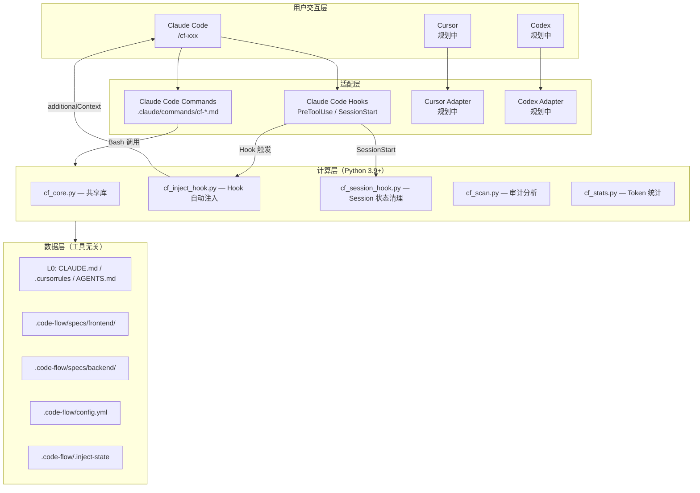
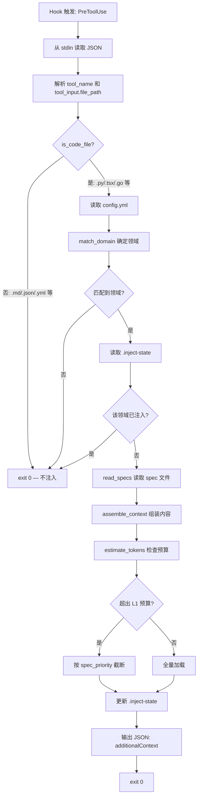
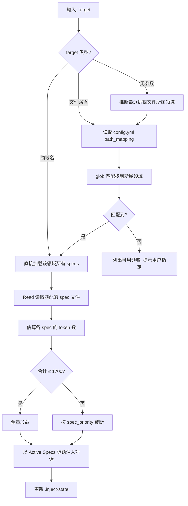

SFRD-TS-03-1.4_V1.4_code-flow 微型设计说明书

# SFRD-TS-03-1.4_V1.4_code-flow 微型设计说明书

## 目录

- [1. 介绍](#1-介绍)
  - [1.1. 目的](#11-目的)
  - [1.2. 用户故事](#12-用户故事)
  - [1.3. 定义和缩写](#13-定义和缩写)
  - [1.4. 参考和引用](#14-参考和引用)
- [2. 模块方案概述](#2-模块方案概述)
- [3. 模块详细设计](#3-模块详细设计)
  - [3.1. 规范体系目录结构](#31-规范体系目录结构)
  - [3.2. /cf-init — 项目规范初始化](#32-cf-init--项目规范初始化)
  - [3.3. Python 脚本详细设计](#33-python-脚本详细设计)
  - [3.4. Hook 自动注入机制](#34-hook-自动注入机制)
  - [3.5. /cf-scan — 规范审计分析](#35-cf-scan--规范审计分析)
  - [3.6. /cf-inject — 手动规范注入（回退）](#36-cf-inject--手动规范注入回退)
  - [3.7. /cf-validate — 验证闭环](#37-cf-validate--验证闭环)
  - [3.8. /cf-stats — Token 统计](#38-cf-stats--token-统计)
  - [3.9. /cf-learn — 经验沉淀](#39-cf-learn--经验沉淀)
  - [3.10. 配置系统](#310-配置系统)
- [4. 关联分析](#4-关联分析)
- [5. 可靠性设计 (FMEA)](#5-可靠性设计-fmea)
- [6. 变更控制](#6-变更控制)
  - [6.1. 变更列表](#61-变更列表)
- [7. 修订记录](#7-修订记录)

---

# 1. 介绍

## 1.1. 目的

code-flow 是一套基于 **Command + Python 脚本 + Claude Code Hook** 的 AI 辅助编码规范管理工具，解决小型团队（2-5 人）在版本迭代中的核心痛点：

**项目目录下缺乏一份完整的、分层的约束规范文件体系，导致 AI 在增量开发中频繁"跑偏"。**

具体问题：
1. **规范缺失**：项目没有系统化的编码规范配置文件（CLAUDE.md / .cursorrules / AGENTS.md 等），AI 每次对话都在"裸奔"。
2. **Token 浪费**：将所有规范堆入单一配置文件，超出 LLM 有效注意力窗口，召回率骤降。
3. **规范注入不精准**：前端开发时加载了后端 DB 规范，后端开发时加载了组件规范，上下文污染。
4. **验证断层**：代码生成后无自动化验证闭环，不符合规范的代码在 PR 阶段才被发现。
5. **工具锁定**：规范与特定 AI 工具耦合，团队切换工具时规范无法复用。
6. **注入需手动触发**：V1.3 中规范注入依赖开发者手动执行 `/cf-inject`，容易遗忘，导致 AI 仍在"裸奔"。

**解决方案**：构建**工具无关的多层规范体系**（`.code-flow/specs/` 细分规范），通过适配层（Command + Hook）对接不同 AI Code 工具，**自动感知编辑文件并按需注入**当前任务相关的规范子集。

**核心架构**：Command（Claude 原生工具）→ 文件系统；Hook → Python 脚本 → additionalContext 自动注入。

**支持的 AI Code 工具**（当前及规划）：
| 工具 | 适配方式 | 状态 |
|------|---------|------|
| Claude Code | Command 文件（`.claude/commands/cf-*.md`）+ Hook（PreToolUse 自动注入） | MVP |
| Cursor | `.cursorrules` 生成 + Rules 目录集成 | 规划中 |
| Codex (OpenAI) | `AGENTS.md` 生成 + CLI 集成 | 规划中 |

**外部依赖**：Python 3.9+，pyyaml（唯一第三方包）。

**目标受众**：2-5 人小团队中使用 AI Code 工具的开发人员和技术负责人。

## 1.2. 用户故事

### US-01：一键初始化项目规范体系

> **作为** 技术负责人，
> **我希望** 在 Claude Code 中运行 `/project:cf-init`，一键检测技术栈并生成完整的规范体系（目录、模板、Command 文件、Python 脚本、Hook 配置、L0 配置），仅需 Python 3.9+ 和 pyyaml，
> **以便** 团队成员 clone 后 5 分钟内可开始 AI 辅助开发。
>
> **验收标准**：
> - 自动检测前端/后端技术栈（如 React + FastAPI）
> - 一次性生成：CLAUDE.md + `.code-flow/` 全套目录（含 scripts/）+ `.claude/commands/cf-*.md` 全部 Command 文件 + `.claude/settings.local.json` Hook 配置
> - 仅需 Python 3.9+ 环境，自动执行 `pip install pyyaml`（失败时 warning，不阻塞）
> - 生成后输出摘要（文件列表 + token 预估）

### US-02：编辑代码文件时自动注入编码规范

> **作为** 前端开发者，
> **我希望** 当我提问"帮我重构 UserAvatar 组件"时，**无需手动执行任何命令**，AI 自动根据我的提问内容判断这是前端任务，主动加载组件规范和前端质量准则，而不是后端 DB 规范，
> **以便** AI 生成的代码严格遵循前端团队的目录结构、命名约定和组件模式。
>
> **验收标准**：
> - AI 根据用户提问内容自动判断领域，主动读取匹配的 spec 文件
> - 仅加载 `frontend/component-specs.md` 和 `frontend/quality-standards.md`
> - 不加载 `backend/*.md` 的任何内容
> - 编辑代码文件时 Hook 作为安全网二次确认注入
> - AI 生成的组件代码符合规范（可通过 lint 验证）

### US-03：按需注入后端规范

> **作为** 后端开发者，
> **我希望** 在编辑 `services/user/repository.py` 时，AI 通过 Hook 自动加载 DB 规范、日志规范和代码质量规范，
> **以便** AI 生成的数据库操作代码遵循团队的 SQL 模式、日志格式和异常处理策略。
>
> **验收标准**：
> - Hook 自动触发，加载 `backend/database.md`、`backend/logging.md`、`backend/code-quality-performance.md`
> - 不加载 `frontend/*.md`
> - AI 生成的 SQL 使用参数化查询，日志符合结构化格式

### US-04：规范审计与瘦身

> **作为** 技术负责人，
> **我希望** 运行 `/cf-scan` 查看所有规范文件的 token 消耗分布，识别冗余和过时内容，
> **以便** 定期精简规范，保持 AI 辅助的高效性。
>
> **验收标准**：
> - 输出各规范文件的 token 数和占比
> - 标记引用了不存在的文件路径/包名的过时内容
> - 标记重复出现 ≥3 次的冗余表述
> - 给出预计可节省的 token 数

### US-05：验证代码是否符合规范

> **作为** 开发者，
> **我希望** AI 生成代码后运行 `/cf-validate`，自动执行类型检查/单测/lint 并将失败信息反馈给 AI，
> **以便** 在同一个对话中完成"生成→验证→修复"闭环。
>
> **验收标准**：
> - 根据变更文件自动选择验证规则（前端文件跑 ESLint，后端文件跑 pytest）
> - 失败时生成 AI 可理解的修复提示
> - 验证通过后输出确认

### US-06：沉淀团队经验到规范文件

> **作为** 团队成员，
> **我希望** 运行 `/project:cf-learn` 时，工具能**自动扫描项目的配置文件和代码模式**，提取出隐含的编码约束（如 ESLint 规则、TypeScript strict 模式、CI 检查要求等），呈现给我确认后写入 CLAUDE.md 或 spec 文件，
> **以便** 不需要手动总结经验，工具自动发现项目中已有但未文档化的约束，规范越来越完整。
>
> **验收标准**：
> - 自动扫描 .eslintrc、tsconfig.json、pyproject.toml、CI 配置等文件
> - 提取具体的、可执行的编码约束（不是泛泛的描述）
> - 按领域分组展示候选学习点，供用户勾选确认
> - 确认后按类型写入 CLAUDE.md 或对应 spec 文件的 `Rules/Patterns/Anti-Patterns` 段落
> - 跳过已在规范中记录的条目（去重）

## 1.3. 定义和缩写

| 术语 | 含义 |
|------|------|
| AI Code 工具 | Claude Code、Cursor、Codex 等 AI 辅助编码工具的统称 |
| 适配层 | 将 code-flow 统一规范转换为特定工具格式的桥接层（Command / Hook / .cursorrules / AGENTS.md） |
| Command | Claude Code 的自定义斜杠命令机制，markdown 指令文件，位于 `.claude/commands/`，用户通过 `/project:command-name` 调用 |
| Hook | Claude Code 的事件钩子机制，在特定工具调用前/后自动执行脚本 |
| PreToolUse | Claude Code Hook 事件，在 AI 调用 Edit/Write/MultiEdit 等工具前触发 |
| SessionStart | Claude Code Hook 事件，在新会话开始时触发 |
| additionalContext | Hook 输出的 JSON 字段，内容会被自动注入到 AI 的对话上下文中 |
| `.inject-state` | `.code-flow/.inject-state` 文件，记录当前 session 已注入的领域，用于去重 |
| L0 配置文件 | 各工具的原生配置：Claude Code 的 CLAUDE.md、Cursor 的 .cursorrules、Codex 的 AGENTS.md |
| `.code-flow/` | 工具的工作目录，存放**工具无关的**细分规范、配置和 Python 脚本 |
| Spec（规范） | `.code-flow/specs/` 下的 markdown 文件，定义特定领域的编码约束 |
| Token Budget | 单次注入的 token 上限，推荐值 2,500 |
| L0 / L1 | 上下文层级：L0=全局原则（工具原生配置）→ L1=领域规范（specs/） |

## 1.4. 参考和引用

1. Boris Cherny —《How to Build Software with Claude Code》(2025)，CLAUDE.md 分层管理最佳实践
2. NoLiMa 基准测试 — LLM 长上下文召回率研究，32k tokens 时 11/12 模型召回率 <50%
3. Claude Code Skills 文档 — Skill 文件格式、安装目录、调用方式
4. Claude Code Hooks 文档 — Hook 事件类型（PreToolUse / SessionStart）、配置格式（settings.local.json）、hookSpecificOutput / additionalContext 机制

---

# 2. 模块方案概述

## 2.1. 核心问题

```
无规范文件 → AI "裸奔" → 代码风格不统一、架构混乱
      ↓ 尝试写 CLAUDE.md
规范全塞一个文件 → Token 膨胀 → 超出注意力窗口 → 规范被忽略
      ↓ 即使规范到位
静态全量加载 → 前端任务加载后端规范 → 上下文污染 → 还是"跑偏"
      ↓ 即使有按需加载
手动触发注入 → 开发者忘记执行 → AI 仍在"裸奔"
```

**根因**：缺乏一套**按领域分类、自动感知、按需加载**的规范管理体系。

## 2.2. 解决方案

**Command + Python + Hook 架构**：

- **适配层**：Claude Code Command 文件（`.claude/commands/cf-*.md`）+ Claude Code Hook（PreToolUse 自动注入）
- **计算层**：Python 3.9+ 脚本（`.code-flow/scripts/`），仅用于 Hook 自动注入和数据统计（cf_core / cf_inject_hook / cf_session_hook / cf_scan / cf_stats）
- **数据层**：分层规范文件（`.code-flow/specs/`）+ 配置文件（`.code-flow/config.yml`）

**关键设计决策**：

1. **恢复 Python 脚本层**：Hook 机制要求脚本在 5 秒内返回 JSON 结果，Claude 原生工具（Read / Glob）无法在 Hook 上下文中调用，必须用独立脚本完成文件读取和匹配逻辑。
2. **Hook 自动注入**：利用 Claude Code 的 PreToolUse Hook，在 AI 调用 Edit/Write/MultiEdit 编辑代码文件时自动触发注入，开发者无需记忆和手动执行 `/cf-inject`。
3. **单一依赖**：仅依赖 pyyaml（无 tiktoken），token 估算使用 `len(text) // 4`。

## 2.3. 系统架构



## 2.4. 技术选型

### 多工具适配策略

| AI Code 工具 | 适配方式 | L0 配置文件 | 注入机制 | 状态 |
|-------------|---------|------------|---------|------|
| Claude Code | Command + Hook（PreToolUse） | CLAUDE.md | Hook 自动注入 + Command 手动回退 | MVP |
| Cursor | `.cursorrules` 生成器 | .cursorrules | 将 specs 编译为 .cursorrules | 规划 |
| Codex | AGENTS.md 生成器 | AGENTS.md | 将 specs 编译为 AGENTS.md | 规划 |

### 为什么恢复 Python 脚本层

V1.3 采用纯 Skill 架构（零依赖），V1.4 恢复 Python 脚本层，原因如下：

| 维度 | 纯 Skill（V1.3） | Command + Python（V1.4，当前方案） |
|------|-----------------|-------------------------------|
| Hook 支持 | **不支持** — Skill 无法作为 Hook 脚本执行 | **原生支持** — Python 脚本可作为 Hook command |
| 自动注入 | 不支持，必须手动 `/cf-inject` | **PreToolUse Hook 自动注入**，编辑代码文件时零操作 |
| 执行速度 | Claude 调用多个原生工具，耗时数秒 | Hook 用 Python 毫秒级响应；Command 用 Claude 原生工具交互式执行 |
| 配置解析 | Claude 理解 YAML 语义（不可靠） | Hook/统计脚本用 pyyaml 精确解析；Command 直接用 Claude Read 工具读取 |
| 安装复杂度 | 零依赖 | 需 Python 3.9+ 和 `pip install pyyaml` |
| Token 计数 | Claude 内建估算 | Hook/统计脚本用 `len(text) // 4` 确定性执行 |
| 维护成本 | 仅 Skill markdown | Command markdown + 5 个 Python 文件（仅 Hook 和统计） |

**决策**：恢复 Python 脚本层。Hook 自动注入是核心新能力，而 Hook 机制**要求独立可执行脚本**——Skill 无法在 Hook 上下文中运行。Python 3.9+ 在现代开发环境中普遍可用，pyyaml 是轻量依赖，安装成本可接受。

### 为什么选择 Hook 机制

| 维度 | 手动 /cf-inject（V1.3） | Hook 自动注入（V1.4） |
|------|------------------------|---------------------|
| 用户体验 | 每次新对话需记住执行 `/cf-inject` | **零操作**，编辑代码文件时自动触发 |
| 遗忘风险 | 高 — 开发者经常忘记加载规范 | **无** — Hook 保证触发 |
| 注入精准度 | 依赖用户正确指定领域 | **自动匹配** — 根据文件路径精确确定领域 |
| 重复注入 | 每次手动执行都会注入 | **去重** — 同领域在同一 session 内仅注入一次 |
| 非代码文件 | 需用户判断是否注入 | **智能过滤** — 自动跳过 .md/.json/.yml 等非代码文件 |

---

# 3. 模块详细设计

## 3.1. 规范体系目录结构

### 3.1.1. 功能描述

定义项目中规范文件的组织方式，是整个工具的数据基础。

### 3.1.2. 目录结构

```
project-root/
├── CLAUDE.md                              # L0: Claude Code 全局配置（由 /cf-init 生成）
├── .cursorrules                           # L0: Cursor 全局配置（规划，由适配器生成）
├── AGENTS.md                              # L0: Codex 全局配置（规划，由适配器生成）
│
├── .claude/
│   ├── commands/                          # 适配层: Claude Code Custom Commands（MVP）
│   │   ├── cf-init.md
│   │   ├── cf-scan.md
│   │   ├── cf-inject.md
│   │   ├── cf-validate.md
│   │   ├── cf-stats.md
│   │   └── cf-learn.md
│   └── settings.local.json               # Hook 配置（由 /cf-init 生成）
│
└── .code-flow/                            # ===== 以下全部工具无关 =====
    ├── config.yml                         # 路径映射 + 预算配置 + 注入过滤规则
    ├── validation.yml                     # 验证规则
    ├── .inject-state                      # 运行时: 当前 session 已注入领域（SessionStart 时清理）
    ├── scripts/                           # 计算层: Python 脚本
    │   ├── cf_core.py                     # 共享库（配置解析、路径匹配、token 估算）
    │   ├── cf_inject_hook.py              # Hook: PreToolUse 自动注入
    │   ├── cf_session_hook.py             # Hook: SessionStart 状态清理
    │   ├── cf_scan.py                     # 统计: 审计分析
    │   └── cf_stats.py                    # 统计: Token 统计
    └── specs/                             # L1: 领域规范（单一数据源）
        ├── frontend/
        │   ├── directory-structure.md      # 前端目录结构约定
        │   ├── quality-standards.md        # 前端质量准则
        │   └── component-specs.md          # 组件开发规范
        └── backend/
            ├── directory-structure.md      # 后端目录结构约定
            ├── logging.md                  # 日志打印规范
            ├── database.md                 # 数据库规范
            ├── platform-rules.md           # 平台规则
            └── code-quality-performance.md # 代码质量与性能
```

### 3.1.3. 层级关系与加载规则

```
L0 (工具原生配置)          — 由各 AI 工具自动加载
                            内容：团队身份、通用编码原则、禁止事项
                            预算：≤ 800 tokens

L1 (specs/frontend/*.md)  — 根据用户提问内容自动注入
L1 (specs/backend/*.md)   — 根据用户提问内容自动注入
                            内容：领域特定的编码约束（Rules/Patterns/Anti-Patterns）
                            预算：≤ 1700 tokens（所有匹配 spec 合计）
```

**总预算**：L0 (800) + L1 (1700) = 2500 tokens

**注入触发方式**：
- **CLAUDE.md 指令**（主要）：Claude 根据用户提问内容自动判断领域，主动读取匹配的 spec 文件作为约束
- **PreToolUse Hook**（安全网）：编辑代码文件时 Hook 自动触发，确保规范不遗漏
- **手动**（回退）：`/project:cf-inject` 命令，用于强制重新注入的场景

**规范沉淀方式**：`cf-learn` 将确认后的条目按类型写入 `Rules/Patterns/Anti-Patterns`，避免新增独立学习文件或单独 Learnings 段落。

### 3.1.4. Spec 文件模板

每个 spec 文件遵循统一格式：

```markdown
# [规范名称]

## Rules
- 规则1
- 规则2

## Patterns
推荐的代码模式和示例

## Anti-Patterns
禁止的代码模式
```

### 3.1.5. 路径匹配规则

```yaml
# .code-flow/config.yml 中的路径映射
path_mapping:
  frontend:
    patterns:
      - "src/components/**"
      - "src/pages/**"
      - "src/hooks/**"
      - "src/styles/**"
      - "**/*.tsx"
      - "**/*.jsx"
      - "**/*.css"
      - "**/*.scss"
    specs:
      - "frontend/directory-structure.md"
      - "frontend/quality-standards.md"
      - "frontend/component-specs.md"

  backend:
    patterns:
      - "services/**"
      - "api/**"
      - "models/**"
      - "**/*.py"
      - "**/*.go"
    specs:
      - "backend/directory-structure.md"
      - "backend/logging.md"
      - "backend/database.md"
      - "backend/platform-rules.md"
      - "backend/code-quality-performance.md"
```

---

## 3.2. /cf-init — 项目规范初始化

### 3.2.1. 功能描述

一键检测项目技术栈，生成完整的规范体系：L0 配置文件 + `.code-flow/` 全套目录（含 Python 脚本）+ Command 文件 + Hook 配置。**依赖 Python 3.9+ 和 pyyaml**。

### 3.2.2. Command 执行逻辑

```
1. 用 Glob 扫描项目根目录，识别技术栈：
   - package.json 存在 → 读取检测前端框架（React/Vue/Angular）
   - pyproject.toml / requirements.txt 存在 → Python 后端
   - go.mod 存在 → Go 后端
   - 同时存在前后端标识 → 全栈项目

2. 用 Write 工具批量生成文件（顺序）：
   a. .code-flow/config.yml（含路径映射 + inject 过滤规则，根据技术栈定制 patterns）
   b. .code-flow/validation.yml（根据技术栈预置规则）
   c. .code-flow/specs/frontend/*.md（仅全栈/前端项目，使用 spec 模板）
   d. .code-flow/specs/backend/*.md（仅全栈/后端项目，使用 spec 模板）
   e. .code-flow/scripts/cf_core.py（共享库）
   f. .code-flow/scripts/cf_inject_hook.py（Hook 自动注入脚本）
   g. .code-flow/scripts/cf_session_hook.py（Session 状态清理脚本）
   h. .code-flow/scripts/cf_scan.py（审计分析脚本）
   i. .code-flow/scripts/cf_stats.py（Token 统计脚本）
   j. CLAUDE.md（如不存在，生成 L0 全局原则模板）
   k. .claude/commands/cf-*.md（6 个 Command 文件）
   l. .claude/settings.local.json（Hook 配置，如已存在则合并 hooks 字段）

3. 用 Bash 执行 pip install pyyaml：
   - 成功 → 继续
   - 失败 → 输出 warning（"请手动安装: pip install pyyaml"），不阻塞后续流程

4. 输出生成摘要：
   - 已生成的文件列表
   - 各 spec 文件的 token 估算
   - Hook 配置状态确认
   - 提醒用户填充 spec 文件的具体内容
```

### 3.2.3. 输入和输出

**输入**：无参数（自动检测）或用户指定 `/cf-init frontend|backend|fullstack`

**输出**：项目中生成完整目录结构 + 摘要信息

### 3.2.4. L0 模板（CLAUDE.md）

```markdown
# Project Guidelines

## Team Identity
- 团队: [团队名称]
- 项目: [项目名称]
- 语言: [主要编程语言]

## Core Principles
- 所有代码变更必须有对应的测试
- 函数单一职责，≤ 50 行
- 禁止 any 类型（TypeScript）/ 禁止裸 except（Python）
- 错误处理：不吞异常，向上传播或明确处理

## Forbidden Patterns
- 禁止硬编码密钥、密码、连接字符串
- 禁止在循环中发起网络请求（N+1 问题）
- 禁止未经参数化的 SQL 拼接

## Spec Loading
This project uses the code-flow layered spec system.

**Auto-inject rule**: Before answering any coding question, you MUST:
1. Determine domain(s) from the user's question (frontend/backend)
2. Read `.code-flow/config.yml` → find matching domain's `specs` list
3. Read each spec file from `.code-flow/specs/` and apply as constraints
4. If question spans multiple domains, load all matching specs

Do NOT ask the user which specs to load — decide automatically based on context.
```

### 3.2.5. Hook 配置模板

`/cf-init` 生成的 `.claude/settings.local.json`：

```json
{
  "hooks": {
    "PreToolUse": [
      {
        "matcher": "Edit|Write|MultiEdit",
        "hooks": [
          {
            "type": "command",
            "command": "python3 .code-flow/scripts/cf_inject_hook.py",
            "timeout": 5
          }
        ]
      }
    ],
    "SessionStart": [
      {
        "hooks": [
          {
            "type": "command",
            "command": "python3 .code-flow/scripts/cf_session_hook.py"
          }
        ]
      }
    ]
  }
}
```

如 `.claude/settings.local.json` 已存在，`/cf-init` 读取现有内容，仅合并 `hooks` 字段（保留其他配置不变）。如 `hooks` 中已有同名事件，追加新的 hook 条目。

### 3.2.6. 异常处理

| 场景 | 处理策略 |
|------|---------|
| CLAUDE.md 已存在 | 保留原文件，输出 diff 建议，由用户决定是否合并 |
| `.code-flow/` 已存在 | 仅生成缺失的文件，不覆盖已有内容 |
| `.claude/commands/` 已存在 | 仅生成缺失的 Command 文件，不覆盖已有内容 |
| `.claude/settings.local.json` 已存在 | 读取现有 JSON，合并 hooks 字段，保留其他配置 |
| 无法识别技术栈 | 生成 Generic 模板（前后端均包含），所有 spec 仅含骨架 |
| Python 3.9+ 不可用 | 输出错误提示，建议安装 Python 3.9+；Command 文件仍然生成（手动模式可用） |
| `pip install pyyaml` 失败 | 输出 warning，提示手动安装，不阻塞 |

---

## 3.3. Python 脚本详细设计

### 3.3.1. 功能描述

`.code-flow/scripts/` 下的 Python 脚本构成计算层，为 Hook 自动注入和 cf-scan/cf-stats 统计命令提供确定性的配置解析、路径匹配和 token 估算能力。其他命令（cf-init / cf-inject / cf-validate / cf-learn）由 Command 文件直接引导 Claude 使用原生工具完成。

### 3.3.2. 兼容性要求

- **Python 版本**：3.9+
- **禁止使用**：`match/case` 语法（3.10+）、`X | Y` union type hint（3.10+）
- **类型注解**：使用 `list[str]`、`dict[str, int]` 等内建泛型（3.9+ 支持），不使用 `typing.List`、`typing.Dict`
- **外部依赖**：仅 `pyyaml`
- **标准库**：`os`、`sys`、`json`、`fnmatch`、`pathlib`

### 3.3.3. cf_core.py — 共享库

```python
# .code-flow/scripts/cf_core.py
# 共享工具函数，被所有脚本 import

def load_config(project_root: str) -> dict:
    """
    读取 .code-flow/config.yml，返回解析后的 dict。
    文件不存在时返回空 dict。
    """

def estimate_tokens(text: str) -> int:
    """
    估算文本的 token 数。
    算法: len(text) // 4
    """

def match_domain(file_path: str, path_mapping: dict) -> list[str]:
    """
    根据文件路径和 path_mapping 配置，返回匹配的领域列表。
    使用 fnmatch 进行 glob 模式匹配。
    可能返回多个领域（如文件同时匹配前端和后端 patterns）。
    """

def is_code_file(file_path: str, inject_config: dict) -> bool:
    """
    判断文件是否为代码文件（应触发注入）。
    优先级: skip_paths > skip_extensions > code_extensions > 默认不注入
    """

def read_specs(project_root: str, domain: str, config: dict) -> list[dict]:
    """
    读取指定领域下的所有 spec 文件。
    返回: [{"path": "frontend/component-specs.md", "content": "...", "tokens": 120}, ...]
    跳过不存在或为空的文件。
    """

def assemble_context(specs: list[dict], budget: int, priorities: dict) -> str:
    """
    将 spec 列表组装为注入上下文字符串。
    如总 token 超出 budget，按 priorities（数字越小优先级越高）截断低优先级 spec。
    返回: markdown 格式的规范内容。
    """

def load_inject_state(project_root: str) -> dict:
    """
    读取 .code-flow/.inject-state JSON 文件。
    文件不存在或解析失败时返回空 dict。
    格式: {"injected_domains": ["frontend", "backend"]}
    """

def save_inject_state(project_root: str, state: dict) -> None:
    """
    写入 .code-flow/.inject-state JSON 文件。
    """
```

### 3.3.4. cf_scan.py — 审计分析脚本

```python
# .code-flow/scripts/cf_scan.py
# 被 /project:cf-scan Command 通过 Bash 调用: python3 .code-flow/scripts/cf_scan.py [project_root]
# 输出 JSON 到 stdout

# 输出格式:
{
  "files": [
    {"path": "CLAUDE.md", "tokens": 650, "percent": "26%", "issues": []},
    {"path": "specs/frontend/component-specs.md", "tokens": 420, "percent": "17%", "issues": []},
    {"path": "specs/backend/logging.md", "tokens": 380, "percent": "15%", "issues": ["冗余: '结构化日志' 3处重复"]}
  ],
  "total_tokens": 2150,
  "budget": 2500,
  "warnings": []
}
```

**执行逻辑**：
1. 读取 CLAUDE.md 和 `.code-flow/specs/**/*.md` 所有文件
2. 估算各文件 token 数
3. 检测冗余：同一关键短语在多个 spec 文件中出现 ≥3 次
4. 检测过时：spec 中引用的文件路径在项目中不存在
5. 检测冗长：单个 spec 文件超过 500 tokens
6. 输出 JSON 结果到 stdout

### 3.3.5. cf_stats.py — Token 统计脚本

```python
# .code-flow/scripts/cf_stats.py
# 被 /project:cf-stats Command 通过 Bash 调用: python3 .code-flow/scripts/cf_stats.py [project_root]
# 输出 JSON 到 stdout

# 输出格式:
{
  "l0": {"file": "CLAUDE.md", "tokens": 650, "budget": 800},
  "l1": {
    "frontend": [
      {"path": "frontend/directory-structure.md", "tokens": 180},
      {"path": "frontend/quality-standards.md", "tokens": 150}
    ],
    "backend": [
      {"path": "backend/database.md", "tokens": 200}
    ]
  },
  "total_tokens": 1580,
  "total_budget": 2500,
  "utilization": "63%"
}
```

**执行逻辑**：
1. 读取 config.yml 获取预算配置和路径映射
2. 读取所有规范文件，估算 token 数
3. 按 L0/L1 分层、按领域分组统计
4. 输出 JSON 结果到 stdout

---

## 3.4. Hook 自动注入机制

### 3.4.1. 功能描述

**V1.4 核心新能力**。利用 Claude Code 的 PreToolUse Hook，在 AI 调用 Edit/Write/MultiEdit 编辑代码文件时自动触发 Python 脚本，读取匹配领域的 spec 文件并通过 `additionalContext` 注入到对话上下文，实现**零操作的规范自动加载**。

### 3.4.2. cf_inject_hook.py 执行流程



### 3.4.3. stdin 输入格式

Hook 从 stdin 接收 Claude Code 传入的 JSON：

```json
{
  "hook_event_name": "PreToolUse",
  "tool_name": "Edit",
  "tool_input": {
    "file_path": "/absolute/path/to/src/components/UserAvatar.tsx",
    "old_string": "...",
    "new_string": "..."
  }
}
```

### 3.4.4. stdout 输出格式

注入成功时输出：

```json
{
  "hookSpecificOutput": {
    "hookEventName": "PreToolUse",
    "additionalContext": "## Active Specs (auto-injected)\n\n### frontend/directory-structure.md\n...\n\n### frontend/component-specs.md\n...\n\n---\n以上规范是本次开发的约束条件，生成代码必须遵循。"
  }
}
```

不需要注入时（非代码文件 / 已注入 / 无匹配领域）：不输出任何内容，直接 exit 0。

### 3.4.5. cf_session_hook.py

```python
# .code-flow/scripts/cf_session_hook.py
# SessionStart Hook: 清理上一个 session 的注入状态

# 执行逻辑:
# 1. 删除 .code-flow/.inject-state（如存在）
# 2. exit 0
```

每次新 session 开始时清理状态，确保新会话中规范会被重新注入。

### 3.4.6. .inject-state 文件格式

```json
{
  "injected_domains": ["frontend"]
}
```

- **用途**：记录当前 session 中已注入的领域，防止重复注入
- **生命周期**：SessionStart 时删除 → 首次编辑代码文件时创建 → 后续编辑时读取判断
- **位置**：`.code-flow/.inject-state`（应加入 `.gitignore`）

### 3.4.7. 智能过滤规则

过滤优先级（从高到低）：

```
1. skip_paths  — 匹配则跳过（如 docs/**、node_modules/**）
2. skip_extensions — 匹配则跳过（如 .md、.json、.yml）
3. code_extensions — 匹配则注入（如 .py、.tsx、.go）
4. 默认 — 不注入
```

配置定义在 `config.yml` 的 `inject` 块中（详见 3.10 配置系统）。

### 3.4.8. 异常处理

| 场景 | 处理策略 |
|------|---------|
| Python 不可用 | Hook 执行失败，Claude Code 忽略并继续；用户可手动 `/cf-inject` |
| cf_inject_hook.py 抛出异常 | 捕获所有异常，stderr 输出错误信息，exit 0（不阻塞编辑操作） |
| config.yml 不存在 | 静默退出（exit 0），不注入 |
| stdin JSON 解析失败 | 静默退出（exit 0） |
| .inject-state 文件损坏 | 删除文件，重新创建，正常注入 |
| spec 文件读取超时（5s Hook timeout） | Hook 被 Claude Code 终止，编辑操作正常继续；输出 warning 建议精简 spec 文件 |
| file_path 为相对路径 | 相对于项目根目录解析 |

---

## 3.5. /cf-scan — 规范审计分析

### 3.5.1. 功能描述

递归扫描 CLAUDE.md 和 `.code-flow/specs/` 下所有规范文件，输出 token 消耗报告和优化建议。

### 3.5.2. Command 执行逻辑

```
1. 用 Bash 调用 Python 脚本：
   python3 .code-flow/scripts/cf_scan.py

2. 解析 stdout JSON 输出

3. Command 将 JSON 结果格式化为人类可读的表格：
   | 文件 | Tokens | 占比 | 问题 |
   |------|--------|------|------|
   | CLAUDE.md | ~650 | 26% | - |
   | specs/frontend/component-specs.md | ~420 | 17% | - |
   | specs/backend/logging.md | ~380 | 15% | 冗余: "结构化日志" 3处重复 |
   | ... | ... | ... | ... |
   | **合计** | **~2150** | **/ 2500** | |

4. 如有 warnings，输出优化建议
```

### 3.5.3. 异常处理

| 场景 | 处理策略 |
|------|---------|
| `.code-flow/` 不存在 | 输出提示，建议运行 `/cf-init` |
| spec 文件全为空模板 | 输出 warning，提示先填充规范内容 |
| Python 脚本执行失败 | 输出错误信息，建议检查 Python 环境和 pyyaml 安装 |

---

## 3.6. /cf-inject — 手动规范注入（回退）

### 3.6.1. 功能描述

**手动回退方式**。V1.5 中规范注入的主要机制为 **CLAUDE.md 指令驱动的自动注入**（Claude 根据用户提问内容自动判断领域并读取 specs），PreToolUse Hook 作为安全网。此命令仅在需要强制重新注入时使用。

**典型使用场景**：
- 需要强制刷新已注入的规范（spec 文件刚被修改）
- 想要预览某个领域的完整规范内容
- 自动注入未生效时的排查手段

### 3.6.2. Command 执行逻辑

```
1. 确定注入范围：
   - /cf-inject frontend       → 直接加载前端全部 specs
   - /cf-inject backend        → 直接加载后端全部 specs
   - /cf-inject src/Foo.tsx    → 读取 config.yml path_mapping，glob 匹配确定领域
   - /cf-inject（无参数）       → 从对话上下文推断最近编辑的文件所属领域

2. 读取 .code-flow/config.yml 获取 path_mapping
3. 用 Read 读取匹配领域下的所有 spec 文件
4. 估算总 token 数，如超出 L1 预算 1700：
   - 按 spec_priority 配置截断（directory-structure 优先保留）
5. 将规范内容以 "## Active Specs" 标题注入当前对话：
   - 明确告知 AI: "以下规范是本次开发的约束条件，生成代码必须遵循"
   - 展示已加载的 spec 文件列表供用户确认
6. 更新 .inject-state（防止 Hook 重复注入同一领域）
```

### 3.6.3. 内部逻辑



### 3.6.4. 预算分配策略

```
总预算 B = 2500 tokens
L0 预算 = 800（由工具自动加载，不计入注入预算）
L1 预算 = 1700（本命令控制）

L1 内部优先级（超出时从低优先级开始截断）：
  1. directory-structure.md   — 最高优先级
  2. quality-standards.md     — 高优先级
  3. 其他 spec               — 按 config.yml 中 spec_priority 排列
```

### 3.6.5. 异常处理

| 场景 | 处理策略 |
|------|---------|
| target 未匹配任何领域 | 列出所有可用领域（frontend / backend），提示用户指定 |
| spec 文件内容为空模板 | 跳过该文件，输出 warning 提示填充 |
| config.yml 不存在 | 提示运行 `/cf-init` |

---

## 3.7. /cf-validate — 验证闭环

### 3.7.1. 功能描述

根据 Git 变更文件列表，自动匹配并执行验证规则（测试、类型检查、lint），失败时生成修复提示反馈给 AI。

### 3.7.2. Command 执行逻辑

```
1. 获取变更文件列表：
   - 用 Bash 执行 git diff --name-only HEAD
   - 或用户指定: /cf-validate src/Foo.tsx

2. 读取 .code-flow/validation.yml

3. 对每条验证规则：
   - 将 trigger glob 与变更文件列表做匹配
   - 匹配到 → 用 Bash 执行 command（替换 {files} 占位符）
   - 未匹配 → 跳过

4. 汇总结果：
   - 全部通过 → 输出确认
   - 有失败 → 展示错误详情 + on_fail 建议
   - AI 自动根据失败信息尝试修复

5. 提示修复后再次运行 /cf-validate 确认
```

### 3.7.3. 验证规则配置

```yaml
# .code-flow/validation.yml
validators:
  - name: "TypeScript 类型检查"
    trigger: "**/*.{ts,tsx}"
    command: "npx tsc --noEmit"
    timeout: 30000
    on_fail: "检查类型定义，参见 specs/frontend/quality-standards.md"

  - name: "ESLint"
    trigger: "**/*.{ts,tsx,js,jsx}"
    command: "npx eslint {files}"
    timeout: 15000
    on_fail: "运行 npx eslint --fix 自动修复"

  - name: "Python 类型检查"
    trigger: "**/*.py"
    command: "python3 -m mypy {files}"
    timeout: 30000
    on_fail: "检查类型注解，参见 specs/backend/code-quality-performance.md"

  - name: "Pytest"
    trigger: "**/*.py"
    command: "python3 -m pytest --tb=short -q"
    timeout: 60000
    on_fail: "测试失败，检查断言和 mock 是否需要更新"
```

### 3.7.4. 安全设计

Command 指令要求 Claude 在执行 Bash 命令前，对 `{files}` 中的每个文件路径用单引号包裹，防止 shell 注入。仅接受 `git diff` 输出的文件路径。

### 3.7.5. 异常处理

| 场景 | 处理策略 |
|------|---------|
| validation.yml 不存在 | 尝试检测 package.json scripts 中的 test/lint 命令 |
| 命令执行超时 | 输出超时提示，建议增大 timeout 或缩小验证范围 |
| 命令不存在 | 提示安装依赖（如 `pip install mypy`） |
| 无变更文件 | 输出"无变更需要验证" |

---

## 3.8. /cf-stats — Token 统计

### 3.8.1. 功能描述

输出规范体系的 token 使用统计，包括各文件分布和预算利用率。

### 3.8.2. Command 执行逻辑

```
1. 用 Bash 调用 Python 脚本：
   python3 .code-flow/scripts/cf_stats.py

2. 解析 stdout JSON 输出

3. Command 将 JSON 结果格式化为人类可读的统计表格：
   - L0 (CLAUDE.md): xxx tokens / 800 budget
   - L1 前端: xxx tokens（含各文件明细）
   - L1 后端: xxx tokens（含各文件明细）
   - 总计: xxx / 2500 budget
   - 利用率: xx%
```

### 3.8.3. 异常处理

| 场景 | 处理策略 |
|------|---------|
| Python 脚本执行失败 | 输出错误信息，建议检查 Python 环境 |
| `.code-flow/` 不存在 | 输出提示，建议运行 `/cf-init` |

---

## 3.9. /cf-learn — 自动约束发现与经验沉淀

### 3.9.1. 功能描述

**自动扫描**项目的配置文件（ESLint、TypeScript、pyproject.toml、CI 配置等）和代码模式，提取隐含的编码约束，呈现给用户确认后写入 CLAUDE.md 或 spec 文件对应章节（`Rules/Patterns/Anti-Patterns`）。

**核心理念**：不需要用户手动总结经验，工具自动发现项目中已有但未文档化的约束；`--review` 模式进一步从**当前工作区变更**中提炼可复用规范。

### 3.9.2. Command 执行逻辑

```
1. 扫描项目配置文件：
   - 用 Glob 查找: .eslintrc*, tsconfig.json, pyproject.toml, .github/workflows/*.yml 等
   - 用 Read 读取每个配置文件，提取关键约束规则

2. 扫描代码模式：
   - 用 Grep 搜索: 错误处理模式、日志库、测试框架、导入规范、命名模式

3. 综合分析，生成候选学习点：
   - 格式: "[来源] 约束描述"
   - 例: "[tsconfig.json] strict 模式已启用，禁止 implicit any"
   - 跳过已在 CLAUDE.md 或 spec 文件中记录的条目（去重）

4. 按领域分组展示，等待用户确认：
   - 全局约束 → 建议写入 CLAUDE.md
   - 域约束 → 建议写入 specs/<domain>/

5. 用 Edit 将确认条目按类型写入目标文件：
   - Rule → `## Rules`
   - Pattern → `## Patterns`
   - Anti-Pattern → `## Anti-Patterns`

6. 输出摘要：写入条目数、目标文件、token 变化
```

### 3.9.3. 扫描示例

运行 `/project:cf-learn` 后输出：

```
扫描发现以下未记录的编码约束：

全局约束（建议写入 CLAUDE.md）：
  1. [x] [tsconfig.json] strict 模式已启用，禁止 implicit any
  2. [x] [CI: lint.yml] PR 必须通过 ruff check + mypy --strict

前端约束（建议写入 specs/frontend/）：
  3. [x] [.eslintrc] React hooks 必须遵循 exhaustive-deps 规则
  4. [x] [代码模式] 组件文件使用 PascalCase 命名

后端约束（建议写入 specs/backend/）：
  5. [x] [pyproject.toml] 使用 ruff 替代 flake8/isort
  6. [x] [Makefile] 测试命令为 make test，覆盖率阈值 80%

确认要写入的条目（输入编号，或 all 全部写入）：
```

### 3.9.4. `--review` 模式（基于当前变更提炼规范）

当传入 `/project:cf-learn --review` 时，跳过常规全量扫描流程，改为只分析当前工作区变更（staged + unstaged + untracked 代码文件）：

```
1. 采集变更文件：
   - git diff --name-only
   - git diff --cached --name-only
   - git ls-files --others --exclude-standard

2. 过滤候选文件：
   - 仅保留代码文件（.py/.js/.ts/.tsx/.jsx/.go/.rs 等）
   - 排除文档、配置、生成产物
   - 应用统一排除集与 .gitignore 规则

3. 读取变更证据：
   - 对已有文件读取 staged/unstaged diff
   - 对 untracked 文件读取完整内容

4. 提炼候选规范：
   - Rule：必须遵守的硬约束
   - Pattern：推荐实现方式
   - Anti-Pattern：明确禁止做法
   - 多文件重复出现的模式标记为高置信度

5. 去重并确认：
   - 与现有 CLAUDE.md / specs 对比，已覆盖规则跳过
   - 展示“来源文件 + 变更证据片段”，等待用户确认写入

6. 写入与摘要：
   - 按 Rule/Pattern/Anti-Pattern 写入对应章节
   - 输出扫描文件数、候选条目数、写入结果
```

示例输出：

```
review 完成：
- 扫描变更文件: 9（staged: 3, unstaged: 4, untracked: 2）
- 提取候选规则: 5（高置信度: 3, 低置信度: 2）
- 已覆盖跳过: 1
- 用户确认写入: 3
```

### 3.9.5. 异常处理

| 场景 | 处理策略 |
|------|---------|
| 无配置文件可扫描 | 提示项目可能未初始化，建议手动添加 |
| 未发现新约束 | 输出"未发现未记录的约束，当前规范已覆盖" |
| `--review` 无变更文件 | 提示"当前工作区无代码变更，先完成改动后再运行 --review" |
| `--review` 仅文档/配置变更 | 提示"未检测到代码变更，暂无可沉淀的实现规范" |
| 追加后 spec 文件超出单文件 token 建议值（500） | 输出 warning，建议精简旧条目 |
| `.code-flow/` 不存在 | 提示运行 `/project:cf-init` |

---

## 3.10. 配置系统

### 3.10.1. config.yml Schema

```yaml
# .code-flow/config.yml
version: 1

# Token 预算
budget:
  total: 2500          # L0 + L1 总预算
  l0_max: 800          # L0 预算上限
  l1_max: 1700         # L1 预算上限

# 注入过滤规则
inject:
  auto: true           # 是否启用 Hook 自动注入
  compress: true       # 注入时对 spec 做保守无损压缩；缺省/非布尔按 true 处理
  code_extensions:     # 触发注入的代码文件扩展名
    - ".py"
    - ".go"
    - ".ts"
    - ".tsx"
    - ".js"
    - ".jsx"
    - ".java"
    - ".rs"
    - ".rb"
    - ".vue"
    - ".svelte"
  skip_extensions:     # 跳过注入的非代码文件扩展名
    - ".md"
    - ".txt"
    - ".json"
    - ".yml"
    - ".yaml"
    - ".toml"
    - ".lock"
    - ".csv"
    - ".xml"
    - ".svg"
    - ".png"
    - ".jpg"
  skip_paths:          # 跳过注入的路径 glob 模式
    - "docs/**"
    - "*.config.*"
    - ".code-flow/**"
    - ".claude/**"
    - "node_modules/**"

# 路径 → 领域映射
path_mapping:
  frontend:
    patterns:
      - "src/components/**"
      - "src/pages/**"
      - "src/hooks/**"
      - "**/*.tsx"
      - "**/*.jsx"
    specs:
      - "frontend/directory-structure.md"
      - "frontend/quality-standards.md"
      - "frontend/component-specs.md"
    spec_priority:       # 超出预算时的保留优先级（越小越优先）
      "frontend/directory-structure.md": 1
      "frontend/quality-standards.md": 2
      "frontend/component-specs.md": 3

  backend:
    patterns:
      - "services/**"
      - "api/**"
      - "models/**"
      - "**/*.py"
    specs:
      - "backend/directory-structure.md"
      - "backend/logging.md"
      - "backend/database.md"
      - "backend/platform-rules.md"
      - "backend/code-quality-performance.md"
    spec_priority:
      "backend/directory-structure.md": 1
      "backend/database.md": 2
      "backend/logging.md": 3
      "backend/code-quality-performance.md": 4
      "backend/platform-rules.md": 5
```

---

# 4. 关联分析

## 4.1. 与各 AI Code 工具原生配置的关系

- **不冲突**：L0 配置文件由 `/cf-init` 生成，L1 通过 Hook 自动注入或手动 `/cf-inject` 补充
- **潜在风险**：如某工具未来自动加载 `.code-flow/` 目录，可能重复注入。**缓解**：L0 中明确指示 specs 需通过 Hook 或命令按需加载
- **多工具并存**：同一项目可同时存在 CLAUDE.md、.cursorrules、AGENTS.md，团队成员可各自使用不同 AI 工具而共享同一套 spec

## 4.2. Hook 与 Command 的交互

- **Hook 优先**：编辑代码文件时 Hook 自动触发注入，开发者无需手动操作
- **Command 回退**：Hook 未触发（Python 不可用 / 非编辑操作 / 配置缺失）时，用户可手动 `/project:cf-inject`
- **去重协同**：`/project:cf-inject` 执行后同样更新 `.inject-state`，防止 Hook 重复注入已手动加载的领域
- **状态清理**：SessionStart Hook 清理 `.inject-state`，确保每个新会话都能获得完整的规范注入

## 4.3. 安全性

- `/project:cf-validate` 执行用户定义的 shell 命令 — Command 指令要求对文件路径用单引号包裹防注入
- Hook 脚本仅读取本地文件和输出 JSON，不执行用户定义的任意命令
- 规范文件纯 markdown，不含可执行代码
- 所有操作本地完成，不涉及网络通信
- `.inject-state` 为运行时临时文件，不含敏感信息，应加入 `.gitignore`

---

# 5. 可靠性设计 (FMEA)

| 失效模式 | 失效影响 | 失效原因 | 风险分析 | 技术改进 |
|:---|:---|:---|:---|:---|
| **Hook 注入 — 注入错误领域的规范** | 前端任务加载后端规范 | `path_mapping` 配置不准确 | **S**: 6 **O**: 4 **D**: 3 **AP**: Med | **措施**: 注入时在 additionalContext 中展示已加载 spec 列表；未匹配时静默跳过。**责任人**: 开发者 **完成时间**: MVP **状态**: 待实现 |
| **Hook 注入 — 规范内容为空模板** | AI 缺乏约束 | 用户 init 后未填充规范 | **S**: 5 **O**: 5 **D**: 2 **AP**: Med | **措施**: 注入空 spec 时跳过该文件；init 后生成 TODO checklist。**责任人**: 开发者 **完成时间**: MVP **状态**: 待实现 |
| **/cf-validate — 命令注入** | 执行非预期 shell 命令 | 文件名含 shell 特殊字符 | **S**: 9 **O**: 2 **D**: 5 **AP**: High | **措施**: 文件路径单引号包裹；仅接受 git 管理的文件。**责任人**: 开发者 **完成时间**: MVP **状态**: 待实现 |
| **/cf-validate — 验证超时** | 阻塞开发流程 | 测试套件过大 | **S**: 5 **O**: 4 **D**: 3 **AP**: Med | **措施**: 每条规则独立 timeout（默认 30s），超时输出提示。**责任人**: 开发者 **完成时间**: MVP **状态**: 待实现 |
| **Hook 脚本执行失败** | 规范未被注入，AI "裸奔" | Python 不可用 / 脚本异常 / pyyaml 未安装 | **S**: 5 **O**: 3 **D**: 4 **AP**: Med | **措施**: 脚本内 try/except 全局捕获，stderr 输出错误信息，exit 0 不阻塞编辑；用户可回退到手动 `/cf-inject`。**责任人**: 开发者 **完成时间**: MVP **状态**: 待实现 |
| **Hook 注入延迟超时** | spec 未注入，编辑操作延迟 | spec 文件过大，5s timeout 不够 | **S**: 4 **O**: 3 **D**: 3 **AP**: Med | **措施**: Hook timeout 设为 5s；超时时 Claude Code 自动终止脚本，编辑操作正常继续；`/cf-scan` 会提示精简过大的 spec 文件。**责任人**: 开发者 **完成时间**: MVP **状态**: 待实现 |
| **去重状态文件损坏** | 同一领域被重复注入或无法注入 | .inject-state JSON 格式损坏 | **S**: 3 **O**: 2 **D**: 2 **AP**: Low | **措施**: `load_inject_state` 解析失败时删除文件并返回空 dict，触发重新注入。**责任人**: 开发者 **完成时间**: MVP **状态**: 待实现 |

---

# 6. 变更控制

## 6.1. 变更列表

| 变更章节 | 变更内容 | 变更原因 | 影响 |
|---|---|---|---|
| 全文 | V1.0 独立 CLI → V1.1 Skill + Python 混合架构 | 用户要求 `/命令` 调用 | V1.0 废弃 |
| 1.2 | 新增用户故事 | 用户要求 | 新增 |
| 3.1 | 按前端/后端细分 spec | 用户核心痛点 | 替代单层设计 |
| 全文 | claude-flow → code-flow | 多工具支持 | 全局重命名 |
| 2.2-2.4 | 新增多工具适配层 | 支持 Cursor / Codex | 架构扩展 |
| 全文 | 去掉 Python 脚本层，纯 Skill 架构 | 用户要求零外部依赖 | 删除 scripts/ 目录、requirements.txt；Skill 直接用 Claude 原生工具 |
| 3.7 | /cf-learn 直写 spec 文件 | 用户要求不要独立 learnings.md | 删除 learnings.md；学习内容写入 spec 的 ## Learnings 段落 |
| 3.2 | /cf-init 一键全套 | 用户要求 | init 同时生成 .code-flow/ + Skill 文件 + CLAUDE.md |
| 1.3 | L2 层级简化为 spec 内嵌 | 架构精简 | 三层→两层（L0 + L1 含 Learnings） |
| **全文** | **恢复 Python 脚本层，Skill + Python + Hook 架构** | **Hook 机制要求独立脚本执行；Python 提供确定性计算** | **新增 .code-flow/scripts/ 目录及 5 个 Python 文件；依赖 Python 3.9+ 和 pyyaml** |
| **3.4（新增）** | **新增 Hook 自动注入机制** | **解决手动 /cf-inject 易遗忘的问题** | **PreToolUse Hook 自动注入；新增 .inject-state 去重；新增 SessionStart 状态清理** |
| **3.6** | **/cf-inject 降级为手动回退** | **Hook 自动注入成为主要方式** | **/cf-inject 保留但降级为回退机制** |
| **3.10** | **config.yml 新增 inject 配置块** | **支持 Hook 智能过滤** | **新增 code_extensions / skip_extensions / skip_paths 配置** |

---

# 7. 修订记录

| 修订版本号 | 作者 | 日期 | 简要说明 |
|---|---|---|---|
| V1.0 | jahan | 2026-03-13 | 初始版本，独立 CLI 架构 |
| V1.1 | jahan | 2026-03-13 | Skill + Python 混合架构；新增用户故事 |
| V1.2 | jahan | 2026-03-13 | code-flow 重命名；多工具适配层 |
| V1.3 | jahan | 2026-03-13 | 去掉 Python 脚本层，纯 Skill 零依赖架构；/cf-learn 直写 spec 文件；/cf-init 一键全套 |
| V1.4 | jahan | 2026-03-13 | 恢复 Python 脚本层；新增 Hook 自动注入机制（PreToolUse + SessionStart）；/cf-inject 降级为手动回退；config.yml 新增 inject 配置块 |
| V1.5 | jahan | 2026-03-15 | Skill → Command 重构：`.claude/skills/` 迁移至 `.claude/commands/`；cf-init/cf-inject/cf-validate/cf-learn 从 Python 脚本改为 Command 富指令（Claude 原生工具）；Python 脚本层精简为 5 个（仅 Hook + 统计） |
